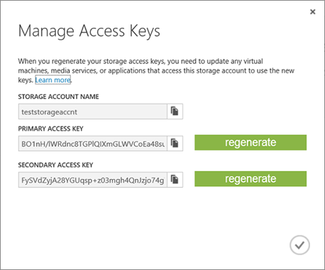
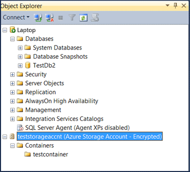
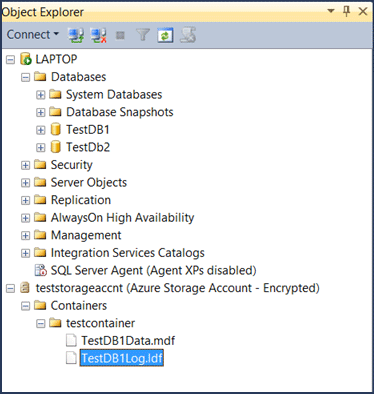
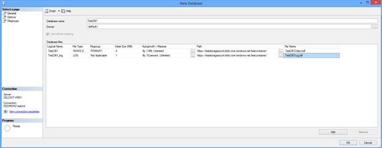

# Lesson 4: Create a database in Windows Azure Storage
  In this lesson, you will learn how to create a database using the SQL Server Data Files in Windows Azure feature. Note that before this lesson, you must complete the Lesson 1, 2, and 3. Lesson 3 is a very important step because you need to store the information about your Windows Azure storage container and its associated policy name and SAS key in the SQL Server credential store before Lesson 4.  
  
 For each storage container used by a data or log file, you must create a SQL Server Credential whose name matches the container path. Then, you can create a new database in Windows Azure Storage  
  
 This lesson assumes that you already completed the following steps:  
  
-   You have a Windows Azure Storage account.  
  
-   You have created a container under your Windows Azure Storage account.  
  
-   You have created a policy on a container with read, write, and list rights. You also generated a SAS key.  
  
-   You have created a SQL Server credential on the source machine.  
  
 To create a database in Windows Azure using the SQL Server Data Files in Windows Azure Storage feature, follow these steps:  
  
1.  Connect to SQL Server Management Studio.  
  
2.  In Object Explorer, connect to the instance of Database Engine installed.  
  
3.  On the Standard tool bar, click New Query.  
  
4.  Copy and paste the following example into the query window, modify as needed. Note that the FILENAME field refers to the URI path of the database file in storage container and it must start with https.  
  
    ```  
  
    --Create a database that uses a SQL Server credential    
    CREATE DATABASE TestDB1    
    ON   
    (NAME = TestDB1_data,   
       FILENAME = 'https://teststorageaccnt.blob.core.windows.net/testcontainer/TestDB1Data.mdf')   
     LOG ON   
    (NAME = TestDB1_log,   
        FILENAME = 'https://teststorageaccnt.blob.core.windows.net/testcontainer/TestDB1Log.ldf')   
    GO  
  
    ```  
  
     Add some data to your database.  
  
    ```  
  
    USE TestDB1;   
    GO   
    CREATE TABLE Table1 (Col1 int primary key, Col2 varchar(20));   
    GO   
    INSERT INTO Table1 (Col1, Col2) VALUES (1, 'string1'), (2, 'string2');   
    GO  
  
    ```  
  
5.  To see the new TestDB1 in your on-premises SQL Server, refresh databases in the Object Explorer.  
  
6.  Similarly, to see the newly created database in your storage account, connect to your storage account via SQL Server Management Studio (SSMS). For information on how to connect to a Windows Azure storage using SQL Server Management Studio, follow these steps:  
  
    1.  First, get the storage account information. Log in to the Management Portal. Then, click **Storage** and choose your storage account. When a storage account is selected, click **Manage Access Keys** at the bottom of the page. This opens a similar dialog window:  
  
           
  
    2.  Copy the **Storage Account Name** and **Primary Access Key** values to the **Connect to Windows Azure Storage** dialog window in SSMS. Then, click **Connect**. This brings the information about storage account containers to SSMS as shown in the following screenshot:  
  
           
  
 The following screenshot demonstrates the new created database both in on-premises and Windows Azure Storage environment.  
  
   
  
 **Note:** If there are any active references to data files in a container, any attempts to delete the associated SQL Server credential fails. Similarly, if there is already a lease on a specific database file in a blob and you want to delete it, first you need to break the lease on the blob. To break the lease, you can use [Lease Blob](https://msdn.microsoft.com/library/azure/ee691972.aspx).  
  
 Using this new feature, you can configure SQL Server so that any CREATE DATABASE statement will default to a cloud enabled database. In other words, you can set default data and log locations in SQL Server Management Studio Server instance properties so anytime you create a database, all database files (.mdf, .ldf) are created as page blobs in Windows Azure Storage.  
  
 To create a database in Windows Azure Storage by using SQL Server Management Studio user interface, perform these steps:  
  
1.  In Object Explorer, connect to an instance of the SQL Server Database Engine and then expand that instance.  
  
2.  Right-click Databases, and then click New Database.  
  
3.  In the New Database dialog window, type a database name.  
  
4.  Change the default values of the primary data and transaction log files, in the Database files grid, click the appropriate cell and enter the new value. Also, specify the path for the file location. For Path, type the URL path of the storage container, such as `https://teststorageaccnt.blob.core.windows.net/testcontainer/`. For FileName, type the physical file names of the database files (.mdf, .ldf).  
  
       
  
     For more information, see [Add Data or Log Files to a Database](databases/add-data-or-log-files-to-a-database.md).  
  
5.  Keep all other default values.  
  
6.  Click OK.  
  
 To see the new TestDB1 in your on-premises SQL Server, refresh databases in the Object Explorer. Similarly, to see the newly created database in your storage account, connect to your storage account via SQL Server Management Studio (SSMS) as explained earlier in this lesson.  
  
 **Next Lesson:**  
  
 [Lesson 5. &#40;Optional&#41; Encrypt your database using TDE](../relational-databases/lesson-4-restore-database-to-virtual-machine-from-url.md)  
  
  
