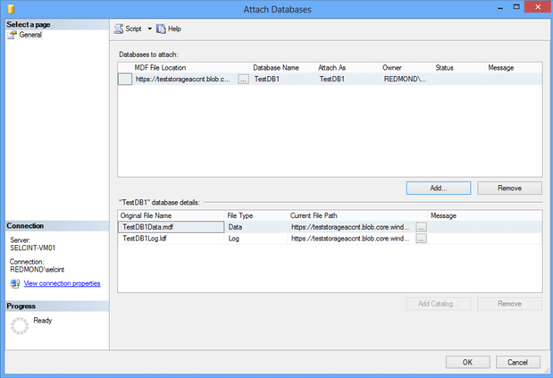

# Lesson 6: Migrate a database from a source machine on-premises to a destination machine in Windows Azure
  This lesson assumes that you already have another SQL Server, which might reside in another on-premises computer or in a virtual machine in Windows Azure. For information on how to create a SQL Server virtual machine in Windows Azure, see [Provisioning a SQL Server Virtual Machine on Windows Azure](http://www.windowsazure.com/manage/windows/common-tasks/install-sql-server/). After provisioning a SQL Server virtual machine in Windows Azure, make sure that you can connect to an instance of SQL Server in this virtual machine via SQL Server Management Studio in another computer.  
  
 This lesson also assumes that you already completed the following steps:  
  
-   You have a Windows Azure Storage account.  
  
-   You have created a container under your Windows Azure Storage account.  
  
-   You have created a policy on a container with read, write, and list rights. You also generated a SAS key.  
  
-   You have created a SQL Server credential on the source machine.  
  
-   You already have created a destination SQL Server virtual machine in Windows Azure. We recommend that you create it by selecting a platform image that includes SQL Server 2014.  
  
 To migrate a database from SQL Server on-premises to another virtual machine in Windows Azure, you can follow these steps:  
  
1.  In the source machine (which is an on-premises computer in this tutorial), open a query window in SQL Server Management Studio. Detach your database to move it to another machine by executing these statements:  
  
    ```  
    -- Detach the database in the source machine   
    USE master  
    EXEC sp_detach_db 'TestDB1', 'true';  
    ```  
  
2.  If you need to transfer a database to a destination machine, first you must prepare it. To prepare your destination machine, first you need to create a SQL Server credential in the destination machine. If it is an encrypted database, you need to import the certificate from the source machine to the destination machine as well.  
  
    1.  To create a SQL Server Credential in the destination machine, follow these steps:  
  
        1.  Connect to the destination machine via SQL Server Management Studio in your source computer.  Or, start SQL Server Management Studio in your destination computer directly.  
  
        2.  On the Standard tool bar, click **New Query**.  
  
        3.  Copy and paste the following example into the query window, modify as needed. The following statement creates a SQL Server Credential to store your storage container's Shared Access Certificate.  
  
            ```sql  
  
            USE master   
            GO   
            CREATE CREDENTIAL [http://teststorageaccnt.blob.core.windows.net/testcontainer]   
            WITH IDENTITY='SHARED ACCESS SIGNATURE',   
            SECRET = 'your SAS key'   
            GO  
  
            ```  
  
        4.  To see all available credentials, you can run the following statement in the query window:  
  
            ```sql  
            SELECT * from sys.credentials   
            ```  
  
        5.  When connected to the destination server, open query window, and run:  
  
            ```sql  
  
            -- Create a master key and a server certificate   
            USE master   
            GO   
            CREATE MASTER KEY ENCRYPTION BY PASSWORD = 'MySQLKey01'; -- You may use a different password.   
            GO   
            CREATE CERTIFICATE MySQLCert   
            FROM FILE = 'C:\certs\MySQLCert.CER'   
            WITH PRIVATE KEY   
            (   
            FILE = 'C:\certs\MySQLPrivateKeyFile.PVK',   
            DECRYPTION BY PASSWORD = 'MySQLKey01'   
            );   
            GO  
  
            ```  
  
             At the end of this step, the destination machine has imported the encryption certificate that was backed up from the source machine. Next, you can attach the data files in the destination machine.  
  
    2.  Then, create a database with data and log files pointing to the existing files in Windows Azure Storage by using FOR ATTACH option. In the query window, run the following statement:  
  
        ```sql  
  
        --Create a database on the destination server   
        CREATE DATABASE TestDB1onDest   
        ON   
        (NAME = TestDB1_data,   
            FILENAME = 'https://teststorageaccnt.blob.core.windows.net/testcontainer/TestDB1Data.mdf' )   
        LOG ON   
         (NAME = TestDB1_log,   
            FILENAME = 'https://teststorageaccnt.blob.core.windows.net/testcontainer/TestDB1Log.ldf')   
        FOR ATTACH   
        GO  
  
        ```  
  
    3.  On the Object Explorer, click Databases, right-click Refresh. You should be able to see the newly created database TestDB1onDest listed.  
  
    4.  Next, run the following statement in the query window:  
  
        ```sql  
  
        USE TestDB1onDest   
        SELECT * FROM Table1;   
        GO  
  
        ```  
  
         This should list all the data you entered in Lesson 4.  
  
 Note that the encrypted database was transferred to another compute instance with no data movement.  
  
 To create a database with data and log files pointing to the existing files in Windows Azure Storage using SQL Server Management Studio user interface, perform these steps:  
  
1.  In **Object Explorer**, connect to an instance of the SQL Server Database Engine and then expand that instance.  
  
2.  Right-click **Databases**, and then click **New Database**. Then, right-click TestDB1. Click Tasks, and then click Detach. In the Detach dialog window, check Drop Connections. Click **OK**.  
  
3.  Connect to the destination machine, which has SQL Server 2014 CTP2 or later. To prepare your destination machine, you need to create a SQL Server credential in the destination machine to point to the same container that you put TestDB1 in. If you are going to re-attach in the same computer, you do not need to create another credential.  
  
4.  In **Object Explorer**, right-click **Databases** and click **Attach**.  
  
5.  In the **Attach Databases** dialog box, to specify the database to be attached, click **Add**. In the **Locate Database Files** dialog window:  
  
     For Database Data File Location, type: `https://teststorageaccnt.blob.core.windows.net/testcontainer/`.  
  
     For File name, type: `TestDB1Data.mdf`.  
  
6.  Click **OK**.  
  
       
  
 **Next Lesson:**  
  
 [Lesson 7: Move your data files to Windows Azure Storage](../relational-databases/lesson-6-generate-activity-and-backup-log-using-file-snapshot-backup.md)  
  
  
