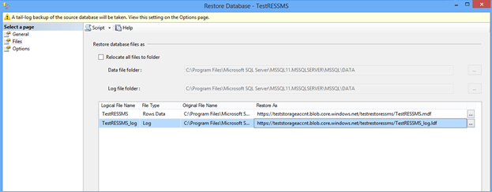
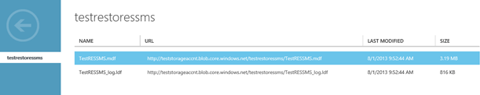

# Lesson 8. Restore a database to Windows Azure Storage
  In this lesson, you will learn how to create a backup file locally and then restore it to Windows Azure Storage. Note that you can have your database either on either on-premises or in a virtual machine in Windows Azure. To follow this lesson, you do not need to complete Lesson 4, 5, 6, and 7.  
  
 This lesson assumes that you already completed the following steps:  
  
-   You have a Windows Azure Storage account.  
  
-   You have created a container under your Windows Azure Storage account.  
  
-   You have created a policy on a container with read, write, and list rights. You also generated a SAS key.  
  
-   You have created a SQL Server credential on the source machine based on Shared Access Signature.  
  
-   You have created a database in the source machine.  
  
 To restore a database to Windows Azure Storage, you can follow these steps:  
  
1.  In the source machine, start SQL Server Management Studio.  
  
2.  When connected to the newly created database, open the query window. Run the following statement:  
  
    ```sql  
  
    USE TestDB3Restore;   
    GO   
    BACKUP DATABASE TestDB3Restore   
    TO DISK = 'C:\BACKUP\TestDB3Restore.Bak'   
       WITH FORMAT,   
       NAME = 'Full Backup of TestDB3Restore'   
    GO  
  
    ```  
  
3.  Next, copy and run the following statements in the Query window.  
  
    ```sql  
  
    USE master;   
    GO   
    RESTORE DATABASE TestDB3Restore    
    FROM DISK = 'C:\BACKUP\TestDB3Restore.bak'    
    WITH REPLACE,   
    MOVE 'TestDB3Restore' TO 'https://teststorageaccnt.blob.core.windows.net/testcontainrestore/TestDB3Restore.mdf',     
    MOVE 'TestDB3Restore_log' TO 'https://teststorageaccnt.blob.core.windows.net/testcontainrestore/TestDB3Restore_log.ldf';   
    GO  
  
    ```  
  
     At the end of this step, your container should list data (.mdf) and (.ldf) files on the Management Portal.  
  
 To restore a database with data and log files pointing to Windows Azure Storage using SQL Server Management Studio user interface, perform these steps:  
  
1.  In **Object Explorer**, click the server name to expand the server tree.  
  
2.  Expand **Databases**, and, select your database.  
  
3.  Right-click the database, point to **Tasks**, and then click **Restore**.  
  
4.  On the **General** page, in the **Restore** source section, click **Source** device.  
  
5.  Click the browse button for the **Source** device text box, which opens the **Select Backup Devices** dialog box.  
  
6.  In the Backup media text box, select **File**, and click the **Add** button to locate the backup (.bak) file. Click **OK**.  
  
7.  Click **Files** on the first page.  
  
8.  In the **Restore Database Files** as section, under **Restore As** field, type the followings:  
  
     For data file, type: `https://teststorageaccnt.blob.core.windows.net/testrestoressms/TestRESSMS.mdf`. For log file, type: `https://teststorageaccnt.blob.core.windows.net/testrestoressms/TestRESSMS_log.ldf`.  
  
       
  
9. Click **OK**.  
  
 When the restore is done, log in to the Management Portal. You should be able to see the .mdf and .ldf files in the container as follows:  
  
   
  
 **Next Lesson:**  
  
 [Lesson 9. Restore a database from Windows Azure Storage](../relational-databases/lesson-8-restore-as-new-database-from-log-backup.md)  
  
  
