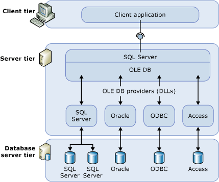

# Linked Servers (Database Engine)
  Configure a linked server to enable the [!INCLUDE[ssDEnoversion](../../includes/ssdenoversion-md.md)] to execute commands against OLE DB data sources outside of the instance of [!INCLUDE[ssNoVersion](../../../includes/ssnoversion-md.md)]. Typically linked servers are configured to enable the [!INCLUDE[ssDE](../../includes/ssde-md.md)] to execute a [!INCLUDE[tsql](../../includes/tsql-md.md)] statement that includes tables in another instance of [!INCLUDE[ssNoVersion](../../../includes/ssnoversion-md.md)], or another database product such as Oracle. Many types OLE DB data sources can be configured as linked servers, including [!INCLUDE[msCoName](../../../includes/msconame-md.md)] Access and Excel. Linked servers offer the following advantages:  
  
-   The ability to access data from outside of [!INCLUDE[ssNoVersion](../../../includes/ssnoversion-md.md)].  
  
-   The ability to issue distributed queries, updates, commands, and transactions on heterogeneous data sources across the enterprise.  
  
-   The ability to address diverse data sources similarly.  
  
 You can configure a linked server by using [!INCLUDE[ssManStudioFull](../../../includes/ssmanstudiofull-md.md)] or by using the [sp_addlinkedserver &#40;Transact-SQL&#41;](/sql/relational-databases/system-stored-procedures/sp-addlinkedserver-transact-sql) statement. OLE DB providers vary greatly in the type and number of parameters required. For example some providers require you to provide a security context for the connection using [sp_addlinkedsrvlogin &#40;Transact-SQL&#41;](/sql/relational-databases/system-stored-procedures/sp-addlinkedsrvlogin-transact-sql). Some OLE DB providers allow [!INCLUDE[ssNoVersion](../../../includes/ssnoversion-md.md)] to update data on the OLE DB source. Others provide only read-only data access. For information about each OLE DB provider, consult documentation for that OLE DB provider.  
  
## Linked Server Components  
 A linked server definition specifies the following objects:  
  
-   An OLE DB provider  
  
-   An OLE DB data source  
  
 An *OLE DB provider* is a DLL that manages and interacts with a specific data source. An *OLE DB data source* identifies the specific database that can be accessed through OLE DB. Although data sources queried through linked server definitions are ordinarily databases, OLE DB providers exist for a variety of files and file formats. These include text files, spreadsheet data, and the results of full-text content searches.  
  
 The [!INCLUDE[msCoName](../../../includes/msconame-md.md)] [!INCLUDE[ssNoVersion](../../../includes/ssnoversion-md.md)] Native Client OLE DB Provider (PROGID: SQLNCLI11) is the official OLE DB provider for [!INCLUDE[ssNoVersion](../../../includes/ssnoversion-md.md)].  
  
> [!NOTE]  
>  [!INCLUDE[ssNoVersion](../../../includes/ssnoversion-md.md)] distributed queries are designed to work with any OLE DB provider that implements the required OLE DB interfaces. However, [!INCLUDE[ssNoVersion](../../../includes/ssnoversion-md.md)] has been tested against only the [!INCLUDE[ssNoVersion](../../../includes/ssnoversion-md.md)] Native Client OLE DB Provider and certain other providers.  
  
## Linked Server Details  
 The following illustration shows the basics of a linked server configuration.  
  
   
  
 Typically, linked servers are used to handle distributed queries. When a client application executes a distributed query through a linked server, [!INCLUDE[ssNoVersion](../../../includes/ssnoversion-md.md)] parses the command and sends requests to OLE DB. The rowset request may be in the form of executing a query against the provider or opening a base table from the provider.  
  
 For a data source to return data through a linked server, the OLE DB provider (DLL) for that data source must be present on the same server as the instance of [!INCLUDE[ssNoVersion](../../../includes/ssnoversion-md.md)].  
  
 When a third-party OLE DB provider is used, the account under which the [!INCLUDE[ssNoVersion](../../../includes/ssnoversion-md.md)] service runs must have read and execute permissions for the directory, and all subdirectories, in which the provider is installed.  
  
## Managing Providers  
 There is a set of options that control how [!INCLUDE[ssNoVersion](../../../includes/ssnoversion-md.md)] loads and uses OLE DB providers that are specified in the registry.  
  
## Managing Linked Server Definitions  
 When you are setting up a linked server, register the connection information and data source information with [!INCLUDE[ssNoVersion](../../../includes/ssnoversion-md.md)]. After registered, that data source can be referred to with a single logical name.  
  
 You can use stored procedures and catalog views to manage linked server definitions:  
  
-   Create a linked server definition by running **sp_addlinkedserver**.  
  
-   View information about the linked servers defined in a specific instance of [!INCLUDE[ssNoVersion](../../../includes/ssnoversion-md.md)] by running a query against the **sys.servers** system catalog views.  
  
-   Delete a linked server definition by running **sp_dropserver**. You can also use this stored procedure to remove a remote server.  
  
 You can also define linked servers by using [!INCLUDE[ssManStudioFull](../../../includes/ssmanstudiofull-md.md)]. In the Object Explorer, right-click **Server Objects**, select **New**, and select **Linked Server**. You can delete a linked server definition by right-clicking the linked server name and selecting **Delete**.  
  
 When you execute a distributed query against a linked server, include a fully qualified, four-part table name for each data source to query. This four-part name should be in the form _linked_server_name.catalog_**._`schema`_.**_object_name_.  
  
> [!NOTE]  
>  Linked servers can be defined to point back (loop back) to the server on which they are defined. Loopback servers are most useful when testing an application that uses distributed queries on a single server network. Loopback linked servers are intended for testing and are not supported for many operations, such as distributed transactions.  
  
## Related Tasks  
 [Create Linked Servers &#40;SQL Server Database Engine&#41;](create-linked-servers-sql-server-database-engine.md)  
  
 [sp_addlinkedserver &#40;Transact-SQL&#41;](/sql/relational-databases/system-stored-procedures/sp-addlinkedserver-transact-sql)  
  
 [sp_addlinkedsrvlogin &#40;Transact-SQL&#41;](/sql/relational-databases/system-stored-procedures/sp-addlinkedsrvlogin-transact-sql)  
  
 [sp_dropserver &#40;Transact-SQL&#41;](/sql/relational-databases/system-stored-procedures/sp-dropserver-transact-sql)  
  
## Related Content  
 [sys.servers &#40;Transact-SQL&#41;](/sql/relational-databases/system-catalog-views/sys-servers-transact-sql)  
  
 [sp_linkedservers &#40;Transact-SQL&#41;](/sql/relational-databases/system-stored-procedures/sp-linkedservers-transact-sql)  
  
  
