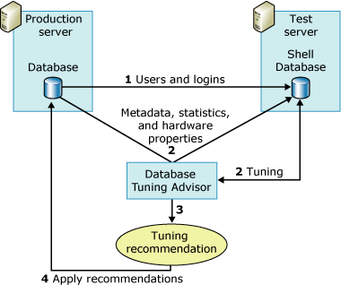

# Reduce the Production Server Tuning Load
  [!INCLUDE[ssDE](../../../includes/ssde-md.md)] Tuning Advisor relies on the query optimizer to analyze a workload and to make tuning recommendations. Performing this analysis on the production server adds to the server load and can hurt server performance during the tuning session. You can reduce the impact to the server load during a tuning session by using a test server in addition to the production server.  
  
## How Database Engine Tuning Advisor Uses a Test Server  
 The traditional way to use a test server is to copy all of the data from your production server to your test server, tune the test server, and then implement the recommendation on your production server. This process eliminates the performance impact on your production server, but nevertheless is not the optimal solution. For example, copying large amounts of data from the production to the test server can consume substantial amounts of time and resources. In addition, test server hardware is seldom as powerful as the hardware that is deployed for production servers. The tuning process relies on the query optimizer, and the recommendations it generates are based in part on the underlying hardware. If the test and production server hardware are not identical, the [!INCLUDE[ssDE](../../../includes/ssde-md.md)] Tuning Advisor recommendation quality is diminished.  
  
 To avoid these problems, [!INCLUDE[ssDE](../../../includes/ssde-md.md)] Tuning Advisor tunes a database on a production server by offloading most of the tuning load onto a test server. It does this by using the production server hardware configuration information and without actually copying the data from the production server to the test server. [!INCLUDE[ssDE](../../../includes/ssde-md.md)] Tuning Advisor does not copy actual data from the production server to the test server. It only copies the metadata and necessary statistics.  
  
 The following steps outline the process for tuning a production database on a test server:  
  
1.  Make sure that the user who wants to use the test server exists on both servers.  
  
     Before you start, make sure that the user who wants to use the test server to tune a database on the production server exists on both servers. This requires that you create the user and his or her login on the test server. If you are a member of the **sysadmin** fixed server role on both computers, this step is not necessary.  
  
2.  Tune the workload on the test server.  
  
     To tune a workload on a test server, you must use an XML input file with the **dta** command-line utility. In the XML input file, specify the name of your test server with the **TestServer** subelement in addition to specifying the values for the other subelements under the **TuningOptions** parent element.  
  
     During the tuning process, Database Engine Tuning Advisor creates a shell database on the test server. To create this shell database and tune it, Database Engine Tuning Advisor makes calls to the production server for the following:  
  
    1.  [!INCLUDE[ssDE](../../../includes/ssde-md.md)] Tuning Advisor imports metadata from the production database to the test server shell database. This metadata includes empty tables, indexes, views, stored procedures, triggers, and so on. This makes it possible for the workload queries to execute against the test server shell database.  
  
    2.  [!INCLUDE[ssDE](../../../includes/ssde-md.md)] Tuning Advisor imports statistics from the production server so the query optimizer can accurately optimize queries on the test server.  
  
    3.  [!INCLUDE[ssDE](../../../includes/ssde-md.md)] Tuning Advisor imports hardware parameters specifying the number of processors and available memory from the production server to provide the query optimizer with the information it needs to generate a query plan.  
  
3.  After [!INCLUDE[ssDE](../../../includes/ssde-md.md)] Tuning Advisor finishes tuning the test server shell database, it generates a tuning recommendation.  
  
4.  Apply the recommendation received from tuning the test server to the production server.  
  
 The following illustration shows the test server and production server scenario:  
  
   
  
> [!NOTE]  
>  The test server tuning feature is not supported in the [!INCLUDE[ssDE](../../../includes/ssde-md.md)] Tuning Advisor graphical user interface (GUI).  
  
## Example  
 First, make sure that the user who wants to perform the tuning exists on both the test and production servers.  
  
 After the user information is copied over to your test server, you can define your test server tuning session in the [!INCLUDE[ssDE](../../../includes/ssde-md.md)] Tuning Advisor XML input file. The following example XML input file illustrates how to specify a test server to tune a database with [!INCLUDE[ssDE](../../../includes/ssde-md.md)] Tuning Advisor.  
  
 In this example, the `MyDatabaseName` database is being tuned on `MyServerName`. The [!INCLUDE[tsql](../../includes/tsql-md.md)] script, `MyWorkloadScript.sql`, is used as the workload. This workload contains events that execute against `MyDatabaseName`. Most of the query optimizer calls to this database, which occur as part of the tuning process, are handled by the shell database that resides on `MyTestServerName`. The shell database is composed of metadata and statistics. This process results in the tuning overhead being offloaded to the test server. When [!INCLUDE[ssDE](../../../includes/ssde-md.md)] Tuning Advisor generates its tuning recommendation using this XML input file, it should consider indexes only (`<FeatureSet>IDX</FeatureSet>`), no partitioning, and need not keep any of the existing physical design structures in `MyDatabaseName`.  
  
```  
<?xml version="1.0" encoding="utf-16" ?>  
<DTAXML xmlns:xsi="http://www.w3.org/2001/XMLSchema-instance" xmlns="https://schemas.microsoft.com/sqlserver/2004/07/dta">  
  <DTAInput>  
    <Server>  
      <Name>MyServerName</Name>  
      <Database>  
        <Name>MyDatabaseName</Name>  
      </Database>  
    </Server>  
    <Workload>  
      <File>MyWorkloadScript.sql</File>  
    </Workload>  
    <TuningOptions>  
      <TestServer>MyTestServerName</TestServer>  
      <FeatureSet>IDX</FeatureSet>  
      <Partitioning>NONE</Partitioning>  
      <KeepExisting>NONE</KeepExisting>  
    </TuningOptions>  
  </DTAInput>  
</DTAXML>  
```  
  
## See Also  
 [Considerations for Using Test Servers](considerations-for-using-test-servers.md)   
 [XML Input File Reference &#40;Database Engine Tuning Advisor&#41;](database-engine-tuning-advisor.md)  
  
  
