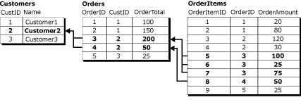
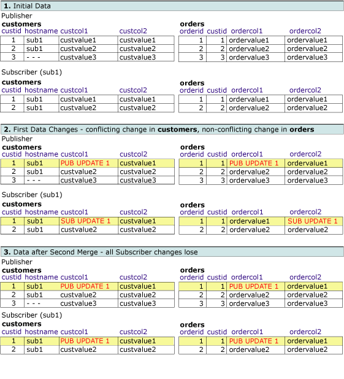
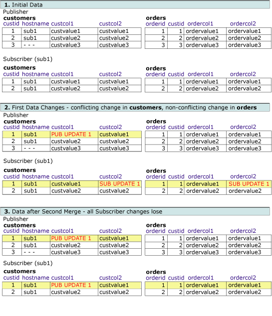
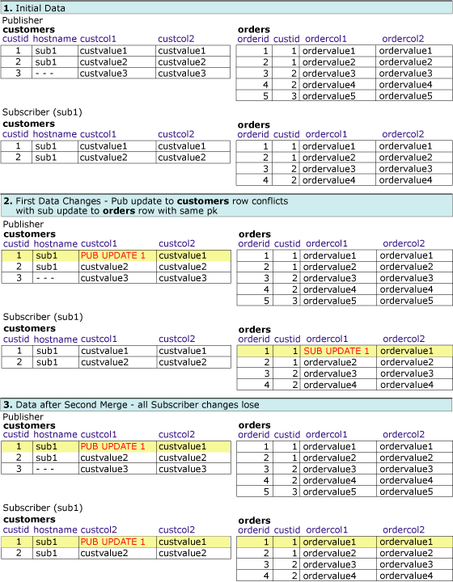

# Detecting and Resolving Conflicts in Logical Records
  This topic covers the various combinations of conflict detection and conflict resolution approaches possible when using logical records. A conflict in merge replication occurs when more than one node changes the same data, or merge replication encounters certain types of errors, such as a constraint violation, when replicating changes. For more information about conflict detection and resolution, see [Advanced Merge Replication Conflict Detection and Resolution](advanced-merge-replication-conflict-detection-and-resolution.md).  
  
 To specify the conflict tracking and resolution level for an article, see [Specify the Conflict Tracking and Resolution Level for Merge Articles](../publish/specify-merge-replication-properties.md#interactive-conflict-resolution).  
  
## Conflict Detection  
 The way in which conflicts are detected for logical records is determined by two article properties: **column_tracking** and **logical_record_level_conflict_detection**. [!INCLUDE[ssVersion2005](../../../includes/ssversion2005-md.md)] and later versions also support logical record-level detection.  
  
 The **logical_record_level_conflict_detection** article property can be set to TRUE or FALSE. The value should only be set for the top-level parent article and will be ignored by child articles. If this value is FALSE, merge replication detects conflicts as in previous versions of [!INCLUDE[ssNoVersion](../../../includes/ssnoversion-md.md)], based solely on the value of the **column_tracking** property for the article. If this value is TRUE, merge replication will ignore the **column_tracking** property of the article, and detect a conflict if changes are made anywhere in the logical record. For example, consider this scenario:  
  
   
  
 A conflict is detected if two users change any values for the Customer2 logical record in the **Customers**, **Orders**, or **OrderItems** tables. This example involves changes made via an UPDATE statement, but the conflict can also be detected by changes made with INSERT or DELETE statements.  
  
## Conflict Resolution  
 By default, merge replication uses priority-based logic to resolve conflicts. If a conflicting change is made in two Subscriber databases, the change for the Subscriber with the higher subscription priority wins, or if the priority is the same, the first change to reach the Publisher wins. With row-level and column-level detection, the entire winning row always overwrites the losing row.  
  
 The **logical_record_level_conflict_resolution** article property can be set to TRUE or FALSE. The value should only be set for the top-level parent article and will be ignored by child articles. If the value is TRUE, the entire winning logical record overwrites the losing logical record. If it is FALSE, individual winning rows can come from different Subscribers or Publishers. For example, Subscriber A could win a conflict on a row from the **Orders** table, and Subscriber B could win on a related row from the **OrderItems** table. The result is a logical record with the **Orders** row from Subscriber A and the **OrderItems** row from Subscriber B.  
  
## Interaction of Conflict Resolution and Detection Settings  
 The outcome of conflicts depends on the interaction of conflict detection and resolution settings. For the examples below, it is assumed that the priority-based conflict resolution is being used. When using logical records, the possibilities are:  
  
-   Row or column level detection, row level resolution  
  
-   Column level detection, logical record resolution  
  
-   Row level detection, logical record resolution  
  
-   Logical record detection, logical record resolution  
  
### Row or Column Level Detection, Row Level Resolution  
 In this example, the publication is configured with:  
  
-   **column_tracking** is TRUE or FALSE  
  
-   **logical_record_level_conflict_detection** is FALSE  
  
-   **logical_record_level_conflict_resolution** is FALSE  
  
 In this case, detection is at the row or column level and resolution is at the row level. These settings are used to take advantage of having all changes to a logical record replicate as a unit, but without conflict detection or resolution at the logical record level.  
  
### Column Level Detection, Logical Record Resolution  
 In this example, the publication is configured with:  
  
-   **column_tracking** is TRUE  
  
-   **logical_record_level_conflict_detection** is FALSE  
  
-   **logical_record_level_conflict_resolution** is TRUE  
  
 A Publisher and Subscriber start with the same data set, and a logical record is defined between the **orders** and **customers** tables. The Publisher changes the **custcol1** column in the **customers** table and the **ordercol1** in the **orders** table. The Subscriber changes **custcol1** in the same row of the **customers** table and the **ordercol2** column in the same row of the **orders** table. The changes to the same column in the **customer** table result in a conflict, but the changes to the **orders** table are not in conflict.  
  
 Because the conflicts are resolved at the logical record level, the winning changes made at the Publisher replace the changes made in the Subscriber tables during replication processing.  
  
   
  
### Row Level Detection, Logical Record Resolution  
 In this example, the publication is configured with:  
  
-   **column_tracking** is FALSE  
  
-   **logical_record_level_conflict_detection** is FALSE  
  
-   **logical_record_level_conflict_resolution** is TRUE  
  
 A Publisher and Subscriber start with the same data set. The Publisher changes the **custcol1** column in the **customers** table. The Subscriber changes **custcol2** in the **customers** table and the **ordercol2** column in the **orders** table. The changes to the same row in the **customers** table result in a conflict, but the Subscriber changes to the **orders** table are not in conflict.  
  
 Because the conflicts are resolved at the logical record level, during synchronization the winning changes made at the Publisher replace the changes made in the Subscriber tables.  
  
   
  
### Logical Record Detection, Logical Record Resolution  
 In this example, the publication is configured with:  
  
-   **logical_record_level_conflict_detection** is TRUE  
  
-   **logical_record_level_conflict_resolution** is TRUE  
  
 A Publisher and Subscriber start with the same data set. The Publisher changes the **custcol1** column in the **customers** table. The Subscriber changes the **ordercol1** column in the **orders** table. There are no changes to the same row or columns, but because the changes are made in the same logical record for **custid**=1, the changes are detected as a conflict at the logical record level.  
  
 Because the conflicts are also resolved at the logical record level, during synchronization the winning change made at the Publisher replaces the change made in the Subscriber tables.  
  
   
  
## See Also  
 [Group Changes to Related Rows with Logical Records](group-changes-to-related-rows-with-logical-records.md)  
  
  
