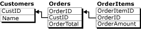
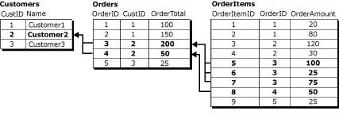

# Group Changes to Related Rows with Logical Records
    
> [!NOTE]  
>  [!INCLUDE[ssNoteDepFutureAvoid](../../../includes/ssnotedepfutureavoid-md.md)]  
  
 By default, merge replication processes data changes on a row-by-row basis. In many circumstances this is appropriate, but for some applications, it is essential that related rows be processed as a unit. The logical records feature of merge replication allows you to define a relationship between related rows in different tables so that the rows are processed as a unit.  
  
> [!NOTE]  
>  The logical records feature can be used alone or in conjunction with join filters. For more information about join filters, see [Join Filters](join-filters.md). To use logical records, the compatibility level of the publication must be at least 90RTM.  
  
 Consider these three related tables:  
  
   
  
 The **Customers** table is the parent table in this relationship and has a primary key column **CustID**. The **Orders** table has a primary key column **OrderID**, with a foreign key constraint on the **CustID** column that references the **CustID** column in the **Customers** table. Similarly, the **OrderItems** table has a primary key column **OrderItemID**, with a foreign key constraint on the **OrderID** column that references the **OrderID** column in the **Orders** table.  
  
 In this example, a logical record consists of all the rows in the **Orders** table that are related to a single **CustID** value and all of the rows in the **OrderItems** table that are related to those rows in the **Orders** table. This diagram shows all the rows in the three tables that are in the logical record for Customer2:  
  
   
  
 To define a logical record relationship between articles, see [Define a Logical Record Relationship Between Merge Table Articles](../publish/define-a-logical-record-relationship-between-merge-table-articles.md).  
  
## Benefits of Logical Records  
 The logical records feature has two primary benefits:  
  
-   Application of data changes as a unit.  
  
-   The detection and resolution of conflicts simultaneously on multiple rows from multiple tables.  
  
### The Application of Changes As a Unit  
 If merge processing is interrupted, such as in the case of a dropped connection, the partially completed set of related replicated changes is rolled back if logical records are used. For example, consider the case where a Subscriber adds a new order with **OrderID** = 6 and two new rows in the **OrderItems** table with **OrderItemID** = 10 and **OrderItemID** = 11 for **OrderID** = 6.  
  
   
  
 If the replication process is interrupted after the **Orders** row for **OrderID** = 6 is complete, but before the **OrderItems** 10 and 11 are completed, and logical records are not used, the **OrderTotal** value for **OrderID** = 6 will not be consistent with the sum of the **OrderAmount** values for the **OrderItems** rows. If logical records are used, the **Orders** row for **OrderID** = 6 is not committed until the related **OrderItems** changes are replicated.  
  
 In a different scenario, if logical records are used, and someone is querying tables when the merge process is applying changes, the user will not see the partially replicated changes until they are all complete. For example, the replication process has uploaded the Orders row for **OrderID** = 6, but a user queries the tables before the replication process has replicated the **OrderItems** rows, the **OrderTotal** value would not be the same as the sum of the **OrderAmount** values. If logical records are used, the **Orders** row would not be visible until the **OrderItems** rows are complete and the transaction has been committed as a unit.  
  
### The Application of Conflict Handling to More Than One Table  
 Consider the case where two Subscribers have the data set above:  
  
-   A user at the first Subscriber changes the **OrderAmount** of **OrderItemID** 5 from 100 to 150 and the **OrderTotal** of **OrderID** 3 from 200 to 250.  
  
-   A user at the second Subscriber changes the **OrderAmount** of **OrderItemID** 6 from 25 to 125 and the **OrderTotal** of **OrderID** 3 from 200 to 300.  
  
 If these changes are replicated without using logical records, the different **OrderTotal** values would result in a conflict and only one of them would be replicated. But the non-conflicting changes in the **OrderItems** table would be replicated without conflict, leaving the final **OrderTotal** values in an inconsistent state with respect to the **OrderItems** rows. If logical records are used in this scenario, the **OrderItems** change associated with the losing **Orders** table change would also be rolled back, and the final **OrderTotal** value would be an accurate summary of the **OrderItems** rows.  
  
 For more information about options related to conflict detection and resolution with logical records, see [Detecting and Resolving Conflicts in Logical Records](advanced-merge-replication-conflict-resolving-in-logical-record.md).  
  
## Considerations for Using Logical Records  
 Keep the following considerations in mind when using logical records.  
  
### General Considerations  
  
-   It is recommended that you keep the number of tables in a logical record as low as possible; five tables or less is recommended.  
  
-   Logical records cannot reference columns with any of the following data types:  
  
    -   `varchar(max)` and `nvarchar(max)`  
  
    -   `varbinary(max)`  
  
    -   `text` and `ntext`  
  
    -   `image`  
  
    -   `XML`  
  
    -   `UDT`  
  
-   Foreign key relationships in published tables cannot be defined with the CASCADE option. For more information, see [CREATE TABLE &#40;Transact-SQL&#41;](/sql/t-sql/statements/create-table-transact-sql) and [ALTER TABLE &#40;Transact-SQL&#41;](/sql/t-sql/statements/alter-table-transact-sql).  
  
-   You cannot update any columns that are used in the logical relation clause.  
  
-   Custom conflict resolution with business logic handlers or custom resolvers is not supported for articles that are included in a logical record.  
  
-   If logical records are used in a publication that includes parameterized filters, you must initialize each Subscriber with a snapshot for its partition. If you initialize a Subscriber with another method, the Merge Agent will fail. For more information, see [Snapshots for Merge Publications with Parameterized Filters](../snapshots-for-merge-publications-with-parameterized-filters.md).  
  
-   Conflicts that involve logical records are not displayed in Conflict Viewer. To view information about these conflicts, use replication stored procedures. For more information, see [View Conflict Information for Merge Publications &#40;Replication Transact-SQL Programming&#41;](../view-conflict-information-for-merge-publications.md).  
  
### Publication Settings  
  
-   The publication must have a compatibility level of 90RTM or greater. For more information, see the "Publication Compatibility Level" section of [Replication Backward Compatibility](../replication-backward-compatibility.md).  
  
-   The publication must use native snapshot mode. This is the default unless you are replicating to [!INCLUDE[ssEW](../../../includes/ssew-md.md)], which does not support logical records.  
  
-   The publication cannot allow Web synchronization. For more information about Web synchronization, see [Web Synchronization for Merge Replication](../web-synchronization-for-merge-replication.md).  
  
-   In order to use logical records on a filtered publication:  
  
    -   Precomputed partitions must also be used. The requirements of precomputed partitions also apply to logical records. For more information, see [Optimize Parameterized Filter Performance with Precomputed Partitions](parameterized-filters-optimize-for-precomputed-partitions.md).  
  
    -   You cannot use nonoverlapping parameterized filters. For more information, see the "Setting 'partition options'" section of [Parameterized Row Filters](parameterized-filters-parameterized-row-filters.md).  
  
-   If the publication uses join filters, the **join unique key** property must be set to **true** for all join filters that are involved in logical record relationships. For more information, see [Join Filters](join-filters.md).  
  
### Relationships Between Tables  
  
-   Tables related through logical records must have a primary key-foreign key relationship.  
  
-   The NOT FOR REPLICATION option cannot be set for foreign key constraints.  
  
-   Child tables can have only one parent table.  
  
     For example, a database tracking classes and students might have a design similar to:  
  
       
  
     You cannot use a logical record to represent the three tables in this relationship, because the rows in **ClassMembers** are not associated with a single primary key row. The tables **Classes** and **ClassMembers** could still form a logical record, as could the tables **ClassMembers** and **Students**, but not all three.  
  
-   The publication cannot contain circular join filter relationships.  
  
     Using the example with the tables **Customers**, **Orders**, and **OrderItems**, you could not use logical records if the **Orders** table also had a foreign key constraint that referenced the **OrderItems** table.  
  
## Performance implications of logical records  
 The logical record feature does come with a performance cost. If logical records are not used, the replication agent can process all of the changes for a given article at the same time, and because the changes are applied in a row-by-row fashion, the locking and transaction log requirements necessary for applying the changes are minimal.  
  
 If logical records are used, the Merge Agent must process the changes for each entire logical record together. This has an effect on the amount of time it takes the Merge Agent to replicate the rows. Additionally, because the agent opens a separate transaction for each logical record, locking requirements can increase.  
  
## See Also  
 [Article Options for Merge Replication](article-options-for-merge-replication.md)  
  
  
