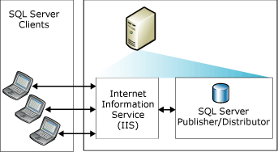
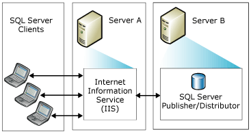
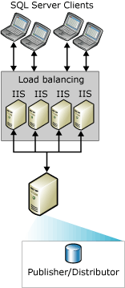

# Topologies for Web Synchronization
  You can choose from a variety of [!INCLUDE[msCoName](../../includes/msconame-md.md)] [!INCLUDE[ssNoVersion](../../includes/ssnoversion-md.md)] Web synchronization replication topologies. Common ways to configure Web synchronization include:  
  
-   Single server  
  
-   Two servers  
  
-   Multiple [!INCLUDE[msCoName](../../includes/msconame-md.md)] Internet Information Services (IIS) systems and [!INCLUDE[ssNoVersion](../../includes/ssnoversion-md.md)] republishing  
  
 For information about configuring Web synchronization, see [Configure Web Synchronization](configure-web-synchronization.md).  
  
## Single Server  
 In the simplest topology, IIS, the [!INCLUDE[ssNoVersion](../../includes/ssnoversion-md.md)] Publisher, and the [!INCLUDE[ssNoVersion](../../includes/ssnoversion-md.md)] Distributor all reside on a single server. Subscribers synchronize by connecting to IIS on the Publisher. The Publisher can be located behind a firewall.  
  
> [!NOTE]  
>  This configuration is recommended only for intranet scenarios. For other scenarios, it is recommended that the IIS server and [!INCLUDE[ssNoVersion](../../includes/ssnoversion-md.md)] Publisher/Distributor be on separate computers.  
  
   
  
## Two Servers  
 You can place IIS on one server and configure the [!INCLUDE[ssNoVersion](../../includes/ssnoversion-md.md)] Publisher and Distributor on another server. The server running IIS can be isolated from the Internet by a firewall. Subscribers synchronize by connecting to IIS.  
  
   
  
## Multiple IIS Systems and SQL Server Republishing  
 If you need to support very large numbers of Subscribers that synchronize at the same time, you can partition the work across multiple computers running IIS.  
  
   
  
 If further load balancing is required on the computer running [!INCLUDE[ssNoVersion](../../includes/ssnoversion-md.md)], you can create a republishing hierarchy on multiple computers. The top-level Publisher publishes data to Subscribers, which in turn republish the data, load balancing requests from the Subscribers.  
  
> [!NOTE]  
>  Subscribers can only synchronize with a specific Publisher. For example, a Subscriber to republisher A cannot synchronize with republisher B when A is not available.  
  
   
  
## See Also  
 [Configure Web Synchronization](configure-web-synchronization.md)   
 [Web Synchronization for Merge Replication](web-synchronization-for-merge-replication.md)  
  
  
