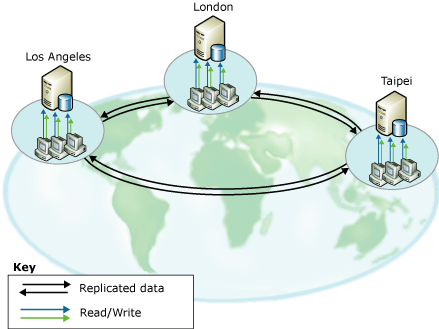
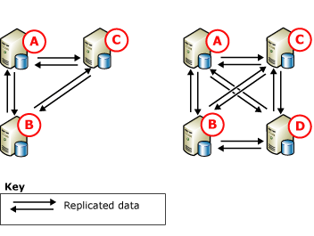

# Peer-to-Peer Transactional Replication
  Peer-to-peer replication provides a scale-out and high-availability solution by maintaining copies of data across multiple server instances, also referred to as *nodes*. Built on the foundation of transactional replication, peer-to-peer replication propagates transactionally consistent changes in near real-time. This enables applications that require scale-out of read operations to distribute the reads from clients across multiple nodes. Because data is maintained across the nodes in near real-time, peer-to-peer replication provides data redundancy, which increases the availability of data.  
  
 Consider a Web application. This can benefit from peer-to-peer replication in the following ways:  
  
-   Catalog queries and other reads are spread across multiple nodes. This enables performance to remain consistent as reads increase.  
  
-   If one of the nodes in the system fails, an application layer can redirect the writes for that node to another node. This maintains availability.  
  
-   If a node requires maintenance or the whole system requires an upgrade, each node can be taken offline and added back to the system without affecting the availability of the application.  
  
 Although peer-to-peer replication enables scaling out of read operations, write performance for the topology is like that for a single node. This is because ultimately all inserts, updates, and deletes are propagated to all nodes. Replication recognizes when a change has been applied to a given node and prevents changes from cycling through the nodes more than one time. We strongly recommend that write operations for each row be performed at only node, for the following reasons:  
  
-   If a row is modified at more than one node, it can cause a conflict or even a lost update when the row is propagated to other nodes.  
  
-   There is always some latency involved when changes are replicated. For applications that require the latest change to be seen immediately, dynamically load balancing the application across multiple nodes can be problematic.  
  
 Peer-to-peer replication includes the option to enable conflict detection across a peer-to-peer topology. This option helps prevent the issues that are caused from undetected conflicts, including inconsistent application behavior and lost updates. By enabling this option, by default a conflicting change is treated as a critical error that causes the failure of the Distribution Agent. In the event of a conflict, the topology remains in an inconsistent state until the conflict is resolved manually and the data is made consistent across the topology. For more information, see [Conflict Detection in Peer-to-Peer Replication](peer-to-peer-conflict-detection-in-peer-to-peer-replication.md).  
  
> [!NOTE]  
>  To avoid potential data inconsistency, make sure that you avoid conflicts in a peer-to-peer topology, even with conflict detection enabled. To ensure that write operations for a particular row are performed at only one node, applications that access and change data must partition insert, update, and delete operations. This partitioning ensures that modifications to a given row originating at one node are synchronized with all other nodes in the topology before the row is modified by a different node. If an application requires sophisticated conflict detection and resolution capabilities, use merge replication. For more information, see [Merge Replication](../merge/merge-replication.md) and [Detect and Resolve Merge Replication Conflicts](../merge/advanced-merge-replication-conflict-detection-and-resolution.md).  
  
## Peer-to-Peer Topologies  
 The following scenarios illustrate typical uses for peer-to-peer replication.  
  
### Topology That Has Two Participating Databases  
   
  
 Both of the preceding illustrations show two participating databases, with user traffic directed to the databases through an application server. This configuration can be used for a variety of applications, from Web sites to workgroup applications, and provides the following benefits:  
  
-   Improved read performance, because reads are spread out over two servers.  
  
-   Higher availability if maintenance is required or in case of failure at one node.  
  
 In both illustrations, read activity is load-balanced between the participating databases, but updates are handled differently:  
  
-   On the left, updates are partitioned between the two servers. If the database contained a product catalog, you could, for example, have a custom application direct updates to node **A** for product names that start with A through M, and direct updates to node **B** for product names that start with N through Z. Updates are then replicated to the other node.  
  
-   On the right, all updates are directed to node **B**. From there, updates are replicated to node **A**. If **B** is offline (for example, for maintenance), the application server can direct all activity to **A**. When **B** is back online, updates can flow to it, and the application server can move all updates back to **B** or keep directing them to **A**.  
  
 Peer-to-peer replication can support either approach, but the central update example on the right is also often used with standard transactional replication.  
  
### Topologies That Have Three or More Participating Databases  
   
  
 The preceding illustration shows three participating databases that provide data for a worldwide software support organization, with offices in Los Angeles, London, and Taipei. The support engineers at each office take customer calls and enter and update information about each customer call. The time zones for the three offices are eight hours apart, so there is no overlap in the workday. As the Taipei office closes, the London office is opening for the day. If a call is still in progress as one office is closing, the call is transferred to a representative at the next office to open.  
  
 Each location has a database and an application server, which are used by the support engineers as they enter and update information about customer calls. The topology is partitioned by time. Therefore, updates occur only at the node that is currently open for business, and then the updates flow to the other participating databases. This topology provides the following benefits:  
  
-   Independence without isolation: Each office can insert, update, or delete data independently but can also share the data because it is replicated to all other participating databases.  
  
-   Higher availability in case of failure or to allow maintenance at one or more of the participating databases.  
  
       
  
 The preceding illustration shows the addition of a node to the three-node topology. A node could be added in this scenario for the following reasons:  
  
-   Because another office is opened.  
  
-   To provide higher availability to support maintenance or increase fault tolerance if a disk failure or other major failure occurs.  
  
 Notice that in both the three- and four-node topologies, all databases publish and subscribe to all other databases. This provides maximum availability in case of maintenance needs or failure of one or more nodes. As nodes are added, you must balance availability and scalability needs against performance and the complexity of deployment and administration.  
  
## Configuring Peer-to-Peer Replication  
 Configuring a peer-to-peer replication topology is very similar to configuring a series of standard transactional publications and subscriptions. The steps described in the following topics show the configuration of a three-node system, similar to the configuration shown on the left in the previous illustration that shows peer-to-peer topology.  
  
## Considerations for Using Peer-to-Peer Replication  
 This section provides information and guidelines to consider when you use peer-to-peer replication.  
  
### General Considerations  
  
-   Peer-to-peer replication is available only in Enterprise versions of [!INCLUDE[ssNoVersion](../../../includes/ssnoversion-md.md)].  
  
-   All databases that participate in peer-to-peer replication should contain identical schema and data:  
  
    -   Object names, object schema, and publication names should be identical.  
  
    -   Publications must allow schema changes to be replicated. (This is a setting of **1** for the publication property **replicate_ddl**, which is the default setting.) For more information, see [Make Schema Changes on Publication Databases](../publish/make-schema-changes-on-publication-databases.md).  
  
    -   Row and column filtering are not supported.  
  
-   We recommend that each node use its own distribution database. This eliminates the potential of having a single point of failure.  
  
-   Tables and other objects cannot be included in multiple peer-to-peer publications in a single publication database.  
  
-   A publication must be enabled for peer-to-peer replication before any subscriptions are created.  
  
-   Subscriptions must be initialized by using a backup or with the **'replication support only'** option. For more information, see [Initialize a Transactional Subscription Without a Snapshot](../initialize-a-transactional-subscription-without-a-snapshot.md).  
  
-   We do not recommend the use of identity columns. When using identities, you must manually manage the ranges assigned to the tables at each participating database. For more information, see the section "Assigning Ranges for Manual Identity Range Management" in [Replicate Identity Columns](../publish/replicate-identity-columns.md).  
  
### Feature Restrictions  
 Peer-to-peer replication supports the core features of transactional replication, but does not support the following options:  
  
-   Initialization and reinitialization with a snapshot.  
  
-   Row and column filters.  
  
-   Timestamp columns.  
  
-   Non-[!INCLUDE[ssNoVersion](../../../includes/ssnoversion-md.md)] Publishers and Subscribers.  
  
-   Immediate updating and queued updating subscriptions.  
  
-   Anonymous subscriptions.  
  
-   Partial subscriptions.  
  
-   Attachable subscriptions and transformable subscriptions. (Both of these options were deprecated in [!INCLUDE[ssVersion2005](../../../includes/ssversion2005-md.md)].)  
  
-   Shared Distribution Agents.  
  
-   The Distribution Agent parameter **-SubscriptionStreams** and the Log Reader Agent parameter **-MaxCmdsInTran**.  
  
-   The article properties **@destination_owner** and **@destination_table**.  

-   Peer-to-Peer transactional replication does not support creating a one-way transactional subscription to a Peer-to-Peer publication
  
 The following properties have special considerations:  
  
-   The publication property **@allow_initialize_from_backup** requires a value of `true`.  
  
-   The article property **@replicate_ddl** requires a value of `true`; **@identityrangemanagementoption** requires a value of `manual`; and **@status** requires that option **24** is set.  
  
-   The value for article properties **@ins_cmd**, **@del_cmd**, and **@upd_cmd** cannot be set to `SQL`.  
  
-   The subscription property **@sync_type** requires a value of `none` or `automatic`.  
  
### Maintenance Considerations  
 The following actions require the system to be quiesced. This means stopping activity on published tables at all nodes and making sure that each node has received all changes from all other nodes.  
  
-   Adding a [!INCLUDE[ssVersion2005](../../../includes/ssversion2005-md.md)] node to an existing topology  
  
-   Adding an article to an existing publication  
  
-   Making schema changes  
  
-   Restoring a node from a backup  
  
 For more information, see [Quiesce a Replication Topology &#40;Replication Transact-SQL Programming&#41;](../administration/quiesce-a-replication-topology-replication-transact-sql-programming.md) and [Administer a Peer-to-Peer Topology &#40;Replication Transact-SQL Programming&#41;](../administration/administer-a-peer-to-peer-topology-replication-transact-sql-programming.md).  
  
-   If you add a new node to a peer-to-peer topology, you should restore only from backups that were created after the new node was added.  
  
-   You cannot reinitialize subscriptions in a peer-to-peer topology. If you have to ensure that a node has a new copy of the data, restore a backup at the node.  
  
## See Also  
 [Administer a Peer-to-Peer Topology &#40;Replication Transact-SQL Programming&#41;](../administration/administer-a-peer-to-peer-topology-replication-transact-sql-programming.md)   
 [Strategies for Backing Up and Restoring Snapshot and Transactional Replication](../administration/strategies-for-backing-up-and-restoring-snapshot-and-transactional-replication.md)   
 [Publication Types for Transactional Replication](transactional-replication.md)  
  
  
