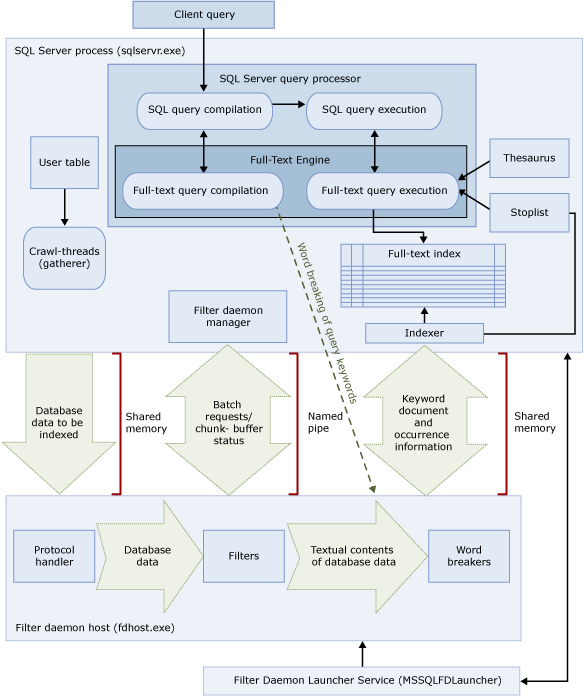

# Full-Text Search
  Full-Text Search in [!INCLUDE[ssNoVersion](../../includes/ssnoversion-md.md)] and [!INCLUDE[ssSDSfull](../../includes/sssdsfull-md.md)] lets users and applications run full-text queries against character-based data in [!INCLUDE[ssNoVersion](../../includes/ssnoversion-md.md)] tables. Before you can run full-text queries on a table, the database administrator must create a full-text index on the table. The full-text index includes one or more character-based columns in the table. These columns can have any of the following data types: `char`, `varchar`, `nchar`, `nvarchar`, `text`, `ntext`, `image`, `xml`, or `varbinary(max)` and FILESTREAM. Each full-text index indexes one or more columns from the table, and each column can use a specific language.  
  
 Full-text queries perform linguistic searches against text data in full-text indexes by operating on words and phrases based on rules of a particular language such as English or Japanese. Full-text queries can include simple words and phrases or multiple forms of a word or phrase. A full-text query returns any documents that contain at least one match (also known as a *hit*). A match occurs when a target document contains all the terms specified in the full-text query, and meets any other search conditions, such as the distance between the matching terms.  
  
> [!NOTE]  
>  Full-text search is an optional component of the [!INCLUDE[ssNoVersion](../../includes/ssnoversion-md.md)] Database Engine. For more information, see [Install SQL Server 2014](../../database-engine/install-windows/install-sql-server.md).  
  
##  <a name="benefits"></a> What Can I Do with Full-Text Search?  
 Full-text search is applicable to a wide range of business scenarios such as e-businesses-searching for items on a web site; law firms-searching for case histories in a legal-data repository; or human resources departments-matching job descriptions with stored resumes. The basic administrative and development tasks of full-text search are equivalent regardless of business scenarios. However, in a given business scenario, full-text index and queries can be honed to meet business goals. For example, for an e-business maximizing performance might be more important than ranking of results, recall accuracy (how many of the existing matches are actually returned by a full-text query), or supporting multiple languages. For a law firm, returning every possible hit (*total recall* of information) might be the most important consideration.  
  
 [In This Topic](#top)  
  
###  <a name="queries"></a> Full-Text Search Queries  
 After columns have been added to a full-text index, users and applications can run full-text queries on the text in the columns. These queries can search for any of the following:  
  
-   One or more specific words or phrases (*simple term*)  
  
-   A word or a phrase where the words begin with specified text (*prefix term*)  
  
-   Inflectional forms of a specific word (*generation term*)  
  
-   A word or phrase close to another word or phrase (*proximity term*)  
  
-   Synonymous forms of a specific word (*thesaurus*)  
  
-   Words or phrases using weighted values (*weighted term*)  
  
 Full-text queries are not case-sensitive. For example, searching for "Aluminum" or "aluminum" returns the same results.  
  
 Full-text queries use a small set of [!INCLUDE[tsql](../../../includes/tsql-md.md)] predicates (CONTAINS and FREETEXT) and functions (CONTAINSTABLE and FREETEXTTABLE). However, the search goals of a given business scenario influence the structure of the full-text queries. For example:  
  
-   e-business-searching for a product on a website:  
  
    ```  
    SELECT product_id   
    FROM products   
    WHERE CONTAINS(product_description, "Snap Happy 100EZ"  
        OR FORMSOF(THESAURUS,'Snap Happy')  
        OR '100EZ')   
    AND product_cost < 200 ;  
    ```  
  
-   Recruitment scenario-searching for job candidates that have experience working with [!INCLUDE[ssNoVersion](../../../includes/ssnoversion-md.md)]:  
  
    ```  
    SELECT candidate_name,SSN   
    FROM candidates   
    WHERE CONTAINS(candidate_resume,"SQL Server") AND candidate_division = 'DBA';  
    ```  
  
 For more information, see [Query with Full-Text Search](query-with-full-text-search.md).  
  
 [In This Topic](#top)  
  
###  <a name="like"></a> Comparing LIKE to Full-Text Search  
 In contrast to full-text search, the [LIKE](/sql/t-sql/language-elements/like-transact-sql)[!INCLUDE[tsql](../../../includes/tsql-md.md)] predicate works on character patterns only. Also, you cannot use the LIKE predicate to query formatted binary data. Furthermore, a LIKE query against a large amount of unstructured text data is much slower than an equivalent full-text query against the same data. A LIKE query against millions of rows of text data can take minutes to return; whereas a full-text query can take only seconds or less against the same data, depending on the number of rows that are returned.  
  
 [In This Topic](#top)  
  
##  <a name="architecture"></a> Components and Architecture of Full-Text Search  
 Full-text search architecture consists of the following processes:  
  
-   The [!INCLUDE[ssNoVersion](../../../includes/ssnoversion-md.md)] process (sqlservr.exe).  
  
-   The filter daemon host process (fdhost.exe).  
  
     For security reasons, filters are loaded by separate processes called the filter daemon hosts. The fdhost.exe processes are created by an FDHOST launcher service (MSSQLFDLauncher), and they run under the security credentials of the FDHOST launcher service account. Therefore, the FDHOST launcher service must be running for full-text indexing and full-text querying to work. For information about setting the service account for this service, see [Set the Service Account for the Full-text Filter Daemon Launcher](set-the-service-account-for-the-full-text-filter-daemon-launcher.md).  
  
 These two processes contain the components of the full-text search architecture. These components and their relationships are summarized in the following illustration. The components are described after the illustration.  
  
   
  
 [In This Topic](#top)  
  
###  <a name="sqlprocess"></a> SQL Server Process  
 The [!INCLUDE[ssNoVersion](../../../includes/ssnoversion-md.md)] process uses the following components for full-text search:  
  
-   **User tables.** These tables contain the data to be full-text indexed.  
  
-   **Full-text gatherer.** The full-text gatherer works with the full-text crawl threads. It is responsible for scheduling and driving the population of full-text indexes, and also for monitoring full-text catalogs.  
  
-   **Thesaurus files.** These files contain synonyms of search terms. For more information, see [Configure and Manage Thesaurus Files for Full-Text Search](configure-and-manage-thesaurus-files-for-full-text-search.md).  
  
-   **Stoplist objects.** Stoplist objects contain a list of common words that are not useful for the search. For more information, see [Configure and Manage Stopwords and Stoplists for Full-Text Search](configure-and-manage-stopwords-and-stoplists-for-full-text-search.md).  
  
-   **[!INCLUDE[ssNoVersion](../../../includes/ssnoversion-md.md)] query processor.** The query processor compiles and executes SQL queries. If a SQL query includes a full-text search query, the query is sent to the Full-Text Engine, both during compilation and during execution. The query result is matched against the full-text index.  
  
-   **Full-Text Engine.** The Full-Text Engine in [!INCLUDE[ssNoVersion](../../../includes/ssnoversion-md.md)] is fully integrated with the query processor. The Full-Text Engine compiles and executes full-text queries. As part of query execution, the Full-Text Engine might receive input from the thesaurus and stoplist.  
  
-   **Index writer (indexer).** The index writer builds the structure that is used to store the indexed tokens.  
  
-   **Filter daemon manager.** The filter daemon manager is responsible for monitoring the status of the Full-Text Engine filter daemon host.  
  
 [In This Topic](#top)  
  
###  <a name="fdhostprocess"></a> Filter Daemon Host Process  
 The filter daemon host is a process that is started by the Full-Text Engine. It runs the following full-text search components, which are responsible for accessing, filtering, and word breaking data from tables, as well as for word breaking and stemming the query input.  
  
 The components of the filter daemon host are as follows:  
  
-   **Protocol handler.** This component pulls the data from memory for further processing and accesses data from a user table in a specified database. One of its responsibilities is to gather data from the columns being full-text indexed and pass it to the filter daemon host, which will apply filtering and word breaker as required.  
  
-   **Filters.** Some data types require filtering before the data in a document can be full-text indexed, including data in `varbinary`, `varbinary(max)`, `image`, or `xml` columns. The filter used for a given document depends on its document type. For example, different filters are used for Microsoft Word (.doc) documents, Microsoft Excel (.xls) documents, and XML (.xml) documents. Then the filter extracts chunks of text from the document, removing embedded formatting and retaining the text and, potentially, information about the position of the text. The result is a stream of textual information. For more information, see [Configure and Manage Filters for Search](configure-and-manage-filters-for-search.md).  
  
-   **Word breakers and stemmers.** A word breaker is a language-specific component that finds word boundaries based on the lexical rules of a given language (*word breaking*). Each word breaker is associated with a language-specific stemmer component that conjugates verbs and performs inflectional expansions. At indexing time, the filter daemon host uses a word breaker and stemmer to perform linguistic analysis on the textual data from a given table column. The language that is associated with a table column in the full-text index determines which word breaker and stemmer are used for indexing the column. For more information, see [Configure and Manage Word Breakers and Stemmers for Search](configure-and-manage-word-breakers-and-stemmers-for-search.md).  
  
 [In This Topic](#top)  
  
##  <a name="processing"></a> Full-Text Search Processing  
 Full-text search is powered by the Full-Text Engine. The Full-Text Engine has two roles: indexing support and querying support.  
  
###  <a name="indexing"></a> Full-Text Indexing Process  
 When a full-text population (also known as a crawl) is initiated, the Full-Text Engine pushes large batches of data into memory and notifies the filter daemon host. The host filters and word breaks the data and converts the converted data into inverted word lists. The full-text search then pulls the converted data from the word lists, processes the data to remove stopwords, and persists the word lists for a batch into one or more inverted indexes.  
  
 When indexing data stored in a `varbinary(max)` or `image` column, the filter, which implements the **IFilter** interface, extracts text based on the specified file format for that data (for example, [!INCLUDE[msCoName](../../includes/msconame-md.md)] Word). In some cases, the filter components require the `varbinary(max)`, or `image` data to be written out to the filterdata folder, instead of being pushed into memory.  
  
 As part of processing, the gathered text data is passed through a word breaker to separate the text into individual tokens, or keywords. The language used for tokenization is specified at the column level, or can be identified within `varbinary(max)`, `image`, or `xml` data by the filter component.  
  
 Additional processing may be performed to remove stopwords, and to normalize tokens before they are stored in the full-text index or an index fragment.  
  
 When a population has completed, a final merge process is triggered that merges the index fragments together into one master full-text index. This results in improved query performance since only the master index needs to be queried rather than a number of index fragments, and better scoring statistics may be used for relevance ranking.  
  
 [In This Topic](#top)  
  
###  <a name="querying"></a> Full-Text Querying Process  
 The query processor passes the full-text portions of a query to the Full-Text Engine for processing. The Full-Text Engine performs word breaking and, optionally, thesaurus expansions, stemming, and stopword (noise-word) processing. Then the full-text portions of the query are represented in the form of SQL operators, primarily as streaming table-valued functions (STVFs). During query execution, these STVFs access the inverted index to retrieve the correct results. The results are either returned to the client at this point, or they are further processed before being returned to the client.  
  
 [In This Topic](#top)  
  
##  <a name="components"></a> Linguistic Components and Language Support in Full-Text Search  
 Full-text search supports almost 50 diverse languages, such as English, Spanish, Chinese, Japanese, Arabic, Bengali, and Hindi. For a complete list of the supported full-text languages, see [sys.fulltext_languages &#40;Transact-SQL&#41;](/sql/relational-databases/system-catalog-views/sys-fulltext-languages-transact-sql). Each of the columns contained in the full-text index is associated with a Microsoft Windows locale identifier (LCID) that equates to a language that is supported by full-text search. For example, LCID 1033 equates to U.S English, and LCID 2057 equates to British English. For each supported full-text language, [!INCLUDE[ssNoVersion](../../../includes/ssnoversion-md.md)] provides linguistic components that support indexing and querying full-text data that is stored in that language.  
  
 Language-specific components include the following:  
  
-   **Word breakers and stemmers.** A word breaker finds word boundaries based on the lexical rules of a given language (*word breaking*). Each word breaker is associated with a stemmer that conjugates verbs for the same language. For more information, see [Configure and Manage Word Breakers and Stemmers for Search](configure-and-manage-word-breakers-and-stemmers-for-search.md).  
  
-   **Stoplists.** A system stoplist is provided that contains a basic set stopwords (also known as noise words). A *stopword* is a word that does not help the search and is ignored by full-text queries. For example, for the English locale words such as "a", "and", "is", and "the" are considered stopwords. Typically, you will need to configure one or more thesaurus files and stoplists. For more information, see [Configure and Manage Stopwords and Stoplists for Full-Text Search](configure-and-manage-stopwords-and-stoplists-for-full-text-search.md).  
  
-   **Thesaurus files.** [!INCLUDE[ssNoVersion](../../../includes/ssnoversion-md.md)] also installs a thesaurus file for each full-text language, as well as a global thesaurus file. The installed thesaurus files are essentially empty, but you can edit them to define synonyms for a specific language or business scenario. By developing a thesaurus tailored to your full-text data, you can effectively broaden the scope of full-text queries on that data. For more information, see [Configure and Manage Thesaurus Files for Full-Text Search](configure-and-manage-thesaurus-files-for-full-text-search.md).  
  
-   **Filters (iFilters).**  Indexing a document in a `varbinary(max)`, `image`, or `xml` data type column requires a filter to perform extra processing. The filter must be specific to the document type (.doc, .pdf, .xls, .xml, and so forth). For more information, see [Configure and Manage Filters for Search](configure-and-manage-filters-for-search.md).  
  
 Word breakers (and stemmers) and filters run in the filter daemon host process (fdhost.exe).  
  
 [In This Topic](#top)  
  
##  <a name="reltasks"></a> Related Tasks  
  
-   [Get Started with Full-Text Search](get-started-with-full-text-search.md)  
  
-   Writing Full-Text Queries  
  
    -   [Query with Full-Text Search](query-with-full-text-search.md)  
  
    -   [Search for Words Close to Another Word with NEAR](search-for-words-close-to-another-word-with-near.md)  
  
    -   [Limit Search Results with RANK](limit-search-results-with-rank.md)  
  
    -   [Improve the Performance of Full-Text Queries](improve-the-performance-of-full-text-queries.md)  
  
    -   [Search Document Properties with Search Property Lists](search-document-properties-with-search-property-lists.md)  
  
    -   [Find Property Set GUIDs and Property Integer IDs for Search Properties](find-property-set-guids-and-property-integer-ids-for-search-properties.md)  
  
-   Managing Catalogs and Indexes  
  
    -   [Create and Manage Full-Text Catalogs](create-and-manage-full-text-catalogs.md)  
  
    -   [Create and Manage Full-Text Indexes](create-and-manage-full-text-indexes.md)  
  
    -   [Choose a Language When Creating a Full-Text Index](choose-a-language-when-creating-a-full-text-index.md)  
  
    -   [Populate Full-Text Indexes](populate-full-text-indexes.md)  
  
    -   [Manage Full-Text Indexes](../../database-engine/manage-full-text-indexes.md)  
  
    -   [Improve the Performance of Full-Text Indexes](improve-the-performance-of-full-text-indexes.md)  
  
    -   [Troubleshoot Full-Text Indexing](troubleshoot-full-text-indexing.md)  
  
    -   [Back Up and Restore Full-Text Catalogs and Indexes](back-up-and-restore-full-text-catalogs-and-indexes.md)  
  
-   Managing the Linguistic Components  
  
    -   [Configure and Manage Filters for Search](configure-and-manage-filters-for-search.md)  
  
    -   [Configure and Manage Word Breakers and Stemmers for Search](configure-and-manage-word-breakers-and-stemmers-for-search.md)  
  
    -   [View or Change Registered Filters and Word Breakers](view-or-change-registered-filters-and-word-breakers.md)  
  
    -   [Revert the Word Breakers Used by Search to the Previous Version](revert-the-word-breakers-used-by-search-to-the-previous-version.md)  
  
    -   [Change the Word Breaker Used for US English and UK English](change-the-word-breaker-used-for-us-english-and-uk-english.md)  
  
    -   [Customize the Behavior of Word Breakers with a Custom Dictionary](customize-the-behavior-of-word-breakers-with-a-custom-dictionary.md)  
  
    -   [Configure and Manage Stopwords and Stoplists for Full-Text Search](configure-and-manage-stopwords-and-stoplists-for-full-text-search.md)  
  
    -   [Configure and Manage Thesaurus Files for Full-Text Search](configure-and-manage-thesaurus-files-for-full-text-search.md)  
  
-   Managing Full-Text Search  
  
    -   [Manage and Monitor Full-Text Search for a Server Instance](manage-and-monitor-full-text-search-for-a-server-instance.md)  
  
    -   [Set the Service Account for the Full-text Filter Daemon Launcher](set-the-service-account-for-the-full-text-filter-daemon-launcher.md)  
  
-   [Upgrade Full-Text Search](upgrade-full-text-search.md)  
  
 [In This Topic](#top)  
  
##  <a name="relcontent"></a> Related Content  
  
-   [Full-Text Search DDL, Functions, Stored Procedures, and Views](../views/views.md)  
  
 [In This Topic](#top)  
  
  
