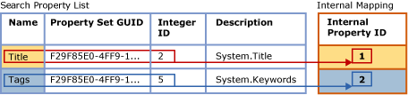

# Search Document Properties with Search Property Lists
  The content of document properties was previously indistinguishable from the content of the document body. This limitation restricted full-text queries to generic searches on whole documents. Now, however, you can configure a full-text index to support property-scoped searching on particular properties, such as Author and Title, for supported document types in a `varbinary`, `varbinary(max)` (including `FILESTREAM`), or `image` binary data column. This form of searching is known as *property searching*.  
  
 The associated [filter](configure-and-manage-filters-for-search.md) (IFilter) determines whether property searching is possible on a specific type of document. For some document types, the associated IFilter extracts some or all of the properties defined for that type of document, as well as the content of the document body. You can configure a full-text index to support property searching only on properties that are extracted by an IFilter during full-text indexing. Among IFilters that extract a number of document properties are the IFilters for Microsoft Office document types (such as .docx, .xlsx, and .pptx). On the other hand, the XML IFilter does not emit properties.  
  
##  <a name="How_FTS_Works_with_search_properties"></a> How Full-Text Search Works with Search Properties  
  
### Internal Property IDs  
 The Full-Text Engine arbitrarily assigns each registered property an internal property ID, which uniquely identifies the property in that particular search list and which is specific to that search property list. Therefore, if a property is added to multiple search property lists, its internal property ID is likely to differ between different lists.  
  
 When a property is registered for a search list, the Full-Text Engine arbitrarily assigns an *internal property ID* to the property. The internal property ID is an integer that uniquely identifies the property in that search property list.  
  
 The following illustration shows a logical view of a search property list that specifies two properties, Title and Keywords. The property-list name for Keywords is "Tags". These properties belong to the same property set, whose GUID is F29F85E0-4FF9-1068-AB91-08002B27B3D9. The property integer identifiers are 2 for Title and 5 for Tags (Keywords). The Full-Text Engine arbitrarily maps each property to an internal property ID that is unique to the search property list. The internal property ID for the Title property is 1, and the internal property ID for the Tags property is 2.  
  
   
  
 The internal property ID is likely to be different from the property integer identifier of the property. If a given property is registered for multiple search property lists, a different internal property ID might be assigned for each search property list. For example, the internal property ID might be 4 in one search property list, 1 in another, 3 in another, and so on. In contrast, the property integer identifier is intrinsic to the property, and it remains the same wherever the property is used.  
  
  
  
### Indexing of Registered Properties  
 After a full-text index is associated with a search property list, the index must be repopulated to index property-specific search terms. During full-text indexing, the contents of all properties are stored in the full-text index along with other content. However, when indexing a search term found in a registered property, the full-text indexer also stores the corresponding internal property ID with the term. In contrast, if a property is not registered, it is stored in the full-text index as if it were part of the document body, and it has a value of zero for the internal property ID.  
  
 The following illustration shows a logical view of how search terms appear in a full-text index that is associated with the search property list shown in the preceding illustration. A sample document, Document 1 contains three properties-Title, Author, and Keywords-as well as the document body. For the properties Title and Keywords, which are specified in the search property list, search terms are associated with their corresponding internal property IDs in the full-text index. In contrast, the content of the Author property is indexed as if it were part of the document body. This means registering a property increases the size of the full-text index somewhat, depending on the amount of content stored in the property.  
  
   
  
 Search terms in the Title property-"Favorite," "Biking," and "Trails"-are associated with the internal property ID assigned to Title for this index, 1. Search terms in the Keywords property-"biking" and "mountain"-are associated with the internal property ID assigned to Tags for this index, 2. For search terms n the Author property-"Jane" and "Doe"-and search terms in the document body, the internal property ID is 0. Note that the term "biking" occurs in the Title property, in the Keywords (Tags) property, and in the document body. A property search for "biking" in the Title or Keywords (Tags) property would return this document in the results. A generic full-text query for "biking" would also return this document, just as if the index were not configured for property searching. A property search for "biking" in the Author property would not return this document.  
  
 A property-scoped full-text query uses the internal property IDs registered for the current search property list of the full-text index.  
  
  
  
##  <a name="impact"></a> Impact of Enabling Property Searching  
 Configuring a full-text index to support searching on one or more properties increases the size of the index somewhat, depending on the number of properties you specify in your search property list and on the content of each property.  
  
 In testing typical corpuses of Microsoft Word<sup>??</sup>, Excel<sup>??</sup>, and PowerPoint<sup>??</sup> documents, we configured a full-text index to index typical search properties. Indexing these properties increased the size of the full-text index size by approximately 5 percent. We anticipate that this approximate size increase will to be typical for most document corpuses. However, ultimately, the size increase will depend on the amount of property data in a given document corpus relative to the amount of overall data.  
  
  
  
##  <a name="creating"></a> Creating a Search Property List and Enabling Property Search  
  
###  <a name="creating_sub"></a> Creating a Search Property List  
 **To create a search property list with Transact-SQL**  
  
 Use the [CREATE SEARCH PROPERTY LIST &#40;Transact-SQL&#41;](/sql/t-sql/statements/create-search-property-list-transact-sql) statement and provide at least a name the list.  
  
##### To create a search property list in Management Studio  
  
1.  In Object Explorer, expand the server.  
  
2.  Expand **Databases**, and then expand the database in which you want to create the search property list.  
  
3.  Expand **Storage**, and then right-click **Search Property Lists**.  
  
4.  Select **New Search Property List**.  
  
5.  Specify the property list name.  
  
6.  Optionally, specify someone else as the property list owner.  
  
7.  Select one of the following options:  
  
    -   **Create an empty search property list**  
  
    -   **Create from an existing search property list**  
  
     For more information, see [New Search Property List](../../database-engine/new-search-property-list.md).  
  
8.  [!INCLUDE[clickOK](../../../includes/clickok-md.md)]  
  
 
  
###  <a name="adding"></a> Adding Properties to a Search Property List  
 Property searching requires creating a *search property list* and specifying one or more properties that you want to make searchable. When you add a property to a search property list, the property is registered for that particular list. To add a property to a search property list you need the following values:  
  
-   Property set GUID  
  
     Each search property belongs to single property set that contains a group of related properties. Each property set is identified by a globally unique identifier (GUID).  
  
-   Property integer identifier  
  
     Each search property possesses an identifier that is unique within the property set. Note that for a given property, the identifier could be either an integer or a string, however full-text search supports only integer identifiers.  
  
-   Property name  
  
     This is the name that users will specify in full-text queries to search on the property. A property name can contain internal spaces. The maximum length is 256 characters.  
  
     The property name can be any of the following:  
  
    -   The Windows canonical name of the property, such as `System.Author` or `System.Contact.HomeAddress`.  
  
    -   A user-friendly name that is easy for your users to remember. Some properties are associated with a well-known user-friendly name, such as "Author" or "Home Address," but you can specify whatever name is most appropriate to your users.  
  
    > [!NOTE]  
    >  A given combination of property set GUID and property identifier must be unique in a given search property list. This means that you cannot add the same property more than once with different names or descriptions.  
  
-   Property description (optional)  
  
     When adding a search property to a search property list, you can supply an optional description. For example, you might want to provide information about a property that is not evident from its name, or you might want to describe the property set of the property.  
  
 **To obtain values for a search property list**  
  
 See [Find Property Set GUIDs and Property Integer IDs for Search Properties](find-property-set-guids-and-property-integer-ids-for-search-properties.md).  
  
 **To add a property to a search property list with Transact-SQL**  
  
 Use the [ALTER SEARCH PROPERTY LIST &#40;Transact-SQL&#41;](/sql/t-sql/statements/alter-search-property-list-transact-sql) statement with the values that you obtained by using one of the methods described in the topic, [Find Property Set GUIDs and Property Integer IDs for Search Properties](find-property-set-guids-and-property-integer-ids-for-search-properties.md).  
  
 The following example demonstrates the use of these values when adding a property to a search property list:  
  
```  
ALTER SEARCH PROPERTY LIST DocumentTablePropertyList  
   ADD 'Title'  
   WITH ( PROPERTY_SET_GUID = 'F29F85E0-4FF9-1068-AB91-08002B27B3D9', PROPERTY_INT_ID = 2,   
      PROPERTY_DESCRIPTION = 'System.Title - Title of the item.' );  
```  
  
 **To add a property to a search property list in Management Studio**  
  
 Use the **Search Property List Properties** dialog box to add and remove search properties. You can find **Search Property Lists** in Object Explorer under the **Storage** node of the associated database.  
  
  
  
###  <a name="associating"></a> Associating a Search Property List with a Full-Text Index  
 For a full-text index to support property searching on the properties that are registered for a search property list, you need to associate the search property list with the index and repopulate the index. Repopulating the full-text index creates property-specific index entries for search terms in each of the registered properties.  
  
 As long as the full-text index remains associated with this search property list, full-text query can use the PROPERTY option of the CONTAINS predicate to search on properties that are registered for that search property list.  
  
 If you change the search property list associated with a full-text index, then the index must be rebuilt to bring it into a consistent state. The index is truncated immediately and is empty until the full population runs. For more information about when changing the search property list causes rebuilding the index, see "Remarks," in [ALTER FULLTEXT INDEX &#40;Transact-SQL&#41;](/sql/t-sql/statements/alter-fulltext-index-transact-sql).  
  
 **To associate a search property list with a full-text index with Transact-SQL**  
  
 Use the [ALTER FULLTEXT INDEX &#40;Transact-SQL&#41;](/sql/t-sql/statements/alter-fulltext-index-transact-sql) statement with the `SET SEARCH PROPERTY LIST = <property_list_name>` clause.  
  
 **To associate a search property list with a full-text index with Management Studio**  
  
 Specify a value for **Search Property List** on the **General** page of the **Full-Text Index Properties** dialog box.  
  
  
  
##  <a name="Ov_CONTAINS_using_PROPERTY"></a> Querying Search Properties with CONTAINS  
 The basic [CONTAINS](/sql/t-sql/queries/contains-transact-sql) syntax for a property-scoped full-text query is as follows:  
  
```tsql  
SELECT column_name FROM table_name  
  WHERE CONTAINS ( PROPERTY ( column_name, 'property_name' ), '<contains_search_condition>' )  
```  
  
 For example, the following query searches on an indexed property, `Title`, in the `Document` column of the `Production.Document` table of the `AdventureWorks` database. The query returns only documents whose `Title` property contains the string `Maintenance` or `Repair`  
  
```  
USE AdventureWorks  
GO  
SELECT Document FROM Production.Document  
  WHERE CONTAINS ( PROPERTY ( Document, 'Title' ), 'Maintenance OR Repair')  
GO  
```  
  
 This example assumes that the IFilter for the document extracts its Title property, that the Title property is added to the search property list, and that the search property list is associated with the full-text index.  
  
  
  
##  <a name="managing"></a> Managing Search Property Lists  
  
###  <a name="viewing"></a> Viewing and Changing a Search Property List  
 **To change a search property list with Transact-SQL**  
  
 Use the [ALTER SEARCH PROPERTY LIST &#40;Transact-SQL&#41;](/sql/t-sql/statements/alter-search-property-list-transact-sql) statement to add or remove search properties.  
  
##### To view and change a search property list in Management Studio  
  
1.  In Object Explorer, expand the server.  
  
2.  Expand **Databases**, and then expand the database.  
  
3.  Expand **Storage**.  
  
4.  Expand **Search Property Lists** to display the search property lists.  
  
5.  Right-click the property list, and select **Properties**.  
  
6.  In the **Search Property List Editor** dialog box, use the Properties grid to add or remove search properties:  
  
    1.  To remove a document property, click the row header to the left of the property, and press DEL .  
  
    2.  To add a document property, click in the empty row at the bottom of the list, to the right of the **\***, and enter the values for the new property.  
  
         For information about these values, see [Search Property List Editor](../../../2014/database-engine/search-property-list-editor.md). For information about how to obtain these values for properties defined by Microsoft, see [Find Property Set GUIDs and Property Integer IDs for Search Properties](find-property-set-guids-and-property-integer-ids-for-search-properties.md). For information about properties defined by an independent software vendor (ISV), see the documentation of that vendor.  
  
7.  [!INCLUDE[clickOK](../../../includes/clickok-md.md)]  
  
  
  
###  <a name="deleting"></a> Deleting a Search Property List  
 You cannot drop a property list from a database while the list is associated with any full-text index.  
  
 **To delete a search property list with Transact-SQL**  
  
 Use the [DROP SEARCH PROPERTY LIST &#40;Transact-SQL&#41;](/sql/t-sql/statements/drop-search-property-list-transact-sql) statement.  
  
##### To delete a search property list in Management Studio  
  
1.  In Object Explorer, expand the server.  
  
2.  Expand **Databases**, and then expand the database.  
  
3.  Expand **Storage**, and then expand the **Search Property Lists** node.  
  
4.  Right-click the property list that you want to delete, and click **Delete**.  
  
5.  [!INCLUDE[clickOK](../../../includes/clickok-md.md)]  

  
## See Also  
 [Find Property Set GUIDs and Property Integer IDs for Search Properties](find-property-set-guids-and-property-integer-ids-for-search-properties.md)   
 [Configure and Manage Filters for Search](configure-and-manage-filters-for-search.md)  
  
  
