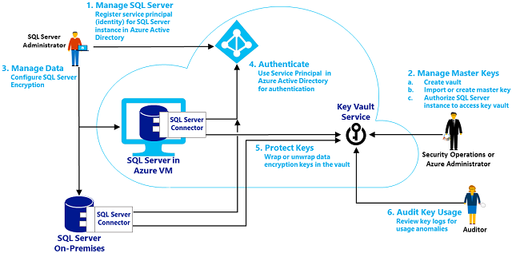

# Extensible Key Management Using Azure Key Vault (SQL Server)
  The [!INCLUDE[ssNoVersion](../../../includes/ssnoversion-md.md)] Connector for [!INCLUDE[msCoName](../../../includes/msconame-md.md)] Azure Key Vault enables [!INCLUDE[ssNoVersion](../../../includes/ssnoversion-md.md)] encryption to leverage the Azure Key Vault service as an [Extensible Key Management &#40;EKM&#41;](extensible-key-management-ekm.md) provider to protect its encryption keys.  
  
 Included in this topic:  
  
-   [Uses of EKM](#Uses)  
  
-   [Step 1: Setting up the Key Vault for use by SQL Server](#Step1)  
  
-   [Step 2: Installing the SQL Server Connector](#Step2)  
  
-   [Step 3: Configure SQL Server to use an EKM provider for the Key Vault](#Step3)  
  
-   [Example A: Transparent Data Encryption by Using an Asymmetric Key from the Key Vault](#ExampleA)  
  
-   [Example B: Encrypting Backups by Using an Asymmetric Key from the Key Vault](#ExampleB)  
  
-   [Example C: Column Level Encryption by Using an Asymmetric Key from the Key Vault](#ExampleC)  
  
##  <a name="Uses"></a> Uses of EKM  
 An organization can use [!INCLUDE[ssNoVersion](../../../includes/ssnoversion-md.md)] encryption to protect sensitive data. [!INCLUDE[ssNoVersion](../../../includes/ssnoversion-md.md)] encryption includes [Transparent Data Encryption &#40;TDE&#41;](transparent-data-encryption.md), [Column Level Encryption](/sql/t-sql/functions/cryptographic-functions-transact-sql) (CLE), and [Backup Encryption](../../backup-restore/backup-encryption.md). In all of these cases the data is encrypted using a symmetric data encryption key. The symmetric data encryption key is further protected by encrypting it with a hierarchy of keys stored in [!INCLUDE[ssNoVersion](../../../includes/ssnoversion-md.md)]. Alternatively, the EKM provider architecture enables [!INCLUDE[ssNoVersion](../../../includes/ssnoversion-md.md)] to protect the data encryption keys by using an asymmetric key stored outside of [!INCLUDE[ssNoVersion](../../../includes/ssnoversion-md.md)] in an external cryptographic provider. Using EKM provider architecture adds an additional layer of security and allows organizations to separate the management of keys and data.  
  
 The [!INCLUDE[ssNoVersion](../../../includes/ssnoversion-md.md)] Connector for Azure Key Vault lets [!INCLUDE[ssNoVersion](../../../includes/ssnoversion-md.md)] leverage the scalable, high performance, and highly available key vault service as an EKM provider for encryption key protection. The key vault service can be used with [!INCLUDE[ssNoVersion](../../../includes/ssnoversion-md.md)] installations on [!INCLUDE[msCoName](../../../includes/msconame-md.md)] Azure Virtual Machines and for on-premises servers. The key vault service also provides the option to use tightly controlled and monitored Hardware Security Modules (HSMs) for a higher level of protection for asymmetric encryption keys. For more information about the key vault, see [Azure Key Vault](https://go.microsoft.com/fwlink/?LinkId=521401).  
  
 The following image summarizes the process flow of EKM using the key vault. The process step numbers in the image are not meant to match the setup step numbers that follow the image.  
  
   
  
##  <a name="Step1"></a> Step 1: Set up the Key Vault for use by SQL Server  
 Use the following steps to set up a key vault for use with the [!INCLUDE[ssDEnoversion](../../../includes/ssdenoversion-md.md)] for encryption key protection. A vault may already be in use for the organization. When a vault does not exist, the Azure Administrator in your organization that is designated to manage encryption keys can create a vault, generate an asymmetric key in the vault, and then authorize [!INCLUDE[ssNoVersion](../../../includes/ssnoversion-md.md)] to use the key. To familiarize yourself with the key vault service review [Get Started with Azure Key Vault](https://go.microsoft.com/fwlink/?LinkId=521402), and the PowerShell [Azure Key Vault Cmdlets](https://docs.microsoft.com/powershell/module/azurerm.keyvault/?view=azurermps-6.13.0) reference.  
  
> [!IMPORTANT]  
>  If you have multiple Azure subscriptions, you must use the subscription that contains [!INCLUDE[ssNoVersion](../../../includes/ssnoversion-md.md)].  
  
1.  **Create a vault:** Create a vault by using the instructions in the **Create a key vault** section of [Get Started with Azure Key Vault](https://go.microsoft.com/fwlink/?LinkId=521402). Record the name of the vault. This topic uses **ContosoKeyVault** as the key vault name.  
  
2.  **Generate an asymmetric key in the vault:** The asymmetric key in the key vault is used to protect [!INCLUDE[ssNoVersion](../../../includes/ssnoversion-md.md)] encryption keys. Only the public portion of the asymmetric key ever leaves the vault, the private portion is never exported by the vault. All cryptographic operations using the asymmetric key are delegated to the Azure Key Vault, and are protected by the key vault security.  
  
     There are several ways that you can generate an asymmetric key and store it in the vault. You can externally generate a key, and import the key into the vault as a .pfx file. Or create the key directly in the vault by using the key vault APIs.  
  
     The [!INCLUDE[ssNoVersion](../../../includes/ssnoversion-md.md)] Connector requires the asymmetric keys to be 2048-bit RSA, and the key name can only use the characters "a-z", "A-Z", "0-9", and "-". In this document the name of the asymmetric key is referred to as **ContosoMasterKey**. Replace this with the unique name you use for the key.  
  
    > [!IMPORTANT]  
    >  Importing the asymmetric key is highly recommended for production scenarios because it allows the administrator to escrow the key in a key escrow system. If the asymmetric key is created in the vault, it cannot be escrowed because the private key can never leave the vault. Keys used to protect critical data should be escrowed. The loss of an asymmetric key will result in permanently unrecoverable data.  
  
    > [!IMPORTANT]  
    >  The key vault supports multiple versions of the same named key. Keys to be used by [!INCLUDE[ssNoVersion](../../../includes/ssnoversion-md.md)] Connector should not be versioned or rolled. If the administrator wants to roll the key used for [!INCLUDE[ssNoVersion](../../../includes/ssnoversion-md.md)] encryption, a new key with a different name should be created in the vault and used to encrypt the DEK.  
  
     For more information on how to import a key into the key vault or to create a key in the key vault (not recommended for a production environment), see the **Add a key or secret to the key vault** section in [Get Started with Azure Key Vault](https://go.microsoft.com/fwlink/?LinkId=521402).  
  
3.  **Get Azure Active Directory Service Principals to use for SQL Server:** When the organization signs up for a Microsoft cloud service, it gets an Azure Active Directory. Create **Service Principals** in the Azure Active Directory for [!INCLUDE[ssNoVersion](../../../includes/ssnoversion-md.md)] to use (to authenticate itself to Azure Active Directory) while accessing the key vault.  
  
    -   One **Service Principal** will be needed by a [!INCLUDE[ssNoVersion](../../../includes/ssnoversion-md.md)] administrator to access the vault while configuring [!INCLUDE[ssNoVersion](../../../includes/ssnoversion-md.md)] to use encryption.  
  
    -   Another **Service Principal** will be needed by the [!INCLUDE[ssDEnoversion](../../../includes/ssdenoversion-md.md)] to access the vault for unwrapping keys used in [!INCLUDE[ssNoVersion](../../../includes/ssnoversion-md.md)] encryption.  
  
     For more information about how to register an application and generate a service principal, see the **Register an Application with Azure Active Directory** section in [Get Started with Azure Key Vault](https://go.microsoft.com/fwlink/?LinkId=521402). The registration process returns an **Application ID** (also known as a **CLIENT ID**) and a **Authentication Key** (also known as a **Secret**) for each Azure Active Directory **Service Principal**. When used in the `CREATE CREDENTIAL` statement, the hyphen must be removed from the **CLIENT ID**. Record these for use in the scripts below:  
  
    -   **Service Principal** for a **sysadmin** login: **CLIENTID_sysadmin_login** and **SECRET_sysadmin_login**  
  
    -   **Service Principal** for the [!INCLUDE[ssDEnoversion](../../../includes/ssdenoversion-md.md)]: **CLIENTID_DBEngine** and **SECRET_DBEngine**.  
  
4.  **Grant Permission for the Service Principals to access the Key Vault:** Both the **CLIENTID_sysadmin_login** and **CLIENTID_DBEngineService Principals** require the **get**, **list**, **wrapKey**, and **unwrapKey** permissions in the key vault. If you intend to create keys through [!INCLUDE[ssNoVersion](../../../includes/ssnoversion-md.md)] you also need to grant the **create** permission in key vault.  
  
    > [!IMPORTANT]  
    >  Users must have at least the **wrapKey** and **unwrapKey** operations for the key vault.  
  
     For more information about granting permissions to the vault, see the **Authorize the application to use the key or secret** section in [Get Started with Azure Key Vault](https://go.microsoft.com/fwlink/?LinkId=521402).  
  
     Links to Azure Key Vault documentation  
  
    -   [What is Azure Key Vault?](https://go.microsoft.com/fwlink/?LinkId=521401)  
  
    -   [Get Started with Azure Key Vault](https://go.microsoft.com/fwlink/?LinkId=521402)  
  
    -   PowerShell [Azure Key Vault Cmdlets](https://go.microsoft.com/fwlink/?LinkId=521403) reference  
  
##  <a name="Step2"></a> Step 2: Install the SQL Server Connector  
 The [!INCLUDE[ssNoVersion](../../../includes/ssnoversion-md.md)] Connector is downloaded and installed by the administrator of the [!INCLUDE[ssNoVersion](../../../includes/ssnoversion-md.md)] computer. The [!INCLUDE[ssNoVersion](../../../includes/ssnoversion-md.md)] Connector is available as a download from the [Microsoft Download Center](https://go.microsoft.com/fwlink/p/?LinkId=521700).  Search for **SQL Server Connector for Microsoft Azure Key Vault**, review the details, system requirements and install instructions and choose to download the connector and start the installation using **Run**. Review the license and accept the license and continue.  
  
 By default the connector is installed at **C:\Program Files\SQL Server Connector for Microsoft Azure Key Vault**. This location can be changed during setup. (If changed, adjust the scripts below.)  
  
 On completing the install, the following are installed on the machine:  
  
-   **Microsoft.AzureKeyVaultService.EKM.dll**: This is the cryptographic EKM provider DLL that needs to be registered with [!INCLUDE[ssNoVersion](../../../includes/ssnoversion-md.md)] by using the CREATE CRYPTOGRAPHIC PROVIDER statement.  
  
-   **Azure Key Vault SQL Server Connector**: This is a Windows service that enables the cryptographic EKM provider to communicate with the key vault.  
  
 The [!INCLUDE[ssNoVersion](../../../includes/ssnoversion-md.md)] Connector installation also allows you to optionally download sample scripts for [!INCLUDE[ssNoVersion](../../../includes/ssnoversion-md.md)] encryption.  
  
##  <a name="Step3"></a> Step 3: Configure SQL Server to use an EKM provider for the Key Vault  
  
###  <a name="Permissions"></a> Permissions  
 To complete this entire process requires CONTROL SERVER permission or membership in the **sysadmin** fixed server role. Specific actions require the following permissions:  
  
-   To create a cryptographic provider, requires CONTROL SERVER permission or membership in the **sysadmin** fixed server role.  
  
-   To change a configuration option and run the RECONFIGURE statement, you must be granted the ALTER SETTINGS server-level permission. The ALTER SETTINGS permission is implicitly held by the **sysadmin** and **serveradmin** fixed server roles.  
  
-   To create a credential, requires ALTER ANY CREDENTIAL permission.  
  
-   To add a credential to a login, requires ALTER ANY LOGIN permission.  
  
-   To create an asymmetric key, requires CREATE ASYMMETRIC KEY permission.  
  
###  <a name="TsqlProcedure"></a> To configure SQL Server to use a cryptographic provider  
  
1.  Configure the [!INCLUDE[ssDE](../../../includes/ssde-md.md)] to use EKM, and register (create) the cryptographic provider with [!INCLUDE[ssNoVersion](../../../includes/ssnoversion-md.md)].  
  
    ```  
    -- Enable advanced options.  
    USE master;  
    GO  
  
    sp_configure 'show advanced options', 1 ;  
    GO  
    RECONFIGURE ;  
    GO  
    -- Enable EKM provider  
    sp_configure 'EKM provider enabled', 1 ;  
    GO  
    RECONFIGURE ;  
    GO  
  
    -- Create a cryptographic provider, using the SQL Server Connector  
    -- which is an EKM provider for the Azure Key Vault. This example uses   
    -- the name AzureKeyVault_EKM_Prov.  
  
    CREATE CRYPTOGRAPHIC PROVIDER AzureKeyVault_EKM_Prov   
    FROM FILE = 'C:\Program Files\SQL Server Connector for Microsoft Azure Key Vault\Microsoft.AzureKeyVaultService.EKM.dll';  
    GO   
    ```  
  
2.  Setup a [!INCLUDE[ssNoVersion](../../../includes/ssnoversion-md.md)] credential for a [!INCLUDE[ssNoVersion](../../../includes/ssnoversion-md.md)] administrator login to use the key vault in order to setup and manage [!INCLUDE[ssNoVersion](../../../includes/ssnoversion-md.md)] encryption scenarios.  
  
    > [!IMPORTANT]  
    >  The **IDENTITY** argument of `CREATE CREDENTIAL` requires the key vault name. The **SECRET** argument of `CREATE CREDENTIAL` requires the *\<Client ID>* (without hyphens) and *\<Secret>* to be passed together without a space between them.  
  
     In the following example, the **Client ID** (`EF5C8E09-4D2A-4A76-9998-D93440D8115D`) is stripped of the hyphens and entered as the string `EF5C8E094D2A4A769998D93440D8115D` and the **Secret** is represented by the string *SECRET_sysadmin_login*.  
  
    ```  
    USE master;  
    CREATE CREDENTIAL sysadmin_ekm_cred   
        WITH IDENTITY = 'ContosoKeyVault',   
        SECRET = 'EF5C8E094D2A4A769998D93440D8115DSECRET_sysadmin_login'   
    FOR CRYPTOGRAPHIC PROVIDER AzureKeyVault_EKM_Prov ;  
  
    -- Add the credential to the SQL Server administrators domain login   
    ALTER LOGIN [<domain>/<login>]  
    ADD CREDENTIAL sysadmin_ekm_cred;  
    ```  
  
     For an example of using variables for the `CREATE CREDENTIAL` arguments and programmatically removing the hyphens from the Client ID, see [CREATE CREDENTIAL &#40;Transact-SQL&#41;](/sql/t-sql/statements/create-credential-transact-sql).  
  
3.  If you imported an asymmetric key as described earlier in step 1, section 3, open the key by providing your key name in the following example.  
  
    ```  
    CREATE ASYMMETRIC KEY CONTOSO_KEY   
    FROM PROVIDER [AzureKeyVault_EKM_Prov]  
    WITH PROVIDER_KEY_NAME = 'ContosoMasterKey',  
    CREATION_DISPOSITION = OPEN_EXISTING;  
    ```  
  
     Though not recommended for production (because the key cannot be exported), it is possible to create an asymmetric key directly in the vault from [!INCLUDE[ssNoVersion](../../../includes/ssnoversion-md.md)]. If you did not import a key earlier, then create an asymmetric key in the key vault for testing by using the following script. Execute the script, using a login provisioned with the **sysadmin_ekm_cred** credential.  
  
    ```  
    CREATE ASYMMETRIC KEY CONTOSO_KEY   
    FROM PROVIDER [AzureKeyVault_EKM_Prov]  
    WITH ALGORITHM = RSA_2048,  
    PROVIDER_KEY_NAME = 'ContosoMasterKey';  
    ```  
  
> [!TIP]  
>  Users receiving the error **Cannot export public key from the provider. Provider error code: 2053.** should check their **get**, **list**, **wrapKey**, and **unwrapKey** permissions in the key vault.  
  
 For more information, see the following:  
  
-   [sp_configure &#40;Transact-SQL&#41;](/sql/relational-databases/system-stored-procedures/sp-configure-transact-sql)  
  
-   [CREATE CRYPTOGRAPHIC PROVIDER &#40;Transact-SQL&#41;](/sql/t-sql/statements/create-cryptographic-provider-transact-sql)  
  
-   [CREATE CREDENTIAL &#40;Transact-SQL&#41;](/sql/t-sql/statements/create-credential-transact-sql)  
  
-   [CREATE ASYMMETRIC KEY &#40;Transact-SQL&#41;](/sql/t-sql/statements/create-asymmetric-key-transact-sql)  
  
-   [CREATE LOGIN &#40;Transact-SQL&#41;](/sql/t-sql/statements/create-login-transact-sql)  
  
-   [ALTER LOGIN &#40;Transact-SQL&#41;](/sql/t-sql/statements/alter-login-transact-sql)  
  
## Examples  
  
###  <a name="ExampleA"></a> Example A: Transparent Data Encryption by Using an Asymmetric Key from the Key Vault  
 After completing the steps above, create a credential and a login, create a database encryption key protected by the asymmetric key in the key vault. Use the database encryption key to encrypt a database with TDE.  
  
 To encrypt a database requires CONTROL permission on the database.  
  
##### To enable TDE using EKM and the Key Vault  
  
1.  Create a [!INCLUDE[ssNoVersion](../../../includes/ssnoversion-md.md)] credential for the [!INCLUDE[ssDE](../../../includes/ssde-md.md)] to use when accessing the key vault EKM during database load.  
  
    > [!IMPORTANT]  
    >  The **IDENTITY** argument of `CREATE CREDENTIAL` requires the key vault name. The **SECRET** argument of `CREATE CREDENTIAL` requires the *\<Client ID>* (without hyphens) and *\<Secret>* to be passed together without a space between them.  
  
     In the following example, the **Client ID** (`EF5C8E09-4D2A-4A76-9998-D93440D8115D`) is stripped of the hyphens and entered as the string `EF5C8E094D2A4A769998D93440D8115D` and the **Secret** is represented by the string *SECRET_DBEngine*.  
  
    ```  
    USE master;  
    CREATE CREDENTIAL Azure_EKM_TDE_cred   
        WITH IDENTITY = 'ContosoKeyVault',   
        SECRET = 'EF5C8E094D2A4A769998D93440D8115DSECRET_DBEngine'   
        FOR CRYPTOGRAPHIC PROVIDER AzureKeyVault_EKM_Prov ;  
    ```  
  
2.  Create a [!INCLUDE[ssNoVersion](../../../includes/ssnoversion-md.md)] login to be used by the [!INCLUDE[ssDE](../../../includes/ssde-md.md)] for TDE, and add the credential to it. This example uses the CONTOSO_KEY asymmetric key stored in the key vault, which was imported or created earlier for the master database, as described in [Step 3, section 3](#Step3) above.  
  
    ```  
    USE master;  
    -- Create a SQL Server login associated with the asymmetric key   
    -- for the Database engine to use when it loads a database   
    -- encrypted by TDE.  
    CREATE LOGIN TDE_Login   
    FROM ASYMMETRIC KEY CONTOSO_KEY;  
    GO   
  
    -- Alter the TDE Login to add the credential for use by the   
    -- Database Engine to access the key vault  
    ALTER LOGIN TDE_Login   
    ADD CREDENTIAL Azure_EKM_TDE_cred ;  
    GO  
    ```  
  
3.  Create the database encryption key (DEK) that will be used for TDE. The DEK can be created using any SQL Server supported algorithm or key length. The DEK will be protected by the asymmetric key in the key vault.  
  
     This example uses the CONTOSO_KEY asymmetric key stored in the key vault, which was imported or created earlier, as described in [Step 3, section 3](#Step3) above.  
  
    ```  
    USE ContosoDatabase;  
    GO  
  
    CREATE DATABASE ENCRYPTION KEY   
    WITH ALGORITHM = AES_128   
    ENCRYPTION BY SERVER ASYMMETRIC KEY CONTOSO_KEY;  
    GO  
  
    -- Alter the database to enable transparent data encryption.  
    ALTER DATABASE ContosoDatabase   
    SET ENCRYPTION ON ;  
    GO  
    ```  
  
     For more information, see the following:  
  
    -   [CREATE DATABASE ENCRYPTION KEY &#40;Transact-SQL&#41;](/sql/t-sql/statements/create-database-encryption-key-transact-sql)  
  
    -   [ALTER DATABASE &#40;Transact-SQL&#41;](/sql/t-sql/statements/alter-database-transact-sql)  
  
###  <a name="ExampleB"></a> Example B: Encrypting Backups by Using an Asymmetric Key from the Key Vault  
 Encrypted backups are supported starting with [!INCLUDE[ssSQL14](../../../includes/sssql14-md.md)]. The following example creates and restores a backup encrypted a data encryption key protected by the asymmetric key in the key vault.  
  
```  
USE master;  
BACKUP DATABASE [DATABASE_TO_BACKUP]  
TO DISK = N'[PATH TO BACKUP FILE]'   
WITH FORMAT, INIT, SKIP, NOREWIND, NOUNLOAD,   
ENCRYPTION(ALGORITHM = AES_256, SERVER ASYMMETRIC KEY = [CONTOSO_KEY]);  
GO  
```  
  
 Sample restore code.  
  
```  
RESTORE DATABASE [DATABASE_TO_BACKUP]  
FROM DISK = N'[PATH TO BACKUP FILE]' WITH FILE = 1, NOUNLOAD, REPLACE;  
GO  
```  
  
 For more information about backup options, see [BACKUP &#40;Transact-SQL&#41;](/sql/t-sql/statements/backup-transact-sql).  
  
###  <a name="ExampleC"></a> Example C: Column Level Encryption by Using an Asymmetric Key from the Key Vault  
 The following example creates a symmetric key protected by the asymmetric key in the key vault. Then the symmetric key is used to encrypt data in the database.  
  
 This example uses the CONTOSO_KEY asymmetric key stored in the key vault, which was imported or created earlier, as described in [Step 3, section 3](#Step3) above. To use this asymmetric key in the `ContosoDatabase` database, you must execute the CREATE ASYMMETRIC KEY statement again, to provide the `ContosoDatabase` database with a reference to the key.  
  
```  
USE [ContosoDatabase];  
GO  
  
-- Create a reference to the key in the key vault  
CREATE ASYMMETRIC KEY CONTOSO_KEY   
FROM PROVIDER [AzureKeyVault_EKM_Prov]  
WITH PROVIDER_KEY_NAME = 'ContosoMasterKey',  
CREATION_DISPOSITION = OPEN_EXISTING;  
  
-- Create the data encryption key.  
-- The data encryption key can be created using any SQL Server   
-- supported algorithm or key length.  
-- The DEK will be protected by the asymmetric key in the key vault  
  
CREATE SYMMETRIC KEY DATA_ENCRYPTION_KEY  
    WITH ALGORITHM=AES_256  
    ENCRYPTION BY ASYMMETRIC KEY CONTOSO_KEY;  
  
DECLARE @DATA VARBINARY(MAX);  
  
--Open the symmetric key for use in this session  
OPEN SYMMETRIC KEY DATA_ENCRYPTION_KEY   
DECRYPTION BY ASYMMETRIC KEY CONTOSO_KEY;  
  
--Encrypt syntax  
SELECT @DATA = ENCRYPTBYKEY(KEY_GUID('DATA_ENCRYPTION_KEY'), CONVERT(VARBINARY,'Plain text data to encrypt'));  
  
-- Decrypt syntax  
SELECT CONVERT(VARCHAR, DECRYPTBYKEY(@DATA));  
  
--Close the symmetric key  
CLOSE SYMMETRIC KEY DATA_ENCRYPTION_KEY;  
```  
  
## See Also  
 [CREATE CRYPTOGRAPHIC PROVIDER &#40;Transact-SQL&#41;](/sql/t-sql/statements/create-cryptographic-provider-transact-sql)   
 [CREATE CREDENTIAL &#40;Transact-SQL&#41;](/sql/t-sql/statements/create-credential-transact-sql)   
 [CREATE ASYMMETRIC KEY &#40;Transact-SQL&#41;](/sql/t-sql/statements/create-asymmetric-key-transact-sql)   
 [CREATE SYMMETRIC KEY &#40;Transact-SQL&#41;](/sql/t-sql/statements/create-symmetric-key-transact-sql)   
 [Extensible Key Management &#40;EKM&#41;](extensible-key-management-ekm.md)   
 [Enable TDE Using EKM](enable-tde-on-sql-server-using-ekm.md)   
 [Backup Encryption](../../backup-restore/backup-encryption.md)   
 [Create an Encrypted Backup](../../backup-restore/create-an-encrypted-backup.md)  
  
  
