# Security Center for SQL Server Database Engine and Azure SQL Database
  This page provides links to help you locate the information that you need about security and protection in the [!INCLUDE[ssDEnoversion](../../includes/ssdenoversion-md.md)]and [!INCLUDE[ssSDSfull](../../../includes/sssdsfull-md.md)].  
  
> [!NOTE]  
>  The capabilities of [!INCLUDE[ssSDSfull](../../../includes/sssdsfull-md.md)] continue to improve. See the most recent version of this topic for the most recent information about [!INCLUDE[ssSDS](../../includes/sssds-md.md)].  
  
|Authentication: Who are you?|Authorization: What can you do?|Encryption: Storing Secret Data|Connection Security: Restricting and Securing|Auditing: Recording Access|  
|----------------------------------|-------------------------------------|-------------------------------------|---------------------------------------------------|--------------------------------|  
|**Who Authenticates?**   [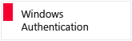](https://msdn.microsoft.com/library/ms144284.aspx)      [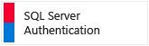](https://msdn.microsoft.com/library/ms144284.aspx)   **Where Authenticated?**   [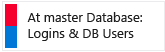](https://msdn.microsoft.com/library/aa337562.aspx)      [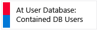](https://msdn.microsoft.com/library/ff929188.aspx)   **Using Other Identities**      [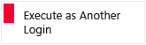](https://msdn.microsoft.com/library/ms181362.aspx)   [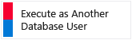](https://msdn.microsoft.com/library/ms181362.aspx)            |**Granting, Revoking, and Denying Permissions**      [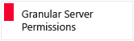](https://msdn.microsoft.com/library/ms191291.aspx)   [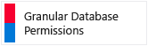](https://msdn.microsoft.com/library/ms191291.aspx)   **Security by Roles**         `Restricting Data Access to Selected Data Elements`   [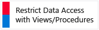](https://msdn.microsoft.com/library/ms175503.aspx)   [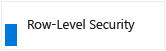](https://msdn.microsoft.com/library/dn765131.aspx)   [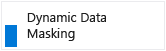](http://azure.microsoft.com/documentation/articles/sql-database-dynamic-data-masking-get-started/)      |**Encrypting Files**   [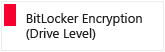](https://support.microsoft.com/en-us/kb/2855131)   [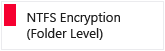](https://msdn.microsoft.com/library/dd163562.aspx)   [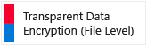](https://msdn.microsoft.com/library/bb934049.aspx)   [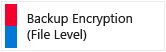](https://msdn.microsoft.com/library/dn449489.aspx)   **Encrypting Sources**   [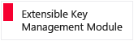](https://msdn.microsoft.com/library/bb895340.aspx)   [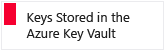](http://azure.microsoft.com/documentation/articles/key-vault-get-started/)   **Column, Data & Key Encryption**   [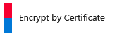](https://msdn.microsoft.com/library/ms188061.aspx)   [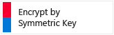](https://msdn.microsoft.com/library/ms174361.aspx)   [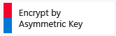](https://msdn.microsoft.com/library/ms186950.aspx)   [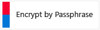](https://msdn.microsoft.com/library/ms190357.aspx)|**Firewall Protection**   [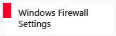](https://msdn.microsoft.com/library/ms175043.aspx)   [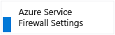](https://msdn.microsoft.com/library/azure/ee621782.aspx)   [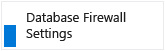](https://msdn.microsoft.com/library/azure/ee621782.aspx)   **Encrypting Data in Transit**      [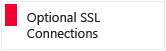](https://msdn.microsoft.com/library/ms191192.aspx)                     |**Automated Auditing**   [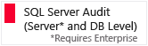](https://msdn.microsoft.com/library/cc280386.aspx)   [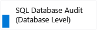](http://azure.microsoft.com/documentation/articles/sql-database-auditing-get-started/)   **Custom Audit**      [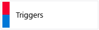](https://msdn.microsoft.com/library/ms175941.aspx)   **Compliance**                     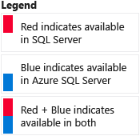|  
  
## Links to Specific Related Topics  
  **Authentication: Who are you?**  
 **Who Authenticates? (Windows or [!INCLUDE[ssNoVersion](../../includes/ssnoversion-md.md)])**  
  
-   [Choose an Authentication Mode](choose-an-authentication-mode.md)  
  
 **Authenticate at the master database** (Logins and database users)  
  
-   [Create a SQL Server Login](authentication-access/create-a-login.md)  
  
-   [Managing Databases and Logins in Azure SQL Database](https://msdn.microsoft.com/library/ee336235.aspx)  
  
-   [Create a Database User](authentication-access/create-a-database-user.md)  
  
 **Authenticate at a user database**  
  
-   [Contained Database Users - Making Your Database Portable](contained-database-users-making-your-database-portable.md)  
  
 **Using Other Identities**  
  
-   [Credentials &#40;Database Engine&#41;](authentication-access/credentials-database-engine.md)  
  
-   [Execute as Another Login](/sql/t-sql/statements/execute-as-transact-sql)  
  
-   [Execute as Another Database User](/sql/t-sql/statements/execute-as-transact-sql)  
  
  **Encryption: Storing Secret Data**  
 **Encrypting Files**  
  
-   [BitLocker (Drive Level)](https://support.microsoft.com/kb/2855131)  
  
-   [NTFS Encryption (Folder Level)](https://msdn.microsoft.com/library/dd163562.aspx)  
  
-   [Transparent Data Encryption (File Level)](encryption/transparent-data-encryption.md)  
  
-   [Backup Encryption (File Level)](../backup-restore/backup-encryption.md)  
  
 **Encrypting Sources**  
  
-   [Extensible Key Management Module](encryption/extensible-key-management-ekm.md)  
  
-   [Keys Stored in the Azure Key Vault](encryption/extensible-key-management-using-azure-key-vault-sql-server.md)  
  
 **Column, Data and Key Encryption**  
  
-   [Encrypt by Certificate](/sql/t-sql/functions/encryptbycert-transact-sql)  
  
-   [Encrypt by Asymmetric Key](/sql/t-sql/functions/encryptbyasymkey-transact-sql)  
  
-   [Encrypt by Symmetric Key](/sql/t-sql/functions/encryptbykey-transact-sql)  
  
-   [Encrypt by Passphrase](/sql/t-sql/functions/encryptbypassphrase-transact-sql)  
  
  **Authorization: What can you do?**  
 **Granting, Revoking, and Denying Permissions**  
  
-   [Permissions Hierarchy &#40;Database Engine&#41;](permissions-hierarchy-database-engine.md)  
  
-   [Permissions](permissions-database-engine.md)  
  
-   [Securables](securables.md)  
  
 **Security by Roles**  
  
-   [Server-Level Roles](authentication-access/server-level-roles.md)  
  
-   [Database-Level Roles](authentication-access/database-level-roles.md)  
  
 `Restricting Data Access to Selected Data Elements`  
  
-   Restrict Data Access Using [Views](../views/views.md) and [Procedures](../stored-procedures/stored-procedures-database-engine.md)  
  
-   [Row-Level Security](https://msdn.microsoft.com/library/azure/dn765131.aspx)  
  
-   [Dynamic Data Masking](http://azure.microsoft.com/documentation/articles/sql-database-dynamic-data-masking-get-started/)  
  
-   [Signed Objects](/sql/t-sql/statements/add-signature-transact-sql)  
  
  **Connection Security: Restricting and Securing**  
 **Firewall Protection**  
  
-   [Configure a Windows Firewall for Database Engine Access](../../database-engine/configure-windows/configure-a-windows-firewall-for-database-engine-access.md)  
  
-   [Azure SQL Database Firewall Settings](/sql/relational-databases/system-stored-procedures/sp-set-database-firewall-rule-azure-sql-database)  
  
-   [Azure Service Firewall Settings](/sql/relational-databases/system-stored-procedures/sp-set-firewall-rule-azure-sql-database)  
  
 **Encrypting Data in Transit**  
  
-   [Secure Sockets Layer for the Database Engine](../../database-engine/configure-windows/enable-encrypted-connections-to-the-database-engine.md)  
  
-   [Secure Sockets Layer for SQL Database](https://msdn.microsoft.com/library/azure/ff394108.aspx)  
  
  **Auditing: Recording Access**  
 **Automated Auditing**  
  
-   [SQL Server Audit &#40;Database Engine&#41;](auditing/sql-server-audit-database-engine.md)  
  
-   [SQL Database Auditing](http://azure.microsoft.com/documentation/articles/sql-database-auditing-get-started/)  
  
 **Custom Audit Implementation**  
  
-   Creating [DDL Triggers](../triggers/ddl-triggers.md) and [DML Triggers](../triggers/dml-triggers.md)  
  
  **Compliance**  
 **SQL Server**  
  
-   [Common Criteria](https://go.microsoft.com/fwlink/?LinkId=616319)  
  
 **SQL Database**  
  
-   [Microsoft Azure Trust Center: Compliance by Feature](http://azure.microsoft.com/support/trust-center/services/)  
  
## See Also  
 [Securing SQL Server](securing-sql-server.md)   
 [Principals &#40;Database Engine&#41;](authentication-access/principals-database-engine.md)   
 [SQL Server Certificates and Asymmetric Keys](sql-server-certificates-and-asymmetric-keys.md)   
 [SQL Server Encryption](encryption/sql-server-encryption.md)   
 [Surface Area Configuration](surface-area-configuration.md)   
 [Strong Passwords](strong-passwords.md)   
 [TRUSTWORTHY Database Property](trustworthy-database-property.md)   
 [Database Engine Features and Tasks](../../database-engine/database-engine-features-and-tasks.md)  
  
  
