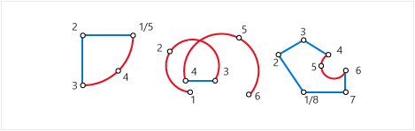

# CompoundCurve
  A `CompoundCurve` is a collection of zero or more continuous `CircularString` or `LineString` instances of either geometry or geography types.  
  
> [!IMPORTANT]  
>  For a detailed description and examples of the new spatial features in this release, including the `CompoundCurve` subtype, download the white paper, [New Spatial Features in SQL Server 2012](https://go.microsoft.com/fwlink/?LinkId=226407).  
  
 An empty `CompoundCurve` instance can be instantiated, but for a `CompoundCurve` to be valid it must meet the following criteria:  
  
1.  It must contain at least one `CircularString` or `LineString` instance.  
  
2.  The sequence of `CircularString` or `LineString` instances must be continuous.  
  
 If a `CompoundCurve` contains a sequence of multiple `CircularString` and `LineString` instances, the ending endpoint for every instance except for the last instance must be the starting endpoint for the next instance in the sequence. This means that if the ending point of a prior instance in the sequence is (4 3 7 2), the starting point for the next instance in the sequence must be (4 3 7 2). Note that Z(elevation) and M(measure) values for the point must also be the same. If there is a difference in the two points, a `System.FormatException` is thrown. Points in a `CircularString` do not have to have a Z or M value. If no Z or M values are given for the ending point of the prior instance, the starting point of the next instance cannot include Z or M values. If the ending point for the prior sequence is (4 3), the starting point for the next sequence must be (4 3); it cannot be (4 3 7 2). All points in a `CompoundCurve` instance must have either no Z value or the same Z value.  
  
## CompoundCurve instances  
 The following illustration shows valid `CompoundCurve` types.  
  
   
  
### Accepted instances  
 `CompoundCurve` instance is accepted if it is an empty instance or meets the following criteria.  
  
1.  All the instances contained by `CompoundCurve` instance are accepted circular arc segment instances. For more information on accepted circular arc segment instances, see [LineString](linestring.md) and [CircularString](circularstring.md).  
  
2.  All of the circular arc segments in the `CompoundCurve` instance are connected. The first point for each succeeding circular arc segment is the same as the last point on the preceeding circular arc segment.  
  
    > [!NOTE]  
    >  This includes the Z and M coordinates. So, all four coordinates X, Y, Z, and M must be the same.  
  
3.  None of the contained instances are empty instances.  
  
 The following example shows accepted `CompoundCurve` instances.  
  
```  
DECLARE @g1 geometry = 'COMPOUNDCURVE EMPTY';  
DECLARE @g2 geometry = 'COMPOUNDCURVE(CIRCULARSTRING(1 0, 0 1, -1 0), (-1 0, 2 0))';  
```  
  
 The following example shows `CompoundCurve` instances that are not accepted. These instances throw `System.FormatException`.  
  
```  
DECLARE @g1 geometry = 'COMPOUNDCURVE(CIRCULARSTRING EMPTY)';  
DECLARE @g2 geometry = 'COMPOUNDCURVE(CIRCULARSTRING(1 0, 0 1, -1 0), (1 0, 2 0))';  
```  
  
### Valid instances  
 A `CompoundCurve` instance is valid if it meets the following criteria.  
  
1.  The `CompoundCurve` instance is accepted.  
  
2.  All circular arc segment instances contained by the `CompoundCurve` instance are valid instances.  
  
 The following example shows valid `CompoundCurve` instances.  
  
```  
DECLARE @g1 geometry = 'COMPOUNDCURVE EMPTY';  
DECLARE @g2 geometry = 'COMPOUNDCURVE(CIRCULARSTRING(1 0, 0 1, -1 0), (-1 0, 2 0))';  
DECLARE @g3 geometry = 'COMPOUNDCURVE(CIRCULARSTRING(1 1, 1 1, 1 1), (1 1, 3 5, 5 4))';  
SELECT @g1.STIsValid(), @g2.STIsValid(), @g3.STIsValid();  
  
```  
  
 `@g3` is valid because the `CircularString` instance is valid. For more information on the validity of the `CircularString` instance, see [CircularString](circularstring.md).  
  
 The following example shows `CompoundCurve` instances that are not valid.  
  
```  
DECLARE @g1 geometry = 'COMPOUNDCURVE(CIRCULARSTRING(1 1, 1 1, 1 1), (1 1, 3 5, 5 4, 3 5))';  
DECLARE @g2 geometry = 'COMPOUNDCURVE((1 1, 1 1))';  
DECLARE @g3 geometry = 'COMPOUNDCURVE(CIRCULARSTRING(1 1, 2 3, 1 1))';  
SELECT @g1.STIsValid(), @g2.STIsValid(), @g3.STIsValid();  
```  
  
 `@g1` is not valid because the second instance is not a valid LineString instance. `@g2` is not valid because the `LineString` instance is not valid. `@g3` is not valid because the `CircularString` instance is not valid. For more information on valid `CircularString` and `LineString` instances, see [CircularString](circularstring.md) and [LineString](linestring.md).  
  
## Examples  
  
### A. Instantiating a geometry instance with an empty CompooundCurve  
 The following example shows how to create an empty `CompoundCurve` instance:  
  
```sql  
DECLARE @g geometry;  
SET @g = geometry::Parse('COMPOUNDCURVE EMPTY');  
```  
  
### B. Declaring and instantiating a geometry instance using a CompoundCurve in the same statement  
 The following example shows how to declare and initialize a `geometry` instance with a `CompoundCurve`in the same statement:  
  
```sql  
DECLARE @g geometry = 'COMPOUNDCURVE ((2 2, 0 0),CIRCULARSTRING (0 0, 1 2.1082, 3 6.3246, 0 7, -3 6.3246, -1 2.1082, 0 0))';  
```  
  
### C. Instantiating a geography instance with a CompoundCurve  
 The following example shows how to declare and initialize a `geography` instance with a `CompoundCurve`:  
  
```sql  
DECLARE @g geography = 'COMPOUNDCURVE(CIRCULARSTRING(-122.358 47.653, -122.348 47.649, -122.348 47.658, -122.358 47.658, -122.358 47.653))';  
```  
  
### D. Storing a square in a CompoundCurve instance  
 The following example uses two different ways to use a `CompoundCurve` instance to store a square.  
  
```sql  
DECLARE @g1 geometry, @g2 geometry;  
SET @g1 = geometry::Parse('COMPOUNDCURVE((1 1, 1 3), (1 3, 3 3),(3 3, 3 1), (3 1, 1 1))');  
SET @g2 = geometry::Parse('COMPOUNDCURVE((1 1, 1 3, 3 3, 3 1, 1 1))');  
SELECT @g1.STLength(), @g2.STLength();  
```  
  
 The lengths for both `@g1` and `@g2` are the same. Notice from the example that a `CompoundCurve` instance can store one or more instances of `LineString`.  
  
### E. Instantiating a geometry instance using a CompoundCurve with multiple CircularStrings  
 The following example shows how to use two different `CircularString` instances to initialize a `CompoundCurve`.  
  
```sql  
DECLARE @g geometry;  
SET @g = geometry::Parse('COMPOUNDCURVE(CIRCULARSTRING(0 2, 2 0, 4 2), CIRCULARSTRING(4 2, 2 4, 0 2))');  
SELECT @g.STLength();  
```  
  
 This produces the following output: 12.566370... which is the equivalent of 4???. The `CompoundCurve` instance in the example stores a circle with a radius of 2. Both of the previous code examples did not have to use a `CompoundCurve`. For the first example a `LineString` instance would have been simpler, and a `CircularString` instance would have been simpler for the second example. However, the next example shows where a `CompoundCurve` provides a better alternative.  
  
### F. Using a CompoundCurve to store a semicircle  
 The following example uses a `CompoundCurve` instance to store a semicircle.  
  
```sql  
DECLARE @g geometry;  
SET @g = geometry::Parse('COMPOUNDCURVE(CIRCULARSTRING(0 2, 2 0, 4 2), (4 2, 0 2))');  
SELECT @g.STLength();  
```  
  
### G. Storing multiple CircularString and LineString instances in a CompoundCurve  
 The following example shows how multiple `CircularString` and `LineString` instances can be stored by using a `CompoundCurve`.  
  
```sql  
DECLARE @g geometry  
SET @g = geometry::Parse('COMPOUNDCURVE((3 5, 3 3), CIRCULARSTRING(3 3, 5 1, 7 3), (7 3, 7 5), CIRCULARSTRING(7 5, 5 7, 3 5))');  
SELECT @g.STLength();  
```  
  
### H. Storing instances with Z and M values  
 The following example shows how to use a `CompoundCurve` instance to store a sequence of `CircularString` and `LineString` instances with both Z and M values.  
  
```sql  
SET @g = geometry::Parse('COMPOUNDCURVE(CIRCULARSTRING(7 5 4 2, 5 7 4 2, 3 5 4 2), (3 5 4 2, 8 7 4 2))');  
```  
  
### I. Illustrating why CircularString instances must be explicitly declared  
 The following example shows why `CircularString` instances must be explicitly declared. The programmer is trying to store a circle in a `CompoundCurve` instance.  
  
```sql  
DECLARE @g1 geometry;    
DECLARE @g2 geometry;  
SET @g1 = geometry::Parse('COMPOUNDCURVE(CIRCULARSTRING(0 2, 2 0, 4 2), (4 2, 2 4, 0 2))');  
SELECT 'Circle One', @g1.STLength() AS Perimeter;  -- gives an inaccurate amount  
SET @g2 = geometry::Parse('COMPOUNDCURVE(CIRCULARSTRING(0 2, 2 0, 4 2), CIRCULARSTRING(4 2, 2 4, 0 2))');  
SELECT 'Circle Two', @g2.STLength() AS Perimeter;  -- now we get an accurate amount  
```  
  
 The output is as follows:  
  
```  
Circle One11.940039...  
Circle Two12.566370...  
```  
  
 The perimeter for Circle Two is approximately 4???, which is the actual value for the perimeter. However, the perimeter for Circle One is significantly inaccurate. Circle One's `CompoundCurve` instance stores one circular arc segment (ABC) and two line segments (CD, DA). The `CompoundCurve` instance has to store two circular arc segments (ABC, CDA) to define a circle. A `LineString` instance defines the second set of points (4 2, 2 4, 0 2) in Circle One's `CompoundCurve` instance. You have to explicitly declare a `CircularString` instance inside a `CompoundCurve`.  
  
## See Also  
 [STIsValid &#40;geometry Data Type&#41;](/sql/t-sql/spatial-geometry/stisvalid-geometry-data-type)   
 [STLength &#40;geometry Data Type&#41;](/sql/t-sql/spatial-geometry/stlength-geometry-data-type)   
 [STStartPoint &#40;geometry Data Type&#41;](/sql/t-sql/spatial-geometry/ststartpoint-geometry-data-type)   
 [STEndpoint &#40;geometry Data Type&#41;](/sql/t-sql/spatial-geometry/stendpoint-geometry-data-type)   
 [LineString](linestring.md)   
 [CircularString](circularstring.md)   
 [Spatial Data Types Overview](spatial-data-types-overview.md)   
 [Point](point.md)  
  
  
