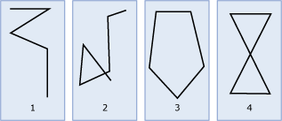

# LineString
  A `LineString` is a one-dimensional object representing a sequence of points and the line segments connecting them.  
  
## LineString Instances  
 The illustration below shows examples of `LineString` instances.  
  
   
  
 As shown in the illustration:  
  
-   Figure 1 is a simple, nonclosed `LineString` instance.  
  
-   Figure 2 is a nonsimple, nonclosed `LineString` instance.  
  
-   Figure 3 is a closed, simple `LineString` instance, and therefore is a ring.  
  
-   Figure 4 is a closed, nonsimple `LineString` instance, and therefore is not a ring.  
  
### Accepted Instances  
 Accepted `LineString` instances can be input into a geometry variable, but they may not be valid `LineString` instances. The following criteria must be met for a `LineString` instance to be accepted. The instance must be formed of at least two points or it must be empty. The following LineString instances are accepted.  
  
```  
DECLARE @g1 geometry = 'LINESTRING EMPTY';  
DECLARE @g2 geometry = 'LINESTRING(1 1,2 3,4 8, -6 3)';  
DECLARE @g3 geometry = 'LINESTRING(1 1, 1 1)';  
```  
  
 `@g3` shows that a `LineString` instance can be accepted, but not valid.  
  
 The following `LineString` instance is not accepted. It will throw a `System.FormatException`.  
  
```  
DECLARE @g geometry = 'LINESTRING(1 1)';  
```  
  
### Valid Instances  
 For a `LineString` instance to be valid it must meet the following criteria.  
  
1.  The `LineString` instance must be accepted.  
  
2.  If a `LineString` instance is not empty then it must contain at least two distinct points.  
  
3.  The `LineString` instance cannot overlap itself over an interval of two or more consecutive points.  
  
 The following `LineString` instances are valid.  
  
```  
DECLARE @g1 geometry= 'LINESTRING EMPTY';  
DECLARE @g2 geometry= 'LINESTRING(1 1, 3 3)';  
DECLARE @g3 geometry= 'LINESTRING(1 1, 3 3, 2 4, 2 0)';  
DECLARE @g4 geometry= 'LINESTRING(1 1, 3 3, 2 4, 2 0, 1 1)';  
SELECT @g1.STIsValid(), @g2.STIsValid(), @g3.STIsValid(), @g4.STIsValid();  
  
```  
  
 The following `LineString` instances are not valid.  
  
```  
DECLARE @g1 geometry = 'LINESTRING(1 4, 3 4, 2 4, 2 0)';  
DECLARE @g2 geometry = 'LINESTRING(1 1, 1 1)';  
SELECT @g1.STIsValid(), @g2.STIsValid();  
```  
  
> [!WARNING]  
>  The detection of `LineString` overlaps is based on floating-point calculations, which are not exact.  
  
## Examples  
 The following example shows how to create a `geometry``LineString` instance with three points and an SRID of 0:  
  
```  
DECLARE @g geometry;  
SET @g = geometry::STGeomFromText('LINESTRING(1 1, 2 4, 3 9)', 0);  
```  
  
 Each point in the `LineString` instance may contain Z (elevation) and M (measure) values. This example adds M values to the `LineString` instance created in the example above. M and Z can be null values.  
  
```  
DECLARE @g geometry;  
SET @g = geometry::STGeomFromText('LINESTRING(1 1 NULL 0, 2 4 NULL 12.3, 3 9 NULL 24.5)', 0);  
```  
  
 The following example shows how to create a `geometry LineString` instance with two points that are the same. A call to `IsValid` indicates that the `LineString` instance is not valid and a call to `MakeValid` will convert the `LineString` instance into a `Point`.  
  
```tsql  
DECLARE @g geometry  
SET @g = geometry::STGeomFromText('LINESTRING(1 3, 1 3)',0);  
IF @g.STIsValid() = 1  
  BEGIN  
     SELECT @g.ToString() + ' is a valid LineString.';    
  END  
ELSE  
  BEGIN  
     SELECT @g.ToString() + ' is not a valid LineString.';  
     SET @g = @g.MakeValid();  
     SELECT @g.ToString() + ' is a valid Point.';    
  END  
  
```  
  
 The above code snippet will return the following:  
  
```  
LINESTRING(1 3, 1 3) is not a valid LineString  
POINT(1 3) is a valid Point.  
```  
  
## See Also  
 [STLength &#40;geometry Data Type&#41;](/sql/t-sql/spatial-geometry/stlength-geometry-data-type)   
 [STStartPoint &#40;geometry Data Type&#41;](/sql/t-sql/spatial-geometry/ststartpoint-geometry-data-type)   
 [STEndpoint &#40;geometry Data Type&#41;](/sql/t-sql/spatial-geometry/stendpoint-geometry-data-type)   
 [STPointN &#40;geometry Data Type&#41;](/sql/t-sql/spatial-geometry/stpointn-geometry-data-type)   
 [STNumPoints &#40;geometry Data Type&#41;](/sql/t-sql/spatial-geometry/stnumpoints-geometry-data-type)   
 [STIsRing &#40;geometry Data Type&#41;](/sql/t-sql/spatial-geometry/stisring-geometry-data-type)   
 [STIsClosed &#40;geometry Data Type&#41;](/sql/t-sql/spatial-geometry/stisclosed-geometry-data-type)   
 [STPointOnSurface &#40;geometry Data Type&#41;](/sql/t-sql/spatial-geometry/stpointonsurface-geometry-data-type)   
 [Spatial Data &#40;SQL Server&#41;](../spatial/spatial-data-sql-server.md)  
  
  
