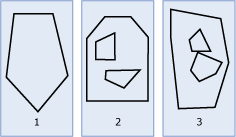

# Polygon
  A `Polygon` is a two-dimensional surface stored as a sequence of points defining an exterior bounding ring and zero or more interior rings.  
  
## Polygon instances  
 A `Polygon` instance can be formed from a ring that has at least three distinct points. A `Polygon` instance can also be empty.  
  
 The exterior and any interior rings of a `Polygon` define its boundary. The space within the rings defines the interior of the `Polygon`.  
  
 The illustration below shows examples of `Polygon` instances.  
  
   
  
 As shown in the illustration:  
  
1.  Figure 1 is a `Polygon` instance whose boundary is defined by an exterior ring.  
  
2.  Figure 2 is a `Polygon` instance whose boundary is defined by an exterior ring and two interior rings. The area inside the interior rings is part of the exterior of the `Polygon` instance.  
  
3.  Figure 3 is a valid `Polygon` instance because its interior rings intersect at a single tangent point.  
  
### Accepted instances  
 Accepted `Polygon` instances are instances that can be stored in a `geometry` or `geography` variable without throwing an exception. The following are accepted `Polygon` instances:  
  
-   An Empty `Polygon` instance  
  
-   A `Polygon` instance that has an acceptable exterior ring and zero or more acceptable interior rings  
  
 The following criteria are needed for a ring to be acceptable.  
  
-   The `LineString` instance must be accepted.  
  
-   The `LineString` instance must have at least four points.  
  
-   The starting and ending points of the `LineString` instance must be the same.  
  
 The following example shows accepted `Polygon` instances.  
  
```  
DECLARE @g1 geometry = 'POLYGON EMPTY';  
DECLARE @g2 geometry = 'POLYGON((1 1, 3 3, 3 1, 1 1))';  
DECLARE @g3 geometry = 'POLYGON((-5 -5, -5 5, 5 5, 5 -5, -5 -5),(0 0, 3 0, 3 3, 0 3, 0 0))';  
DECLARE @g4 geometry = 'POLYGON((-5 -5, -5 5, 5 5, 5 -5, -5 -5),(3 0, 6 0, 6 3, 3 3, 3 0))';  
DECLARE @g5 geometry = 'POLYGON((1 1, 1 1, 1 1, 1 1))';  
```  
  
 As `@g4` and `@g5` show an accepted `Polygon` instance may not be a valid `Polygon` instance. `@g5` also shows that a Polygon instance needs to only contain a ring with any four points to be accepted.  
  
 The following examples throw a `System.FormatException` because the `Polygon` instances are not accepted.  
  
```  
DECLARE @g1 geometry = 'POLYGON((1 1, 3 3, 1 1))';  
DECLARE @g2 geometry = 'POLYGON((1 1, 3 3, 3 1, 1 5))';  
```  
  
 `@g1` is not accepted because the `LineString` instance for the exterior ring does not contain enough points. `@g2` is not accepted because the starting point of the exterior ring `LineString` instance is not the same as the ending point. The following example has an acceptable exterior ring, but the interior ring is not acceptable. This also throws a `System.FormatException`.  
  
```  
DECLARE @g geometry = 'POLYGON((-5 -5, -5 5, 5 5, 5 -5, -5 -5),(0 0, 3 0, 0 0))';  
```  
  
### Valid instances  
 The interior rings of a `Polygon` can touch both themselves and each other at single tangent points, but if the interior rings of a `Polygon` cross, the instance is not valid.  
  
 The following example shows valid `Polygon` instances.  
  
```  
DECLARE @g1 geometry = 'POLYGON((-20 -20, -20 20, 20 20, 20 -20, -20 -20))';  
DECLARE @g2 geometry = 'POLYGON((-20 -20, -20 20, 20 20, 20 -20, -20 -20), (10 0, 0 10, 0 -10, 10 0))';  
DECLARE @g3 geometry = 'POLYGON((-20 -20, -20 20, 20 20, 20 -20, -20 -20), (10 0, 0 10, 0 -10, 10 0), (-10 0, 0 10, -5 -10, -10 0))';  
SELECT @g1.STIsValid(), @g2.STIsValid(), @g3.STIsValid();  
```  
  
 `@g3` is valid because the two interior rings touch at a single point and do not cross each other. The following example shows `Polygon` instances that are not valid.  
  
```  
DECLARE @g1 geometry = 'POLYGON((-20 -20, -20 20, 20 20, 20 -20, -20 -20), (20 0, 0 10, 0 -20, 20 0))';  
DECLARE @g2 geometry = 'POLYGON((-20 -20, -20 20, 20 20, 20 -20, -20 -20), (10 0, 0 10, 0 -10, 10 0), (5 0, 1 5, 1 -5, 5 0))';  
DECLARE @g3 geometry = 'POLYGON((-20 -20, -20 20, 20 20, 20 -20, -20 -20), (10 0, 0 10, 0 -10, 10 0), (-10 0, 0 10, 0 -10, -10 0))';  
DECLARE @g4 geometry = 'POLYGON((-20 -20, -20 20, 20 20, 20 -20, -20 -20), (10 0, 0 10, 0 -10, 10 0), (-10 0, 1 5, 0 -10, -10 0))';  
DECLARE @g5 geometry = 'POLYGON((10 0, 0 10, 0 -10, 10 0), (-20 -20, -20 20, 20 20, 20 -20, -20 -20) )';  
DECLARE @g6 geometry = 'POLYGON((1 1, 1 1, 1 1, 1 1))';  
SELECT @g1.STIsValid(), @g2.STIsValid(), @g3.STIsValid(), @g4.STIsValid(), @g5.STIsValid(), @g6.STIsValid();  
```  
  
 `@g1` is not valid because the inner ring touches the exterior ring in two places. `@g2` is not valid because the second inner ring in within the interior of the first inner ring. `@g3` is not valid because the two inner rings touch at multiple consecutive points. `@g4` is not valid because the interiors of the two inner rings overlap. `@g5` is not valid because the exterior ring is not the first ring. `@g6` is not valid because the ring does not have at least three distinct points.  
  
## Examples  
 The following example creates a simple `geometry``Polygon` instance with a hole and SRID 10.  
  
```  
DECLARE @g geometry;  
SET @g = geometry::STPolyFromText('POLYGON((0 0, 0 3, 3 3, 3 0, 0 0), (1 1, 1 2, 2 1, 1 1))', 10);  
```  
  
 Aninstance that is not valid may be entered and converted to a valid `geometry` instance. In the following example of a `Polygon`, the interior and exterior rings overlap and the instance is not valid.  
  
```  
DECLARE @g geometry;  
SET @g = geometry::Parse('POLYGON((1 0, 0 1, 1 2, 2 1, 1 0), (2 0, 1 1, 2 2, 3 1, 2 0))');  
```  
  
 In the following example, the invalid instance is made valid with `MakeValid()`.  
  
```  
SET @g = @g.MakeValid();  
SELECT @g.ToString();  
```  
  
 The `geometry` instance returned from the above example is a `MultiPolygon`.  
  
```  
MULTIPOLYGON (((2 0, 3 1, 2 2, 1.5 1.5, 2 1, 1.5 0.5, 2 0)), ((1 0, 1.5 0.5, 1 1, 1.5 1.5, 1 2, 0 1, 1 0)))  
```  
  
 Here is another example of converting an invalid instance to a valid geometry instance. In the following example the `Polygon` instance has been created using three points that are exactly the same:  
  
```sql  
DECLARE @g geometry  
SET @g = geometry::Parse('POLYGON((1 3, 1 3, 1 3, 1 3))');  
SET @g = @g.MakeValid();  
SELECT @g.ToString()  
```  
  
 The geometry instance returned above is a `Point(1 3)`.  If the `Polygon` given is `POLYGON((1 3, 1 5, 1 3, 1 3))` then `MakeValid()` would return `LINESTRING(1 3, 1 5)`.  
  
## See Also  
 [STArea &#40;geometry Data Type&#41;](/sql/t-sql/spatial-geometry/starea-geometry-data-type)   
 [STExteriorRing &#40;geometry Data Type&#41;](/sql/t-sql/spatial-geometry/stexteriorring-geometry-data-type)   
 [STNumInteriorRing &#40;geometry Data Type&#41;](/sql/t-sql/spatial-geometry/stnuminteriorring-geometry-data-type)   
 [STInteriorRingN &#40;geometry Data Type&#41;](/sql/t-sql/spatial-geometry/stinteriorringn-geometry-data-type)   
 [STCentroid &#40;geometry Data Type&#41;](/sql/t-sql/spatial-geometry/stcentroid-geometry-data-type)   
 [STPointOnSurface &#40;geometry Data Type&#41;](/sql/t-sql/spatial-geometry/stpointonsurface-geometry-data-type)   
 [MultiPolygon](../spatial/polygon.md)   
 [Spatial Data &#40;SQL Server&#41;](../spatial/spatial-data-sql-server.md)   
 [STIsValid &#40;geography Data Type&#41;](/sql/t-sql/spatial-geography/stisvalid-geography-data-type)   
 [STIsValid &#40;geometry Data Type&#41;](/sql/t-sql/spatial-geometry/stisvalid-geometry-data-type)  
  
  
