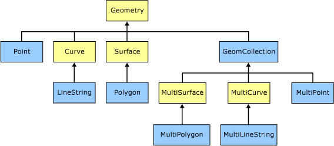
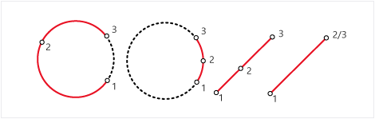
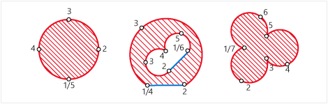

# Spatial Data Types Overview
  There are two types of spatial data. The `geometry` data type supports planar, or Euclidean (flat-earth), data. The `geometry` data type both conforms to the Open Geospatial Consortium (OGC) Simple Features for SQL Specification version 1.1.0 and is compliant with SQL MM (ISO standard).  
  
 In addition, [!INCLUDE[ssNoVersion](../../../includes/ssnoversion-md.md)] supports the `geography` data type, which stores ellipsoidal (round-earth) data, such as GPS latitude and longitude coordinates.  
  
> [!IMPORTANT]  
>  For a detailed description and examples of spatial features introduced in [!INCLUDE[ssSQL11](../../includes/sssql11-md.md)], including enhancements to the spatial data types, download the white paper, [New Spatial Features in SQL Server Code-Named "Denali"](https://go.microsoft.com/fwlink/?LinkId=226407).  
  
##  <a name="objects"></a> Spatial Data Objects  
 The `geometry` and `geography` data types support sixteen spatial data objects, or instance types. However, only eleven of these instance types are *instantiable*; you can create and work with these instances (or instantiate them) in a database. These instances derive certain properties from their parent data types that distinguish them as `Points`, **LineStrings, CircularStrings**, `CompoundCurves`, `Polygons`, `CurvePolygons` or as multiple `geometry` or `geography` instances in a `GeometryCollection`. `Geography` type has an additional instance type, `FullGlobe`.  
  
 The figure below depicts the `geometry` hierarchy upon which the `geometry` and `geography` data types are based. The instantiable types of `geometry` and `geography` are indicated in blue.  
  
   
  
 As the figure indicates, the ten instantiable types of the `geometry` and `geography` data types are `Point`, `MultiPoint`, `LineString`, `CircularString`, `MultiLineString`, `CompoundCurve`, `Polygon`, `CurvePolygon`, `MultiPolygon`, and `GeometryCollection`. There is one additional instantiable type for the geography data type: `FullGlobe`. The `geometry` and `geography` types can recognize a specific instance as long as it is a well-formed instance, even if the instance is not defined explicitly. For example, if you define a `Point` instance explicitly using the STPointFromText() method, `geometry` and `geography` recognize the instance as a `Point`, as long as the method input is well-formed. If you define the same instance using the `STGeomFromText()` method, both the `geometry` and `geography` data types recognize the instance as a `Point`.  
  
 The subtypes for geometry and geography types are divided into simple and collection types.  Some methods like `STNumCurves()` work only with simple types.  
  
 Simple types include:  
  
-   [Point](../spatial/point.md)  
  
-   [LineString](../spatial/linestring.md)  
  
-   [CircularString](../spatial/circularstring.md)  
  
-   [CompoundCurve](../spatial/compoundcurve.md)  
  
-   [Polygon](../spatial/polygon.md)  
  
-   [CurvePolygon](../spatial/curvepolygon.md)  
  
 Collection types include:  
  
-   [MultiPoint](../spatial/multipoint.md)  
  
-   [MultiLineString](../spatial/multilinestring.md)  
  
-   [MultiPolygon](../spatial/multipolygon.md)  
  
-   [GeometryCollection](../spatial/geometrycollection.md)  
  
  
##  <a name="differences"></a> Differences Between the geometry and geography Data Types  
 The two types of spatial data often behave quite similarly, but there are some key differences in how the data is stored and manipulated.  
  
### How connecting edges are defined  
 The defining data for `LineString` and `Polygon` types are vertices only.  The connecting edge between two vertices in a geometry type is a straight line.  However, the connecting edge between two vertices in a geography type is a short great elliptic arc between the two vertices.  A great ellipse is the intersection of the ellipsoid with a plane through its center and a great elliptic arc is an arc segment on the great ellipse.  
  
### How circular arc segments are defined  
 Circular arc segments for geometry types are defined on the XY Cartesian coordinate plane (Z values are ignored). Circular arc segments for geography types are defined by curve segments on a reference sphere. Any parallel on the reference sphere can be defined by two complementary circular arcs where the points for both arcs have a constant latitude angle.  
  
### Measurements in spatial data types  
 In the planar, or flat-earth, system, measurements of distances and areas are given in the same unit of measurement as coordinates. Using the `geometry` data type, the distance between (2, 2) and (5, 6) is 5 units, regardless of the units used.  
  
 In the ellipsoidal, or round-earth system, coordinates are given in degrees of latitude and longitude. However, lengths and areas are usually measured in meters and square meters, though the measurement may depend on the spatial reference identifier (SRID) of the `geography` instance. The most common unit of measurement for the `geography` data type is meters.  
  
### Orientation of spatial data  
 In the planar system, the ring orientation of a polygon is not an important factor. For example, a polygon described by ((0, 0), (10, 0), (0, 20), (0, 0)) is the same as a polygon described by ((0, 0), (0, 20), (10, 0), (0, 0)). The OGC Simple Features for SQL Specification does not dictate a ring ordering, and [!INCLUDE[ssNoVersion](../../../includes/ssnoversion-md.md)] does not enforce ring ordering.  
  
 In an ellipsoidal system, a polygon has no meaning, or is ambiguous, without an orientation. For example, does a ring around the equator describe the northern or southern hemisphere? If we use the `geography` data type to store the spatial instance, we must specify the orientation of the ring and accurately describe the location of the instance. The interior of the polygon in an ellipsoidal system is defined by the left-hand rule.  
  
 When the compatibility level is 100 or below in [!INCLUDE[ssCurrent](../../../includes/sscurrent-md.md)] then the `geography` data type has the following restrictions:  
  
-   Each `geography` instance must fit inside a single hemisphere. No spatial objects larger than a hemisphere can be stored.  
  
-   Any `geography` instance from an Open Geospatial Consortium (OGC) Well-Known Text (WKT) or Well-Known Binary (WKB) representation that produces an object larger than a hemisphere throws an `ArgumentException`.  
  
-   The `geography` data type methods that require the input of two `geography` instances, such as STIntersection(), STUnion(), STDifference(), and STSymDifference(), will return null if the results from the methods do not fit inside a single hemisphere. STBuffer() will also return null if the output exceeds a single hemisphere.  
  
 In [!INCLUDE[ssCurrent](../../../includes/sscurrent-md.md)], `FullGlobe` is a special type of Polygon that covers the entire globe. `FullGlobe` has an area, but no borders or vertices.  
  
### Outer and inner rings not important in geography data type  
 The OGC Simple Features for SQL Specification discusses outer rings and inner rings, but this distinction makes little sense for the [!INCLUDE[ssNoVersion](../../../includes/ssnoversion-md.md)] `geography` data type; any ring of a polygon can be taken to be the outer ring.  
  
 For more information on OGC specifications, see the following:  
  
-   [OGC Specifications, Simple Feature Access Part 1 - Common Architecture](https://go.microsoft.com/fwlink/?LinkId=93627)  
  
-   [OGC Specifications, Simple Feature Access Part 2 - SQL Options](https://go.microsoft.com/fwlink/?LinkId=93628)  
  
  
##  <a name="circular"></a> Circular Arc Segments  
 Three instantiable types can take circular arc segments: `CircularString`, `CompoundCurve`, and `CurvePolygon`.  A circular arc segment is defined by three points in a two dimensional plane and the third point cannot be the same as the first point.  
  
 Figures A and B show typical circular arc segments. Note how each of the three points lie on the perimeter of a circle.  
  
 Figures C and D show how a line segment can be defined as a circular arc segment.  Note that three points are still needed to define the circular arc segment unlike a regular line segment which can be defined by just two points.  
  
 Methods operating on circular arc segment types use straight line segments to approximate the circular arc. The number of line segments used to approximate the arc will depend on the length and curvature of the arc. Z values can be stored for each of the circular arc segment types; however, methods will not use the Z values in their calculations.  
  
> [!NOTE]  
>  If Z values are given for circular arc segments then they must be the same for all points in the circular arc segment for it to be accepted for input. For example: `CIRCULARSTRING(0 0 1, 2 2 1, 4 0 1)` is accepted, but `CIRCULARSTRING(0 0 1, 2 2 2, 4 0 1)` is not accepted.  
  
### LineString and CircularString comparison  
 The following diagram shows identical isosceles triangles (triangle A uses line segments to define the triangle and triangle B uses circular arc segments to defined the triangle):  
  
   
  
 This example shows how to store the above isosceles triangles using both a `LineString` instance and `CircularString` instance:  
  
```tsql  
DECLARE @g1 geometry;  
DECLARE @g2 geometry;  
SET @g1 = geometry::STGeomFromText('LINESTRING(1 1, 5 1, 3 5, 1 1)', 0);  
SET @g2 = geometry::STGeomFromText('CIRCULARSTRING(1 1, 3 1, 5 1, 4 3, 3 5, 2 3, 1 1)', 0);  
IF @g1.STIsValid() = 1 AND @g2.STIsValid() = 1  
  BEGIN  
      SELECT @g1.ToString(), @g2.ToString()  
      SELECT @g1.STLength() AS [LS Length], @g2.STLength() AS [CS Length]  
  END  
```  
  
 Notice that a `CircularString` instance requires seven points to define the triangle, but a `LineString` instance requires only four points to define the triangle. The reason for this is that a `CircularString` instance stores circular arc segments and not line segments. So the sides of the triangle stored in the `CircularString` instance are ABC, CDE, and EFA whereas the sides of the triangle stored in the `LineString` instance are AC, CE, and EA.  
  
 Consider the following code snippet:  
  
```tsql  
SET @g1 = geometry::STGeomFromText('LINESTRING(0 0, 2 2, 4 0)', 0);  
SET @g2 = geometry::STGeomFromText('CIRCULARSTRING(0 0, 2 2, 4 0)', 0);  
SELECT @g1.STLength() AS [LS Length], @g2.STLength() AS [CS Length];  
```  
  
 This snippet will produce the following results:  
  
```  
LS LengthCS Length  
5.65685...6.28318...  
```  
  
 The following illustration shows how each type is stored (red line shows `LineString``@g1`, blue line shows `CircularString``@g2`):  
  
   
  
 As the illustration above shows, `CircularString` instances use fewer points to store curve boundaries with greater precision than `LineString` instances. `CircularString` instances are useful for storing circular boundaries like a twenty-mile search radius from a specific point. `LineString` instances are good for storing boundaries that are linear like a square city block.  
  
### LineString and CompoundCurve comparison  
 The following code examples show how to store the same figure using `LineString` and `CompoundCurve` instances:  
  
```tsql  
SET @g = geometry::Parse('LINESTRING(2 2, 4 2, 4 4, 2 4, 2 2)');  
SET @g = geometry::Parse('COMPOUNDCURVE((2 2, 4 2), (4 2, 4 4), (4 4, 2 4), (2 4, 2 2))');  
SET @g = geometry::Parse('COMPOUNDCURVE((2 2, 4 2, 4 4, 2 4, 2 2))');  
```  
  
 or  
  
 In the examples above, either a `LineString` instance or a `CompoundCurve` instance could store the figure.  This next example uses a `CompoundCurve` to store a pie slice:  
  
```tsql  
SET @g = geometry::Parse('COMPOUNDCURVE(CIRCULARSTRING(2 2, 1 3, 0 2),(0 2, 1 0, 2 2))');  
```  
  
 A `CompoundCurve` instance can store the circular arc segment (2 2, 1 3, 0 2) directly whereas a `LineString` instance would have to convert the curve into several smaller line segments.  
  
### CircularString and CompoundCurve comparison  
 The following code example shows how the pie slice can be stored in a `CircularString` instance:  
  
```tsql  
DECLARE @g geometry;  
SET @g = geometry::Parse('CIRCULARSTRING( 0 0, 1 2.1082, 3 6.3246, 0 7, -3 6.3246, -1 2.1082, 0 0)');  
SELECT @g.ToString(), @g.STLength();  
```  
  
 To store the pie slice using a `CircularString` instance requires that three points be used for each line segment.  If an intermediate point is not known, it either has to be calculated or the endpoint of the line segment has to be doubled as the following snippet shows:  
  
```tsql  
SET @g = geometry::Parse('CIRCULARSTRING( 0 0, 3 6.3246, 3 6.3246, 0 7, -3 6.3246, 0 0, 0 0)');  
```  
  
 `CompoundCurve` instances allow both `LineString` and `CircularString` components so that only two points to the line segments of the pie slice need to be known.  This code example shows how to use a `CompoundCurve` to store the same figure:  
  
```tsql  
DECLARE @g geometry;  
SET @g = geometry::Parse('COMPOUNDCURVE(CIRCULARSTRING( 3 6.3246, 0 7, -3 6.3246), (-3 6.3246, 0 0, 3 6.3246))');  
SELECT @g.ToString(), @g.STLength();  
```  
  
### Polygon and CurvePolygon comparison  
 `CurvePolygon` instances can use `CircularString` and `CompoundCurve` instances when defining their exterior and interior rings.  `Polygon` instances cannot use the circular arc segment types: `CircularString` and `CompoundCurve`.  
  
  
## See Also  
 [Spatial Data &#40;SQL Server&#41;](../spatial/spatial-data-sql-server.md)   
 [geometry Data Type Method Reference](/sql/t-sql/spatial-geometry/spatial-types-geometry-transact-sql)   
 [geography Data Type Method Reference](/sql/t-sql/spatial-geography/spatial-types-geography)   
 [STNumCurves &#40;geometry Data Type&#41;](/sql/t-sql/spatial-geometry/stnumcurves-geometry-data-type)   
 [STNumCurves &#40;geography Data Type&#41;](/sql/t-sql/spatial-geography/stnumcurves-geography-data-type)   
 [STGeomFromText &#40;geometry Data Type&#41;](/sql/t-sql/spatial-geometry/stgeomfromtext-geometry-data-type)   
 [STGeomFromText &#40;geography Data Type&#41;](/sql/t-sql/spatial-geography/stgeomfromtext-geography-data-type)  
  
  
