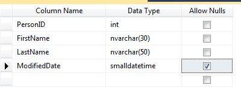

# Create Tables (Database Engine)
  You can create a new table, name it, and add it to an existing database in [!INCLUDE[ssCurrent](../../includes/sscurrent-md.md)] by using [!INCLUDE[ssManStudioFull](../../includes/ssmanstudiofull-md.md)] or [!INCLUDE[tsql](../../includes/tsql-md.md)].  
  
> [!NOTE]  
>  If you are connected to a SQL Azure database, the new table option launches a create table template script. Edit the parameters, then run the script to create a new table. For more information, see [SQL Azure Overview](https://microsoft.sharepoint.com/sites/infopedia_g01/pages/cards/azure-sql-database.aspx).  
  
 **In This Topic**  
  
-   **Before you begin:**  
  
     [Security](#Security)  
  
-   **To create a table, using:**  
  
     [SQL Server Management Studio](#SSMSProcedure)  
  
     [Transact-SQL](#TsqlProcedure)  
  
##  <a name="BeforeYouBegin"></a> Before You Begin  
  
###  <a name="Security"></a> Security  
  
####  <a name="Permissions"></a> Permissions  
 Requires CREATE TABLE permission in the database and ALTER permission on the schema in which the table is being created.  
  
 If any columns in the CREATE TABLE statement are defined as a CLR user-defined type, either ownership of the type or REFERENCES permission on it is required.  
  
 If any columns in the CREATE TABLE statement have an XML schema collection associated with them, either ownership of the XML schema collection or REFERENCES permission on it is required.  
  
##  <a name="SSMSProcedure"></a> Using SQL Server Management Studio  
  
#### To create a table with Table Designer  
  
1.  In **Object Explorer**, connect to the instance of [!INCLUDE[ssDE](../../includes/ssde-md.md)] that contains the database to be modified.  
  
2.  In **Object Explorer**, expand the **Databases** node and then expand the database that will contain the new table.  
  
3.  In Object Explorer, right-click the **Tables** node of your database and then click **New Table**.  
  
4.  Type column names, choose data types, and choose whether to allow nulls for each column as shown in the following illustration.  
  
       
  
5.  To specify more properties for a column, such as identity or computed column values, click the column and in the column properties tab, choose the appropriate properties. For more information about column properties, see [Table Column Properties &#40;SQL Server Management Studio&#41;](table-column-properties-sql-server-management-studio.md).  
  
6.  To specify a column as a primary key, right-click the column and select **Set Primary Key**. For more information, see [Create Primary Keys](../tables/create-primary-keys.md).  
  
7.  To create foreign key relationships, check constraints, or indexes, right-click in the Table Designer pane and select an object from the list as shown in the following illustration.  
  
       
  
     For more information about these objects, see [Create Foreign Key Relationships](../tables/create-foreign-key-relationships.md), [Create Check Constraints](../tables/create-check-constraints.md) and [Indexes](../indexes/indexes.md).  
  
8.  By default, the table is contained in the **dbo** schema. To specify a different schema for the table, right-click in the Table Designer pane and select **Properties** as shown in the following illustration. From the **Schema** drop-down list, select the appropriate schema.  
  
       
  
     For more information about schemas, see [Create a Database Schema](../security/authentication-access/create-a-database-schema.md).  
  
9. From the **File** menu, choose **Save** *table name*.  
  
10. In the **Choose Name** dialog box, type a name for the table and click **OK**.  
  
11. To view the new table, in **Object Explorer**, expand the **Tables** node and press **F5** to refresh the list of objects. The new table is displayed in the list of tables.  
  
##  <a name="TsqlProcedure"></a> Using Transact-SQL  
  
#### To create a table in the Query Editor  
  
1.  In **Object Explorer**, connect to an instance of [!INCLUDE[ssDE](../../includes/ssde-md.md)].  
  
2.  On the Standard bar, click **New Query**.  
  
3.  Copy and paste the following example into the query window and click **Execute**.  
  
    ```  
    CREATE TABLE dbo.PurchaseOrderDetail  
    (  
        PurchaseOrderID int NOT NULL  
        ,LineNumber smallint NOT NULL  
        ,ProductID int NULL  
        ,UnitPrice money NULL  
        ,OrderQty smallint NULL  
        ,ReceivedQty float NULL  
        ,RejectedQty float NULL  
        ,DueDate datetime NULL  
    );  
    ```  
  
 For more examples, see [CREATE TABLE &#40;Transact-SQL&#41;](/sql/t-sql/statements/create-table-transact-sql).  
  
  
