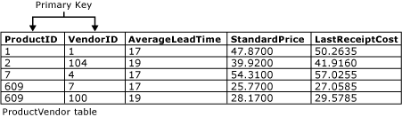

# Primary and Foreign Key Constraints
  Primary keys and foreign keys are two types of constraints that can be used to enforce data integrity in [!INCLUDE[ssNoVersion](../../includes/ssnoversion-md.md)] tables. These are important database objects.  
  
 This topic contains the following sections.  
  
 [Primary Key Constraints](../tables/primary-and-foreign-key-constraints.md#PKeys)  
  
 [Foreign Key Constraints](../tables/primary-and-foreign-key-constraints.md#FKeys)  
  
 [Related Tasks](../tables/primary-and-foreign-key-constraints.md#Tasks)  
  
##   Primary Key Constraints  
 A table typically has a column or combination of columns that contain values that uniquely identify each row in the table. This column, or columns, is called the primary key (PK) of the table and enforces the entity integrity of the table. Because primary key constraints guarantee unique data, they are frequently defined on an identity column.  
  
 When you specify a primary key constraint for a table, the [!INCLUDE[ssDE](../../includes/ssde-md.md)] enforces data uniqueness by automatically creating a unique index for the primary key columns. This index also permits fast access to data when the primary key is used in queries. If a primary key constraint is defined on more than one column, values may be duplicated within one column, but each combination of values from all the columns in the primary key constraint definition must be unique.  
  
 As shown in the following illustration, the **ProductID** and **VendorID** columns in the **Purchasing.ProductVendor** table form a composite primary key constraint for this table. This makes sure that every row in the **ProductVendor** table has a unique combination of **ProductID** and **VendorID**. This prevents the insertion of duplicate rows.  
  
   
  
-   A table can contain only one primary key constraint.  
  
-   A primary key cannot exceed 16 columns and a total key length of 900 bytes.  
  
-   The index generated by a primary key constraint cannot cause the number of indexes on the table to exceed 999 nonclustered indexes and 1 clustered index.  
  
-   If clustered or nonclustered is not specified for a primary key constraint, clustered is used if there no clustered index on the table.  
  
-   All columns defined within a primary key constraint must be defined as not null. If nullability is not specified, all columns participating in a primary key constraint have their nullability set to not null.  
  
-   If a primary key is defined on a CLR user-defined type column, the implementation of the type must support binary ordering.  
  
##   Foreign Key Constraints  
 A foreign key (FK) is a column or combination of columns that is used to establish and enforce a link between the data in two tables to control the data that can be stored in the foreign key table. In a foreign key reference, a link is created between two tables when the column or columns that hold the primary key value for one table are referenced by the column or columns in another table. This column becomes a foreign key in the second table.  
  
 For example, the **Sales.SalesOrderHeader** table has a foreign key link to the **Sales.SalesPerson** table because there is a logical relationship between sales orders and salespeople. The **SalesPersonID** column in the **SalesOrderHeader** table matches the primary key column of the **SalesPerson** table. The **SalesPersonID** column in the **SalesOrderHeader** table is the foreign key to the **SalesPerson** table. By creating this foreign key relationship, a value for **SalesPersonID** cannot be inserted into the **SalesOrderHeader** table if it does not already exist in the **SalesPerson** table.  
  
### Indexes on Foreign Key Constraints  
 Unlike primary key constraints, creating a foreign key constraint does not automatically create a corresponding index. However, manually creating an index on a foreign key is often useful for the following reasons:  
  
-   Foreign key columns are frequently used in join criteria when the data from related tables is combined in queries by matching the column or columns in the foreign key constraint of one table with the primary or unique key column or columns in the other table. An index enables the [!INCLUDE[ssDE](../../includes/ssde-md.md)] to quickly find related data in the foreign key table. However, creating this index is not required. Data from two related tables can be combined even if no primary key or foreign key constraints are defined between the tables, but a foreign key relationship between two tables indicates that the two tables have been optimized to be combined in a query that uses the keys as its criteria.  
  
-   Changes to primary key constraints are checked with foreign key constraints in related tables.  
  
### Referential Integrity  
 Although the main purpose of a foreign key constraint is to control the data that can be stored in the foreign key table, it also controls changes to data in the primary key table. For example, if the row for a salesperson is deleted from the **Sales.SalesPerson** table, and the salesperson's ID is used for sales orders in the **Sales.SalesOrderHeader** table, the relational integrity between the two tables is broken; the deleted salesperson's sales orders are orphaned in the **SalesOrderHeader** table without a link to the data in the **SalesPerson** table.  
  
 A foreign key constraint prevents this situation. The constraint enforces referential integrity by guaranteeing that changes cannot be made to data in the primary key table if those changes invalidate the link to data in the foreign key table. If an attempt is made to delete the row in a primary key table or to change a primary key value, the action will fail when the deleted or changed primary key value corresponds to a value in the foreign key constraint of another table. To successfully change or delete a row in a foreign key constraint, you must first either delete the foreign key data in the foreign key table or change the foreign key data in the foreign key table, which links the foreign key to different primary key data.  
  
#### Cascading Referential Integrity  
 By using cascading referential integrity constraints, you can define the actions that the [!INCLUDE[ssDE](../../includes/ssde-md.md)] takes when a user tries to delete or update a key to which existing foreign keys point. The following cascading actions can be defined.  
  
 NO ACTION  
 The [!INCLUDE[ssDE](../../includes/ssde-md.md)] raises an error and the delete or update action on the row in the parent table is rolled back.  
  
 CASCADE  
 Corresponding rows are updated or deleted in the referencing table when that row is updated or deleted in the parent table. CASCADE cannot be specified if a `timestamp` column is part of either the foreign key or the referenced key. ON DELETE CASCADE cannot be specified for a table that has an INSTEAD OF DELETE trigger. ON UPDATE CASCADE cannot be specified for tables that have INSTEAD OF UPDATE triggers.  
  
 SET NULL  
 All the values that make up the foreign key are set to NULL when the corresponding row in the parent table is updated or deleted. For this constraint to execute, the foreign key columns must be nullable. Cannot be specified for tables that have INSTEAD OF UPDATE triggers.  
  
 SET DEFAULT  
 All the values that make up the foreign key are set to their default values if the corresponding row in the parent table is updated or deleted. For this constraint to execute, all foreign key columns must have default definitions. If a column is nullable, and there is no explicit default value set, NULL becomes the implicit default value of the column. Cannot be specified for tables that have INSTEAD OF UPDATE triggers.  
  
 CASCADE, SET NULL, SET DEFAULT and NO ACTION can be combined on tables that have referential relationships with each other. If the [!INCLUDE[ssDE](../../includes/ssde-md.md)] encounters NO ACTION, it stops and rolls back related CASCADE, SET NULL and SET DEFAULT actions. When a DELETE statement causes a combination of CASCADE, SET NULL, SET DEFAULT and NO ACTION actions, all the CASCADE, SET NULL and SET DEFAULT actions are applied before the [!INCLUDE[ssDE](../../includes/ssde-md.md)] checks for any NO ACTION.  
  
### Triggers and Cascading Referential Actions  
 Cascading referential actions fire the AFTER UPDATE or AFTER DELETE triggers in the following manner:  
  
-   All the cascading referential actions directly caused by the original DELETE or UPDATE are performed first.  
  
-   If there are any AFTER triggers defined on the affected tables, these triggers fire after all cascading actions are performed. These triggers fire in opposite order of the cascading action. If there are multiple triggers on a single table, they fire in random order, unless there is a dedicated first or last trigger for the table. This order is as specified by using [sp_settriggerorder](/sql/relational-databases/system-stored-procedures/sp-settriggerorder-transact-sql).  
  
-   If multiple cascading chains originate from the table that was the direct target of an UPDATE or DELETE action, the order in which these chains fire their respective triggers is unspecified. However, one chain always fires all its triggers before another chain starts firing.  
  
-   An AFTER trigger on the table that is the direct target of an UPDATE or DELETE action fires regardless of whether any rows are affected. There are no other tables affected by cascading in this case.  
  
-   If any one of the previous triggers perform UPDATE or DELETE operations on other tables, these actions can start secondary cascading chains. These secondary chains are processed for each UPDATE or DELETE operation at a time after all triggers on all primary chains fire. This process may be recursively repeated for subsequent UPDATE or DELETE operations.  
  
-   Performing CREATE, ALTER, DELETE, or other data definition language (DDL) operations inside the triggers may cause DDL triggers to fire. This may subsequently perform DELETE or UPDATE operations that start additional cascading chains and triggers.  
  
-   If an error is generated inside any particular cascading referential action chain, an error is raised, no AFTER triggers are fired in that chain, and the DELETE or UPDATE operation that created the chain is rolled back.  
  
-   A table that has an INSTEAD OF trigger cannot also have a REFERENCES clause that specifies a cascading action. However, an AFTER trigger on a table targeted by a cascading action can execute an INSERT, UPDATE, or DELETE statement on another table or view that fires an INSTEAD OF trigger defined on that object.  
  
##   Related Tasks  
 The following table lists the common tasks associated with primary key and foreign key constraints.  
  
|Task|Topic|  
|----------|-----------|  
|Describes how to create a primary key.|[Create Primary Keys](../tables/create-primary-keys.md)|  
|Describes how to delete a primary key.|[Delete Primary Keys](../tables/delete-primary-keys.md)|  
|Describes how to modify a primary key.|[Modify Primary Keys](../tables/modify-primary-keys.md)|  
|Describes how to create foreign key relationships|[Create Foreign Key Relationships](../tables/create-foreign-key-relationships.md)|  
|Describes how to modify foreign key relationships.|[Modify Foreign Key Relationships](../tables/modify-foreign-key-relationships.md)|  
|Describes how to delete foreign key relationships.|[Delete Foreign Key Relationships](../tables/delete-foreign-key-relationships.md)|  
|Describes how to view foreign key properties.|[View Foreign Key Properties](../tables/view-foreign-key-properties.md)|  
|Describes how to disable foreign key constraints for replication.|[Disable Foreign Key Constraints for Replication](../tables/disable-foreign-key-constraints-for-replication.md)|  
|Describes how to disable foreign key constraints during an INSERT or UPDATE statement.|[Disable Foreign Key Constraints with INSERT and UPDATE Statements](../tables/disable-foreign-key-constraints-with-insert-and-update-statements.md)|  
  
  
