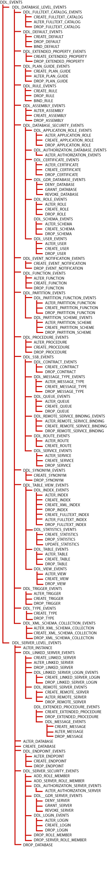
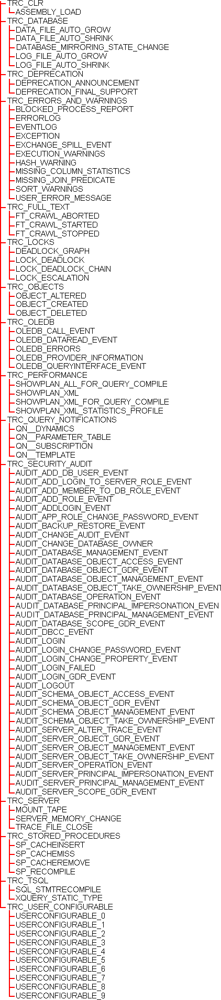

# WMI Provider for Server Events Classes and Properties
  The following server events make up the programming model for the WMI Provider for Server Events. There are two main categories of events that can be queried by issuing WQL queries against the provider. These are data definition language (DDL) events and trace events. The QUEUE_ACTIVATION and BROKER_QUEUE_DISABLED service broker events can also be queried. Note the inclusive nature of the following tree diagrams. The DDL_ASSEMBLY_EVENTS event, for example, includes any ALTER_ASSEMBLY, CREATE_ASSEMBLY, and DROP_ASSEMBLY event. Similarly, the TRC_FULL_TEXT event includes any FT_CRAWL_ABORTED, FT_CRAWL_STARTED, and FT_CRAWL_STOPPED event. ALL_EVENTS covers all DDL events, trace events, QUEUE_ACTIVATION, and BROKER_QUEUE_DISABLED.  
  
 To learn which properties can be queried from an event or event group, refer to the event schema. By default, the event schema is installed in the following directory: [!INCLUDE[ssInstallPath](../../includes/ssinstallpath-md.md)]Tools\Binn\schemas\sqlserver\2006\11\events\events.xsd.  
  
 Alternatively, you can refer to the event schema published at [https://schemas.microsoft.com/sqlserver](https://go.microsoft.com/fwlink/?linkid=43100).  
  
 For example, by referring to the ALTER_DATABASE event, you will learn that its parent event is DDL_SERVER_LEVEL_EVENTS and its properties are `TSQLCommand` and `DatabaseName`. The event also inherits the properties `SQLInstance`, `PostTime`, `ComputerName`, `SPID`, and `LoginName`. The event has no children events.  
  
> [!NOTE]  
>  System stored procedures that perform DDL-like operations can also fire event notifications. Test your event notifications to determine their responses to system stored procedures that are run. For example, the CREATE TYPE statement and **sp_addtype** stored procedure will both fire an event notification that is created on a CREATE_TYPE event. For more information, see[DDL Events](../../relational-databases/triggers/ddl-events.md).  
  
 **Data Definition Language Events and Event Groups**  
  
   
  
 **Trace Events and Event Groups**  
  
   
  
## See Also  
 [WMI Provider for Server Events Concepts](../../relational-databases/wmi-provider-server-events/wmi-provider-for-server-events-concepts.md)   
 [Using WQL with the WMI Provider for Server Events](../../relational-databases/wmi-provider-server-events/using-wql-with-the-wmi-provider-for-server-events.md)  
  
  
