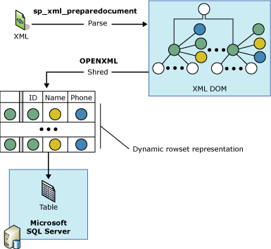
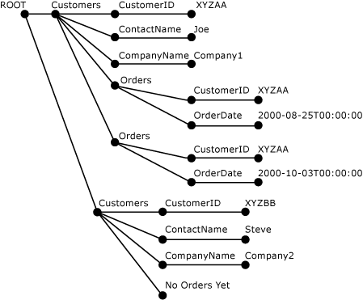

# OPENXML (SQL Server)
  OPENXML, a [!INCLUDE[tsql](../../includes/tsql-md.md)] keyword, provides a rowset over in-memory XML documents that is similar to a table or a view. OPENXML allows access to XML data as though it is a relational rowset. It does this by providing a rowset view of the internal representation of an XML document. The records in the rowset can be stored in database tables.  
  
 OPENXML can be used in SELECT and SELECT INTO statements wherever rowset providers, a view, or OPENROWSET can appear as the source. For information about the syntax of OPENXML, see [OPENXML &#40;Transact-SQL&#41;](/sql/t-sql/functions/openxml-transact-sql).  
  
 To write queries against an XML document by using OPENXML, you must first call `sp_xml_preparedocument`. This parses the XML document and returns a handle to the parsed document that is ready for consumption. The parsed document is a document object model (DOM) tree representation of various nodes in the XML document. The document handle is passed to OPENXML. OPENXML then provides a rowset view of the document, based on the parameters passed to it.  
  
> [!NOTE]  
>  `sp_xml_preparedocument` uses a SQL-updated version of the MSXML parser, Msxmlsql.dll. This version of the MSXML parser was designed to support [!INCLUDE[ssNoVersion](../../includes/ssnoversion-md.md)] and remain backward compatible with MSXML version 2.6.  
  
 The internal representation of an XML document must be removed from memory by calling the **sp_xml_removedocument** system stored procedure to free the memory.  
  
 The following illustration shows the process.  
  
   
  
 Note that to understand OPENXML, familiarity with XPath queries and an understanding of XML is required. For more information about XPath support in SQL Server, see [Using XPath Queries in SQLXML 4.0](../sqlxml-annotated-xsd-schemas-xpath-queries/using-xpath-queries-in-sqlxml-4-0.md).  
  
> [!NOTE]  
>  OpenXML allows the row and column XPath patterns to be parameterized as variables. Such parameterization could lead to XPath expression injections, if the programmer exposes the parameterization to outside users (for example, if the parameters are provided via an externally called stored procedure). To avoid such potential security issues, it is recommended that XPath parameters should never be exposed to external callers.  
  
## Example  
 The following example shows the use of `OPENXML` in an `INSERT` statement and a `SELECT` statement. The sample XML document contains `<Customers>` and `<Orders>` elements.  
  
 First, the `sp_xml_preparedocument` stored procedure parses the XML document. The parsed document is a tree representation of the nodes (elements, attributes, text, and comments) in the XML document. `OPENXML` then refers to this parsed XML document and provides a rowset view of all or parts of this XML document. An `INSERT` statement using `OPENXML` can insert data from such a rowset into a database table. Several `OPENXML` calls can be used to provide a rowset view of various parts of the XML document and process them, for example, by inserting them into different tables. This process is also referred to as shredding XML into tables.  
  
 In the following example, an XML document is shredded in a way that `<Customers>` elements are stored in the `Customers` table and `<Orders>` elements are stored in the `Orders` table by using two `INSERT` statements. The example also shows a `SELECT` statement with `OPENXML` that retrieves `CustomerID` and `OrderDate` from the XML document. The last step in the process is to call `sp_xml_removedocument`. This is done in order to release the memory allocated to contain the internal XML tree representation that was created during the parse phase.  
  
```  
-- Create tables for later population using OPENXML.  
CREATE TABLE Customers (CustomerID varchar(20) primary key,  
                ContactName varchar(20),   
                CompanyName varchar(20));  
GO  
CREATE TABLE Orders( CustomerID varchar(20), OrderDate datetime);  
GO  
DECLARE @docHandle int;  
DECLARE @xmlDocument nvarchar(max); -- or xml type  
SET @xmlDocument = N'<ROOT>  
<Customers CustomerID="XYZAA" ContactName="Joe" CompanyName="Company1">  
<Orders CustomerID="XYZAA" OrderDate="2000-08-25T00:00:00"/>  
<Orders CustomerID="XYZAA" OrderDate="2000-10-03T00:00:00"/>  
</Customers>  
<Customers CustomerID="XYZBB" ContactName="Steve"  
CompanyName="Company2">No Orders yet!  
</Customers>  
</ROOT>';  
EXEC sp_xml_preparedocument @docHandle OUTPUT, @xmlDocument;  
-- Use OPENXML to provide rowset consisting of customer data.  
INSERT Customers   
SELECT *   
FROM OPENXML(@docHandle, N'/ROOT/Customers')   
  WITH Customers;  
-- Use OPENXML to provide rowset consisting of order data.  
INSERT Orders   
SELECT *   
FROM OPENXML(@docHandle, N'//Orders')   
  WITH Orders;  
-- Using OPENXML in a SELECT statement.  
SELECT * FROM OPENXML(@docHandle, N'/ROOT/Customers/Orders') WITH (CustomerID nchar(5) '../@CustomerID', OrderDate datetime);  
-- Remove the internal representation of the XML document.  
EXEC sp_xml_removedocument @docHandle;   
```  
  
 The following illustration shows the parsed XML tree of the previous XML document that was created by using sp_xml_preparedocument.  
  
   
  
## OPENXML Parameters  
 The parameters to OPENXML include the following:  
  
-   An XML document handle (*idoc*)  
  
-   An XPath expression to identify the nodes to be mapped to rows (*rowpattern*)  
  
-   A description of the rowset to be generated  
  
-   Mapping between the rowset columns and the XML nodes  
  
### XML Document Handle (idoc)  
 The document handle is returned by the `sp_xml_preparedocument` stored procedure.  
  
### XPath Expression to Identify the Nodes to Be Processed (rowpattern)  
 The XPath expression specified as *rowpattern* identifies a set of nodes in the XML document. Each node that is identified by *rowpattern* corresponds to a single row in the rowset that is generated by OPENXML.  
  
 The nodes identified by the XPath expression can be any XML node in the XML document. If *rowpattern* identifies a set of elements in the XML document, there is one row in the rowset for each element node identified. For example, if *rowpattern* ends in an attribute, a row is created for each attribute node selected by *rowpattern*.  
  
### Description of the Rowset to Be Generated  
 A rowset schema is used by OPENXML to generate the resulting rowset. You can use the following options when specifying a rowset schema.  
  
#### Using the Edge Table Format  
 You should use the edge table format to specify a rowset schema. Do not use the WITH clause.  
  
 When you do this, OPENXML returns a rowset in the edge table format. This is referred to as an edge table, because every edge in the parsed XML document tree maps to a row in the rowset.  
  
 Edge tables represent within a single table the fine-grained XML document structure. This structure includes the element and attribute names, the document hierarchy, the namespaces, and the processing instructions. The edge table format allows you to obtain additional information that is not exposed through the metaproperties. For more information about metaproperties, see [Specify Metaproperties in OPENXML](../xml/specify-metaproperties-in-openxml.md).  
  
 The additional information provided by an edge table allows you to store and query the data type of an element and attribute, and the node type, and also store and query information about the XML document structure. With this additional information, it may also be possible to build your own XML document management system.  
  
 By using an edge table, you can write stored procedures that take XML documents as binary large object (BLOB) input, produce the edge table, and then extract and analyze the document on a more detailed level. This detailed level could include finding the document hierarchy, the element and attribute names, the namespaces, and the processing instructions.  
  
 The edge table also can serve as a storage format for XML documents when mapping to other relational formats is not logical and an ntext field is not providing enough structural information.  
  
 In situations where you can use an XML parser to examine an XML document, you can use an edge table instead to obtain the same information.  
  
 The following table describes the structure of the edge table.  
  
|Column name|Data type|Description|  
|-----------------|---------------|-----------------|  
|**id**|**bigint**|Is the unique ID of the document node.<br /><br /> The root element has an ID value of 0. The negative ID values are reserved.|  
|**parentid**|**bigint**|Identifies the parent of the node. The parent identified by this ID is not necessarily the parent element. However, this depends on the NodeType of the node whose parent is identified by this ID. For example, if the node is a text node, its parent may be an attribute node.<br /><br /> If the node is at the top level in the XML document, its **ParentID** is NULL.|  
|**node type**|**int**|Identifies the node type and is an integer that corresponds to the XML object model (DOM) node type numbering.<br /><br /> Following are the values that can appear in this column to indicate the node type:<br /><br /> **1** = Element node<br /><br /> **2** = Attribute node<br /><br /> **3** = Text node<br /><br /> **4** = CDATA section node<br /><br /> **5** = Entity reference node<br /><br /> **6** = Entity node<br /><br /> **7** = Processing instruction node<br /><br /> **8** = Comment node<br /><br /> **9** = Document node<br /><br /> **10** = Document Type node<br /><br /> **11** = Document Fragment node<br /><br /> **12** = Notation node<br /><br /> For more information, see the "nodeType Property" topic in the Microsoft XML (MSXML) SDK.|  
|**localname**|**nvarchar(max)**|Gives the local name of the element or attribute. Is NULL if the DOM object does not have a name.|  
|**prefix**|**nvarchar(max)**|Is the namespace prefix of the node name.|  
|**namespaceuri**|**nvarchar(max)**|Is the namespace URI of the node. If the value is NULL, no namespace is present.|  
|**datatype**|**nvarchar(max)**|Is the actual data type of the element or attribute row and is otherwise NULL. The data type is inferred from the inline DTD or from the inline schema.|  
|**prev**|**bigint**|Is the XML ID of the previous sibling element. Is NULL if there is no direct previous sibling.|  
|**text**|**ntext**|Contains the attribute value or the element content in text form. Or is NULL, if the edge table entry does not need a value.|  
  
#### Using the WITH Clause to Specify an Existing Table  
 You can use the WITH clause to specify the name of an existing table. To do this, just specify an existing table name whose schema can be used by OPENXML to generate the rowset.  
  
#### Using the WITH Clause to Specify a Schema  
 You can use the WITH Clause to specify a complete schema. In specifying the rowset schema, you specify the column names, their data types, and their mapping to the XML document.  
  
 You can specify the column pattern by using the ColPattern parameter in the SchemaDeclaration. The specified column pattern is used to map a rowset column to the XML node that is identified by rowpattern and is also used to determine the type of mapping.  
  
 If ColPattern is not specified for a column, the rowset column maps to the XML node with the same name, based on the mapping specified by the *flags* parameter. However, if ColPattern is specified as part of the schema specification in the WITH clause, it overwrites the mapping that is specified in the *flags* parameter.  
  
### Mapping Between the Rowset Columns and the XML Nodes  
 In the OPENXML statement, you can optionally specify the type of mapping, such as attribute-centric or element-centric, between the rowset columns and the XML nodes that are identified by the *rowpattern*. This information is used in the transformation between the XML nodes and the rowset columns.  
  
 You can specify the mapping in two ways, and you can also specify both:  
  
-   By using the *flags* parameter  
  
     The mapping that is specified by the *flags* parameter assumes name correspondence in which the XML nodes map to the corresponding rowset columns with same name.  
  
-   By using the *ColPattern* parameter  
  
     *ColPattern*, an XPath expression, is specified as part of *SchemaDeclaration* in the WITH clause. The mapping specified in *ColPattern* overwrites the mapping specified by the *flags* parameter.  
  
     *ColPattern* can be used to specify the type of mapping, such as attribute-centric or element-centric, that overwrites or enhances the default mapping indicated by the *flags*.  
  
     *ColPattern* is specified under the following circumstances:  
  
    -   The column name in the rowset is different from the element or attribute name to which it is mapped. In this case, *ColPattern* is used to identify the XML element and attribute name to which the rowset column maps.  
  
    -   You want to map a metaproperty attribute to the column. In this case, *ColPattern* is used to identify the metaproperty to which the rowset column maps. For more information about how to use metaproperties, see [Specify Metaproperties in OPENXML](../xml/specify-metaproperties-in-openxml.md).  
  
 Both the *flags* and *ColPattern* parameters are optional. If no mapping is specified, attribute-centric mapping is assumed. Attribute-centric mapping is the default value of the *flags* parameter.  
  
#### Attribute-centric Mapping  
 Setting the *flags* parameter in OPENXML to 1 (XML_ATTRIBUTES) specifies **attribute-centric** mapping. If *flags* contains XML_ ATTRIBUTES, the exposed rowset provides or consumes rows where each XML element is represented as a row. The XML attributes are mapped to the attributes that are defined in the SchemaDeclaration or that are provided by the Tablename of the WITH clause, based on name correspondence. Name correspondence means that the XML attributes of a particular name are stored in a column in the rowset with the same name.  
  
 If the column name is different from the attribute name that it maps to, *ColPattern* must be specified.  
  
 If the XML attribute has a namespace qualifier, the column name in the rowset must also have the qualifier.  
  
#### Element-centric Mapping  
 Setting the *flags* parameter in OPENXML to 2 (XML_ELEMENTS) specifies **element-centric** mapping. It is similar to **attribute-centric** mapping, except for the following differences:  
  
-   The name correspondence of the mapping example, a column mapping to an XML element with the same name chooses the noncomplex subelements, unless a column-level pattern is specified. In the retrieval process, if the subelement is complex because it contains additional subelements, the column is set to NULL. Attribute values of the subelements are then ignored.  
  
-   For multiple subelements that have the same name, the first node is returned.  
  
## See Also  
 [sp_xml_preparedocument &#40;Transact-SQL&#41;](/sql/relational-databases/system-stored-procedures/sp-xml-preparedocument-transact-sql)   
 [sp_xml_removedocument &#40;Transact-SQL&#41;](/sql/relational-databases/system-stored-procedures/sp-xml-removedocument-transact-sql)   
 [OPENXML &#40;Transact-SQL&#41;](/sql/t-sql/functions/openxml-transact-sql)   
 [XML Data &#40;SQL Server&#41;](../xml/xml-data-sql-server.md)  
  
  
