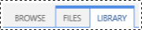
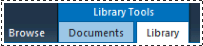
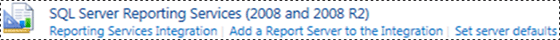
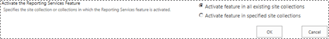

# Add Report Server Content Types to a Library (Reporting Services in SharePoint Integrated Mode)
  [!INCLUDE[ssRSnoversion](../includes/ssrsnoversion-md.md)] provides predefined SharePoint content types that are used to manage shared data source (.rsds) files, report models (.smdl), and Report Builder report definition (.rdl) files. Adding a **Report Builder Report**, **Report Model**, and **Report Data Source** content type to a library enables the **New** command so that you can create new documents of that type.  
  
 **[!INCLUDE[applies](../includes/applies-md.md)]**  [!INCLUDE[ssRSnoversion](../includes/ssrsnoversion-md.md)] SharePoint mode  
  
 To add content types to a library, you must be a site administrator or have Full Control level of permission.  
  
 The [!INCLUDE[ssRSnoversion](../includes/ssrsnoversion-md.md)] content types and content type management will automatically be enabled in all document libraries for existing site collections created from the following **Business Intelligence Center** site template.  
  
 Sites created after the [!INCLUDE[ssRSnoversion](../includes/ssrsnoversion-md.md)] integration will not have the [!INCLUDE[ssRSnoversion](../includes/ssrsnoversion-md.md)] content types enabled.  
  
> [!TIP]  
>  If you have **not** previously configured content types for a library, first enable management of content types, then enable the [!INCLUDE[ssRSnoversion](../includes/ssrsnoversion-md.md)] content types. See the procedures on enabling content type management in a single document library.  
  
 **Short video:** [(SSRS) Enabling Content Types in SharePoint2010.wmv](http://www.youtube.com/watch?v=yqhm3DrtT1w) (http://www.youtube.com/watch?v=yqhm3DrtT1w).  
  
 **In this topic:**  
  
-   [Enable content types in all document libraries in an existing BI center](#bkmk_enable_all)  
  
-   [To enable content type management for a single document library (SharePoint 2013)](#bkmk_enable_content_management)  
  
-   [To add Reporting Services content types (SharePoint 2013)](#bkmk_add_single)  
  
-   [To enable content type management for a single document library (SharePoint 2010)](#bkmk_enable_content_management_2010)  
  
-   [To add report server content types (SharePoint 2010)](#bkmk_add_single_2010)  
  
-   [To enable Content types and content management for multiple BI sites](#bkmk_enable_multiple_sites)  
  
##   Enable content types in all document libraries in an existing BI center  
  
1.  To enable the content types and content management in all document libraries in an existing **Business Intelligence Center** site, you can toggle the [!INCLUDE[ssRSnoversion](../includes/ssrsnoversion-md.md)] integration feature.  
  
2.  Go to **Site settings**.  
  
    -   In SharePoint 2013, click the **Settings** icon.   
  
    -   In SharePoint 2010, click **Site Actions**, then click **Site Settings**.  
  
3.  Click **Site collection features**.  
  
4.  Find the **Report Server Integration Feature** and click **Deactivate**.  
  
       
  
5.  Refresh the browser then click **Activate** for the **Report Server Integration Feature**.  
  
      
  
##   To enable content type management for a single document library (SharePoint 2013)  
  
1.  Open the library for which you want to enable multiple content types.  
  
2.  Click **Library** in the ribbon.  
  
       
  
3.  On the **Library** ribbon, click **Library Settings**. If you do not see **Library Settings** or the button is disabled, you do not have permission to configure library settings, including content types.  
  
       
  
4.  In the **General Settings** section, click **Advanced settings**.  
  
       
  
5.  In the **Content Types** section, select **Yes** to allow management of content types.  
  
6.  Click **OK**.  
  
##   To add Reporting Services content types (SharePoint 2013)  
  
1.  Open the library for which you want to add Reporting Services content types.  
  
2.  On the ribbon, click **Library**.  
  
3.  Click **Library Settings**.  
  
4.  Under **Content Types**, click **Add from existing site content types**.  
  
5.  In **Select site content types from**, select **SQL Server Reporting Services Content Types**.  
  
6.  In the **Available Site Content Types** list, click **Report Builder**, and then click **Add** to move the selected content type to the **Content types to add** list.  
  
7.  To add **Report Model** and **Report Data Source** content types, repeat the previous step.  
  
8.  When you finish adding content types, click **OK**.  
  
9. > [!NOTE]  
    >  If the [!INCLUDE[ssRSnoversion](../includes/ssrsnoversion-md.md)] content type group **SQL Server Reporting Services Content Types** is not visible on the **Add Content Types** page, one of the following conditions is true:  
  
    -   The [!INCLUDE[ssRSnoversion](../includes/ssrsnoversion-md.md)] add-in for SharePoint products has not been installed. For more information, see [Install or Uninstall the Reporting Services Add-in for SharePoint &#40;SharePoint 2010 and SharePoint 2013&#41;](install-windows/install-or-uninstall-the-reporting-services-add-in-for-sharepoint.md). The topic includes information on installing the add-in and stepping through a files only installation of the add-in to work around issues.  
  
    -   The add-in is installed but the site collection feature **Report Server Integration Feature** is not active. Verify the site collection feature in **Site Settings**.  
  
    -   All of the [!INCLUDE[ssRSnoversion](../includes/ssrsnoversion-md.md)] content types have already been added to the library. If all the content types are part of a library, then the group is removed from the **Add Content Types** page. If you delete one or more of the [!INCLUDE[ssRSnoversion](../includes/ssrsnoversion-md.md)] content types, then the group **SQL Server Reporting Services Content Types** will be visible on the **Add Content Types** page.  
  
##   To enable content type management for a single document library (SharePoint 2010)  
  
1.  Open the library for which you want to enable multiple content types. On the library menu bar, you should see the following menus: **New**, **Upload**, **Actions**, and **Settings**. If you do not see **Settings**, you do not have permission to add a content type.  
  
2.  On the **Library Tools** ribbon, click **Library**.  
  
       
  
3.  On the **Settings** ribbon group, click **Library Settings**.  
  
4.  Under **General Settings**, click **Advanced settings**.  
  
5.  In the **Content Types** section, select **Yes** to allow management of content types.  
  
6.  Click **OK**.  
  
##   To add report server content types (SharePoint 2010)  
  
1.  Open the library for which you want to add Reporting Services content types.  
  
2.  On the **Library Tools** ribbon tabs, click the **Library tab**.  
  
3.  On the **Settings** ribbon group, click **Library Settings**.  
  
4.  Under **Content Types**, click **Add from existing site content types**.  
  
5.  In the **Select Content Types** section, in **Select site content types from**, click the arrow to select **SQL Server Reporting Services Content Types**.  
  
6.  In the **Available Site Content Types** list, click **Report Builder**, and then click **Add** to move the selected content type to the **Content types to add** list.  
  
7.  To add **Report Model** and **Report Data Source** content types, repeat the previous step.  
  
8.  When you finish adding content types, click **OK**.  
  
##   To enable Content types and content management for multiple BI sites  
  
1.  For SQL Server Reporting Services 2008 and 2008 R2 report servers, you can enable content types and content management for multiple Business Intelligence Center sites:  
  
2.  In SharePoint Central Administration, click **General Applications settings**. In the **SQL Server Reporting Services (2008 and 2008 R2)** section, click **Reporting Services Integration**.  
  
       
  
3.  Click **Activate feature in all exciting site collections**.  
  
       
  
4.  Click **Ok**.  
  
## See Also  
 [SharePoint Site and List Permission Reference for Report Server Items](security/sharepoint-site-and-list-permission-reference-for-report-server-items.md)   
 [Start Report Builder &#40;Report Builder&#41;](report-builder/start-report-builder.md)  
  
  
