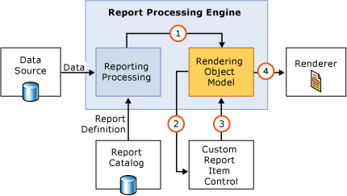
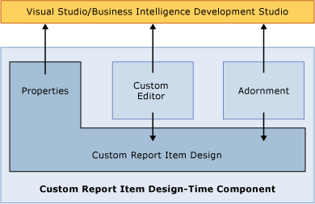

# Custom Report Item Architecture
  A custom report item is an extension to the Report Definition Language (RDL) that allows developers to add functionality that's not natively supported in RDL or extend the functionality of existing controls. There are two main components to a custom report item: the run-time component and the design-time component. These components are implemented as [!INCLUDE[dnprdnshort](../../includes/dnprdnshort-md.md)] assemblies, and can be written in any CLS-compliant language.  
  
## The Run-Time Component  
 The run-time component for a custom report item is called by the report processor at run time. The run-time component accepts data passed by the report processor at run time, processes this data, and returns an image containing the rendered custom report item.  
  
   
  
## The Design-Time Component  
 The design-time component allows the custom report item to be defined and manipulated in the Report Designer interface in [!INCLUDE[vsprvs](../../includes/vsprvs-md.md)]. The design-time component consists of several sub-controls that control the appearance and properties of the custom report item in the design environment.  
  
   
  
## See Also  
 [Creating a Custom Report Item Run-Time Component](../custom-report-items/creating-a-custom-report-item-run-time-component.md)   
 [Creating a Custom Report Item Design-Time Component](../custom-report-items/creating-a-custom-report-item-design-time-component.md)   
 [How to: Deploy a Custom Report Item](../custom-report-items/how-to-deploy-a-custom-report-item.md)  
  
  
