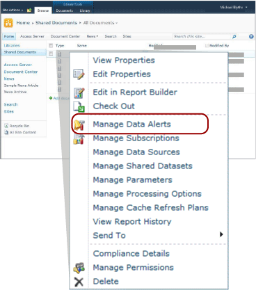

# Data Alert Manager for SharePoint Users
  [!INCLUDE[ssRSnoversion](../includes/ssrsnoversion-md.md)] provides Data Alert Manager for SharePoint information workers to manage the data alerts. They can view information about the alerts they created, delete alerts, open alert definitions for editing, and run alerts on demand. They can choose to view alerts for a single report only or alerts for all reports. The following picture shows the features available to information workers in Data Alert Manager.  
  
   
  
 When a SharePoint site is enabled for data alerts, two SharePoint pages, MyDataAlerts.aspx and SiteDataAlerts.aspx are created and added to the SharePoint site. MyDataAlerts.aspx is Data Alert Manager for SharePoint information workers. Information workers open Data Alert Manager from the right-click menu of reports on which they created alerts.  
  
 You can also open Data Alert Manager directly by using a URL. The following shows the syntax of the URL:  
  
 `http://<site name>/_layouts/ReportServer/MyDataAlerts.aspx`  
  
> [!NOTE]  
>  Before you can use the [!INCLUDE[ssRSnoversion](../includes/ssrsnoversion-md.md)] alerting features, an administrator must grant you permissions. For information about the required permissions, see [Reporting Services Data Alerts](../ssms/agent/alerts.md).  
  
##   View Data Alert Information  
 You can view a list of data alerts that you created in Data Alert Designer. To open Data Alert Manager, you right-click a report published to a SharePoint library. The following picture shows the **Manage Data Alerts** option on the report right-click menu.  
  
   
  
 Data Alert Manager includes a table that lists the alert name, report name, your name as the creator of the alert definition, the number the alert message was sent, the last time the alert was run, the last time the alert definition was modified, and the status of the latest alert message. If the alert message cannot be generated or sent, the status column contains information about the error and helps you troubleshoot the alert. For more information, see [Manage My Data Alerts in Data Alert Manager](manage-my-data-alerts-in-data-alert-manager.md).  
  
 The following table shows sample data from a table in Data Alert Manager. When an error occurs, the error message and the identifier of the entry in the log (a GUID) are included in the **Status** field in the table.  
  
|Alert Name|Report Name|Created By|Sent Alerts|Last Run|Last Modified|Status|  
|----------------|-----------------|----------------|-----------------|--------------|-------------------|------------|  
|SalesQTR|SalesByTerritoryAndQTR|Lauren Johnson|4|6/12/2011|6/1/2011|Last alert ran successfully and alert was sent.|  
|UnitsSold|ProductsSalesByQTR|Lauren Johnson|2|7/1/2011|6/28/2011|Last alert ran successfully, but the data was unchanged and no alert was sent.|  
|TopPromotion|PromotionTracking|Lauren Johnson|0||5/23/2011|Alert created.|  
  
  
##   Delete Data Alerts  
 You delete alerts definitions from Data Alert Manager. As information worker you can delete the alert definitions that you created. You cannot delete alert definitions created by others. For more information, see [Manage My Data Alerts in Data Alert Manager](manage-my-data-alerts-in-data-alert-manager.md).  
  
 When you delete an alert definition, it is deleted permanently. If you want only to pause alert messages, you should change the recurrence pattern or the start or stop date in the alert definition. For more information, see [Edit a Data Alert in Alert Designer](edit-a-data-alert-in-alert-designer.md).  
  
  
  
##   Edit Data Alerts  
 As an information worker, you open your alert definitions for edit from Data Alert Manger. You can edit the alert definitions that you created, but not those created by others. When you right-click the alert definition and click **Edit** the Data Alert Designer opens, displaying the alert definition. For more information see, [Data Alert Designer](../../2014/reporting-services/data-alert-designer.md) and [Edit a Data Alert in Alert Designer](edit-a-data-alert-in-alert-designer.md).  
  
  
  
##   Run Data Alerts  
 Data Alert Manager includes information about the last time the alerting service processed the data alert definition and the number of times the data alert message has been sent. You might want to run and send the alert message immediately, instead of waiting for the time the schedule specifies. When you run an alert from Data Alert Manager, the alert schedule is overwritten and processing of the alert definition starts within one to five minutes, depending on the time needed to run the report and how busy the report server is at the time that you chose to run the alert. However, if you specified a message be sent only if results change and the results did not change, then no message is created or sent. For more information, see [Manage My Data Alerts in Data Alert Manager](manage-my-data-alerts-in-data-alert-manager.md).  
  
> [!NOTE]  
>  After you click the **Run**  option, it takes a few seconds to update the value of the **Status** column to indicate the alert is processing. If you click the **Run**  option multiple times, the alert will be processed multiple times. This consumes resources on the report server unnecessarily and might impact performance of the report server. To see updated information about the alert, click the Web browser refresh button to check for status updates as well as other information about the alert.  
  
  
  
##   Related Tasks  
 This section lists procedures that show you how to manage your alerts and edit your alert definitions.  
  
-   [Manage My Data Alerts in Data Alert Manager](manage-my-data-alerts-in-data-alert-manager.md)  
  
-   [Edit a Data Alert in Alert Designer](edit-a-data-alert-in-alert-designer.md)  
  
  
  
## See Also  
 [Data Alert Designer](../../2014/reporting-services/data-alert-designer.md)   
 [Create a Data Alert in Data Alert Designer](create-a-data-alert-in-data-alert-designer.md)   
 [Reporting Services Data Alerts](../ssms/agent/alerts.md)  
  
  
