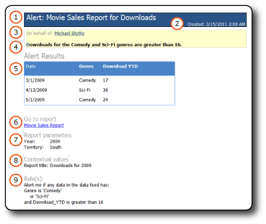
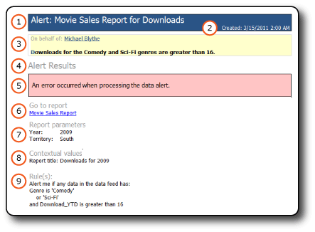

# Data Alert Messages
  [!INCLUDE[ssRSnoversion](../includes/ssrsnoversion-md.md)] data alerts deliver two types of data alert messages by email: Messages with data alert results and messages with error descriptions. Messages with results keep all recipients informed about changes in report data that is of common interest and important to business decisions. If for some reason an error occurs and the results are not available, the error message is sent instead.  
  
 The owner of the data alert definition also can view information about the data alert instance in Data Alert Manager. For more information, see [Data Alert Manager for SharePoint Users](../../2014/reporting-services/data-alert-manager-for-sharepoint-users.md).  
  
##   Data Alert Messages  
 The following pictures show a data alert message with results and an alert message with an error description.  
  
 **Results message**  
  
   
  
 **Error message**  
  
   
  
 The messages include the same types of information.  
  
1.  **On behalf of** contains the name of the person who created the data alert definition.  
  
2.  If you provided a description in the alert definition, it displays below **On behalf of**.  
  
3.  **Alert Results** display the rows in the report data feed that satisfy the rules specified in the alert definition in a tabular format or display an error description. There is no limit on the number of rows that displays.  
  
4.  **Go to report** is a link to the report that the alert definition is built upon. If the link is not valid because the report was moved or deleted, an error message displays.  
  
5.  **Rule(s)** lists the rules and clauses in the alert definition. This information helps you verify and understand the alert results and identify rules in the data alert definition that you might want to change to narrow or broaden results.  
  
6.  **Report parameters** list the parameters and parameter values that were used when the report was run. Parameters and parameter values help you understand the alert results.  
  
7.  **Contextual values** list the names and values of report items that are outside of the report data regions. The items are typically text boxes. For example, a text box with a constant value such as the subject or description of a report.  
  
 The only difference between the two message types is item 5, **Alert Results**. If an error occurs when a data alert instance or data alert message is created, **Alert Results** displays an error message that describes the problem. The error message, sent to all recipients, let them know that the alert results that they are expecting and might rely on to make business decisions are not available.  
  
 
  
##   Related Tasks  
 This section lists procedures that show you how to create and edit the data alert definitions that provide much of the information that you see in data alert messages.  
  
-   [Create a Data Alert in Data Alert Designer](create-a-data-alert-in-data-alert-designer.md)  
  
-   [Edit a Data Alert in Alert Designer](edit-a-data-alert-in-alert-designer.md)  
  

  
## See Also  
 [Data Alert Designer](../../2014/reporting-services/data-alert-designer.md)   
 [Reporting Services Data Alerts](../ssms/agent/alerts.md)  
  
  
