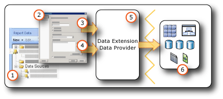

# Data Connections, Data Sources, and Connection Strings in Report Builder
  To include data in a report, you create data connections and datasets. A data connection includes information about how to access an external source of data. A dataset includes a query command that specifies which data to include by using the data connection.  
  
1.  **Data sources in the Report Data pane** A data source appears in the Report Data pane after you create an embedded data source or add a shared data source.  
  
2.  **Connection Dialog Box** Use the Connection Dialog Box to build a connection string or to paste a connection string.  
  
3.  **Data connection information** The connection string is passed to the data extension.  
  
4.  **Credentials** Credentials are managed separately from the connection string.  
  
5.  **Data Extension/Data Provider** Connecting to the data can be through multiple data access layers.  
  
6.  **External data sources** Retrieve data from relational databases, multidimensional data bases, SharePoint lists, Web services, or report models.  
  
 For more information, see [Embedded and Shared Data Connections or Data Sources &#40;Report Builder and SSRS&#41;](../../2014/reporting-services/embedded-and-shared-data-connections-or-data-sources-report-builder-and-ssrs.md) and [Data Connections, Data Sources, and Connection Strings in Reporting Services](../../2014/reporting-services/data-connections-data-sources-and-connection-strings-in-reporting-services.md).  
  
 Data can also be included in a report by using predefined shared data sources, shared datasets, and report parts. These items already have the data connection information that you need. For more information, see [Add Data to a Report &#40;Report Builder and SSRS&#41;](report-data/report-datasets-ssrs.md).  
  
> [!NOTE]  
>  [!INCLUDE[ssRBRDDup](../includes/ssrbrddup-md.md)]  
  
   
  
##   Connection String Examples  
 A data connection includes a connection string that is typically provided by the owner of the external data source. The following table lists examples of connections strings for different types of external data sources.  
  
|**Data source**|**Example**|**Description**|  
|---------------------|-----------------|---------------------|  
|[!INCLUDE[ssNoVersion](../includes/ssnoversion-md.md)] database on the local server|`data source="(local)";initial catalog=AdventureWorks2012`|Set data source type to `SQL Server`.|  
|[!INCLUDE[ssNoVersion](../includes/ssnoversion-md.md)] instance database|`Data Source=localhost\MSSQL12.InstanceName; Initial Catalog= AdventureWorks2012`|Set data source type to `SQL Server`.|  
|[!INCLUDE[ssNoVersion](../includes/ssnoversion-md.md)] Express database|`Data Source=localhost\MSSQL12.SQLEXPRESS; Initial Catalog= AdventureWorks2012`|Set data source type to `SQL Server`.|  
|[!INCLUDE[ssASnoversion](../includes/ssasnoversion-md.md)] database on the local server|`data source=localhost;initial catalog=Adventure Works DW 2012`|Set data source type to `SQL Server Analysis Services`.|  
|SharePoint List|`data source=http://MySharePointWeb/MySharePointSite/`|Set data source type to `SharePoint List`.|  
||||  
|Report Models|Not applicable.|You do not need a connection string for a report model. In Report Builder, browse to the report server and select the .smdl file that is the report model.|  
|Oracle server|`data source=myserver`|Set the data source type to `Oracle`. The Oracle client tools must be installed on the Report Builder computer and on the report server.|  
|SAP NetWeaver BI data source|`DataSource=http://mySAPNetWeaverBIServer:8000/sap/bw/xml/soap/xmla`|Set the data source type to `SAP NetWeaver BI`.|  
|Hyperion Essbase data source|`Data Source=http://localhost:13080/aps/XMLA; Initial Catalog=Sample`|Set the data source type to `Hyperion Essbase`.|  
|Teradata data source|`data source=` *\<NN>.\<NNN>.\<NNN>.\<N>* `;`|Set the data source type to `Teradata`. The connection string is an Internet Protocol (IP) address in the form of four fields, where each field can be from one to three digits.|  
|Teradata data source|`Database=` *\<database name>* `; data source=` *\<NN*N*>.\<NNN>.\<NNN>.\<N*NN*>*`;Use X Views=False;Restrict to Default Database=True`|Set the data source type to `Teradata`, similar to the previous example. Only use the default database that is specified in the Database tag, and do not automatically discover data relationships.|  
|XML data source, Web service|`data source=http://adventure-works.com/results.aspx`|Set the data source type to `XML`. The connection string is a URL for a web service that supports Web Services Definition Language (WSDL).|  
|XML data source, XML document|`http://localhost/XML/Customers.xml`|Set the data source type to `XML`. The connection string is a URL to the XML document.|  
|XML data source, embedded XML document|*Empty*|Set the data source type to `XML`. The XML data is embedded in the report definition.|  
  
 For more information about each connection type, see [Add Data from External Data Sources &#40;SSRS&#41;](report-data/add-data-from-external-data-sources-ssrs.md) and [Data Sources Supported by Reporting Services &#40;SSRS&#41;](create-deploy-and-manage-mobile-and-paginated-reports.md).  
  

  
##   Creating Data Sources  
 To create an embedded data source, you must have a connection string and the credentials that you need to access the data. This information usually comes from the owner of the data source. The data connection is saved in the report definition as part of the data source. Credentials are managed independently from the connection. For step-by-step instructions, see [Add and Verify a Data Connection or Data Source &#40;Report Builder and SSRS&#41;](report-data/add-and-verify-a-data-connection-report-builder-and-ssrs.md).  
  
> [!NOTE]  
>  Some types of credentials might not support all the scenarios that Report Builder uses: to run a query in the query designer, preview a report from your computer when you are not connected to a report server, and run the report from the report server. We recommend that you use shared data sources whenever possible. You can store credentials for a shared data source on the report server. For more information, see [Specify Credentials in Report Builder](../../2014/reporting-services/specify-credentials-in-report-builder.md).  
  
 To create a shared data source, you must use Report Manager to create the data source directly on the report server, or use an authoring environment such as Report Designer in [!INCLUDE[ssNoVersion](../includes/ssnoversion-md.md)] [!INCLUDE[ssBIDevStudioFull](../includes/ssbidevstudiofull-md.md)]. For more information, see [Create an Embedded or Shared Data Source &#40;SSRS&#41;](../../2014/reporting-services/create-an-embedded-or-shared-data-source-ssrs.md).  
  

  
## See Also  
 [Add Data to a Report &#40;Report Builder and SSRS&#41;](report-data/report-datasets-ssrs.md)   
 [Report Parts &#40;Report Builder and SSRS&#41;](report-parts-report-builder-and-ssrs.md)  
  
  
