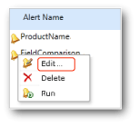

# Edit a Data Alert in Alert Designer
  You open the data alert definition that you want to edit from Data Alert Manager. Only the user that created the alert definition can edit it. For more information about opening Data Alert Manager, see [Manage My Data Alerts in Data Alert Manager](manage-my-data-alerts-in-data-alert-manager.md).  
  
 The following picture shows you the context menu on a data alert in Data Alert Manager.  
  
   
  
 The following procedure includes the steps to open the alert definition for editing in Data Alert Designer from Data Alert Manager.  
  
### To edit a data alert definition in Data Alert Designer  
  
1.  In Data Alert Manager, right-click the data alert definition that you want to edit and click **Edit**.  
  
     The alert definition opens in Data Alert Designer.  
  
2.  Update the rules, schedule settings, and email settings. For more information, see [Data Alert Designer](../../2014/reporting-services/data-alert-designer.md) and [Create a Data Alert in Data Alert Designer](create-a-data-alert-in-data-alert-designer.md).  
  
    > [!NOTE]  
    >  You cannot choose a different data feed. To use a different data feed, you must create a new data alert definition.  
  
3.  Click **Save**.  
  
    > [!NOTE]  
    >  If the report has changed and the data feeds generated from the report have changed the alert definition might no longer be valid. This occurs when a column that the alert definition references in its rules is deleted from the report or changes data type or the report is deleted or moved. You can open an alert definition that is not valid, but you cannot resave it until it is valid based on the current version of the report data feed that it is built upon. To learn more about how data feeds are generated from reports, see [Generating Data Feeds from Reports &#40;Report Builder and SSRS&#41;](report-builder/generating-data-feeds-from-reports-report-builder-and-ssrs.md).  
  
## See Also  
 [Data Alert Manager for Alerting Administrators](../../2014/reporting-services/data-alert-manager-for-alerting-administrators.md)   
 [Reporting Services Data Alerts](../ssms/agent/alerts.md)  
  
  
