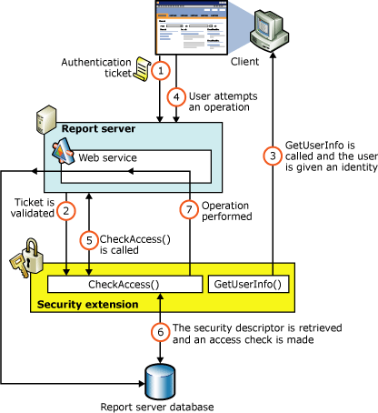

# Authorization in Reporting Services
  Authorization is the process of determining whether an identity should be granted the requested type of access to a given resource in the report server database. [!INCLUDE[ssRSnoversion](../../../includes/ssrsnoversion-md.md)] uses a role-based authorization architecture that grants a user access to a given resource based on the user's role assignment for the application. Security extensions for [!INCLUDE[ssRSnoversion](../../../includes/ssrsnoversion-md.md)] contain an implementation of an authorization component that is used to grant access to users once they are authenticated on the report server. Authorization is invoked when a user attempts to perform an operation on the system or a report server item through the SOAP API and via URL access. This is made possible through the security extension interface **IAuthorizationExtension**. As stated previously, all extensions inherit from **IExtension** the base interface for any extension that you deploy. **IExtension** and **IAuthorizationExtension** are members of the **Microsoft.ReportingServices.Interfaces** namespace.  
  
## Checking Access  
 In authorization, the key to any custom security implementation is the access check, which is implemented in the <xref:Microsoft.ReportingServices.Interfaces.IAuthorizationExtension.CheckAccess%2A> method. <xref:Microsoft.ReportingServices.Interfaces.IAuthorizationExtension.CheckAccess%2A> is called each time a user attempts an operation on the report server. The <xref:Microsoft.ReportingServices.Interfaces.IAuthorizationExtension.CheckAccess%2A> method is overloaded for each operation type. For folder operations, an example of an access check might look like the following:  
  
```  
// Overload for Folder operations  
public bool CheckAccess(  
   string userName,   
   IntPtr userToken,   
   byte[] secDesc,   
   FolderOperation requiredOperation)  
{  
   // If the user is the administrator, allow unrestricted access.  
   if (userName == m_adminUserName)   
      return true;  
  
   AceCollection acl = DeserializeAcl(secDesc);  
   foreach(AceStruct ace in acl)  
   {  
         if (userName == ace.PrincipalName)  
         {  
            foreach(FolderOperation aclOperation in   
               ace.FolderOperations)  
            {  
               if (aclOperation == requiredOperation)  
                     return true;  
            }  
         }  
   }  
   return false;  
}  
```  
  
 The report server calls the <xref:Microsoft.ReportingServices.Interfaces.IAuthorizationExtension.CheckAccess%2A> method by passing in the name of the logged-on user, a user token, the security descriptor for the item, and the requested operation. Here you would check the security descriptor for the user name and the appropriate permission to complete the request, then return `true` to signify that access is granted or `false` to signify access is denied.  
  
## Security Descriptors  
 When setting authorization policies on items in the report server database, a client application (such as Report Manager) submits the user information to the security extension along with a security policy for the item. This security policy and user information are known collectively as a security descriptor. A security descriptor contains the following information for an item in the report server database:  
  
-   The group or user that has some type of permission to perform operations on the item.  
  
-   The item's type.  
  
-   A discretionary access control list controlling access to the item.  
  
 Security descriptors are created using the Web service <xref:ReportService2010.ReportingService2010.SetPolicies%2A> and <xref:ReportService2010.ReportingService2010.SetSystemPolicies%2A> methods.  
  
### Authorization Flow  
 [!INCLUDE[ssRSnoversion](../../../includes/ssrsnoversion-md.md)] authorization is controlled by the security extension currently configured to run on the server. Authorization is role-based and limited to the permissions and operations supplied by the [!INCLUDE[ssRSnoversion](../../../includes/ssrsnoversion-md.md)] security architecture. The following diagram depicts the process of authorizing users to operate on items in the report server database:  
  
   
  
 As shown in this diagram, authorization follows this sequence:  
  
1.  Once authenticated, client applications make requests to the report server through the Reporting Services Web service methods. An authentication ticket is passed to the report server in the form of a cookie in the HTTP header of each Web request.  
  
2.  The cookie is validated prior to any access check.  
  
3.  Once the cookie is validated, the report server calls <xref:Microsoft.ReportingServices.Interfaces.IAuthenticationExtension.GetUserInfo%2A> and the user is given an identity.  
  
4.  The user attempts an operation through the Reporting Services Web service.  
  
5.  The report server calls the <xref:Microsoft.ReportingServices.Interfaces.IAuthorizationExtension.CheckAccess%2A> method.  
  
6.  The security descriptor is retrieved and passed to a custom security extension implementation of <xref:Microsoft.ReportingServices.Interfaces.IAuthorizationExtension.CheckAccess%2A>. At this point, the user, group, or computer is compared to the security descriptor of the item being accessed and is authorized to perform the requested operation.  
  
7.  If the user is authorized, the Web service performs the operation and returns a response to the calling application.  
  
  
