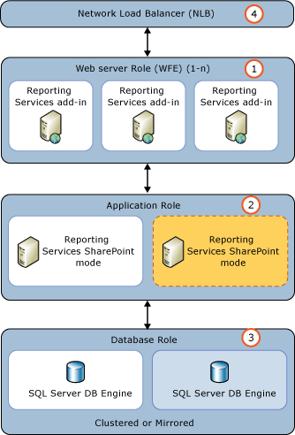

# Add an Additional Report Server to a Farm (SSRS Scale-out)
  Adding a second or more SharePoint mode report servers to your SharePoint farm can improve the performance and response time of the report server processing. If you find performance slowing down as you added more users, reports, and other applications to the report server, then adding additions report servers can improve performance. It is also recommended to add a second report server to increase the availability of report servers when there are issues with hardware or you are conducting general maintenance on individual servers in your environment. Starting with the [!INCLUDE[ssSQL11](../../includes/sssql11-md.md)] release, the steps to scale-out a [!INCLUDE[ssRSnoversion](../../includes/ssrsnoversion-md.md)] environment in SharePoint mode follows standard SharePoint farm deployment and leverages the SharePoint load balancing features.  
  
> [!IMPORTANT]  
>  Scale-out of [!INCLUDE[ssRSnoversion](../../includes/ssrsnoversion-md.md)] is not supported on all editions of [!INCLUDE[ssNoVersion](../../includes/ssnoversion-md.md)]. For more information, see the [!INCLUDE[ssRSnoversion](../../includes/ssrsnoversion-md.md)] section of [Features Supported by the Editions of SQL Server 2014](../../../2014/getting-started/features-supported-by-the-editions-of-sql-server-2014.md).  
  
> [!TIP]  
>  Starting with [!INCLUDE[ssSQL11](../../includes/sssql11-md.md)] you do not use [!INCLUDE[ssRSnoversion](../../includes/ssrsnoversion-md.md)] Configuration Manager to add servers and scale out report servers. SharePoint products manage the scale-out of reporting services as SharePoint servers with the [!INCLUDE[ssRSnoversion](../../includes/ssrsnoversion-md.md)] service are added to the farm.  
  
 For information on how to scale-out native mode report servers, see [Configure a Native Mode Report Server Scale-Out Deployment &#40;SSRS Configuration Manager&#41;](../../reporting-services/install-windows/configure-a-native-mode-report-server-scale-out-deployment.md).  
  
-   [Load Balancing](#bkmk_loadbalancing)  
  
-   [Prerequisites](#bkmk_prerequisites)  
  
-   [Steps](#bkmk_steps)  
  
-   [Additional Configuration](#bkmk_additional)  
  
##   Load Balancing  
 The Load balancing of [!INCLUDE[ssRSnoversion](../../includes/ssrsnoversion-md.md)] service applications will be managed automatically by SharePoint unless your environment has a custom or third-party load balancing solution. The default SharePoint load balancing behavior is that each [!INCLUDE[ssRSnoversion](../../includes/ssrsnoversion-md.md)] Service Application will be balanced across all the application servers where you have started the [!INCLUDE[ssRSnoversion](../../includes/ssrsnoversion-md.md)] service. To verify if the [!INCLUDE[ssRSnoversion](../../includes/ssrsnoversion-md.md)] service is installed and started, click **Manage services on server** in SharePoint Central Administration.  
  
##   Prerequisites  
  
-   You must be a local administrator to run SQL Server Setup.  
  
-   The computer must be joined to a domain.  
  
-   You need to know the name of the existing database server that is hosting the SharePoint configuration and content databases.  
  
-   The database server must be configured to allow for remote database connections.  If it is not, you will not be able to join the new server to the farm because the new server will not be able to make a connection to the SharePoint configuration databases.  
  
-   The new server will need to have the same version of SharePoint installed that the current farm servers are running. For example if the farm already has SharePoint 2010 Service Pack 1 (SP1) installed, you will need to also install SP1 on the new server before it can join the farm.  
  
-   Review the following additional topics to understand system and version requirements:  
  
     [Guidance for Using SQL Server BI Features in a SharePoint 2010 Farm](../../../2014/sql-server/install/guidance-for-using-sql-server-bi-features-in-a-sharepoint-2010-farm.md)  
  
##   Steps  
 The steps in this topic assume that a SharePoint farm administrator is installing and configuring the server. The diagram shows a typical three tier environment and the numbered items in the diagram are described in the following list:  
  
-   (1) Multiple web front-end (WFE) servers. The WFE servers require the [!INCLUDE[ssRSnoversion](../../includes/ssrsnoversion-md.md)] add-in for SharePoint 2010.  
  
-   (2) A single application server running [!INCLUDE[ssRSnoversion](../../includes/ssrsnoversion-md.md)] and web sites, for example Central Administration. The following steps add a second application server to this tier.  
  
-   (3) Two SQL Server database servers.  
  
-   (4) Represents a software or hardware network load balancing solution (NLB)  
  
   
  
 The following steps assume that an administrator is installing and configuring the server. The server will be setup as a new application server in the farm and not used as a web front-end (WFE).  
  
|Step|Description and Link|  
|----------|--------------------------|  
|Run the SharePoint 2010 Products Preparation Tool|You must have the SharePoint 2010 installation media. The preparation tool is **PrerequisiteInstaller.exe** on the installation media.|  
|Install a SharePoint 2010 product.|1) Select the **Server Farm** installation type.   2) Select **Complete** for the server type.   3) When the installation is complete, do not run the SharePoint Products Configuration wizard if your existing SharePoint farm has SharePoint 2010 SP1 installed. You should install SharePoint SP1 before running the SharePoint products configuration wizard.|  
|Install SharePoint Server 2010 SP1.|If your existing SharePoint farm has SharePoint 2010 SP1 installed download and install SharePoint 2010 SP1 from:[https://support.microsoft.com/kb/2460045](https://go.microsoft.com/fwlink/p/?linkID=219697).   For more information on SharePoint 2010 SP1, see [Known issues when you install Office 2010 SP1 and SharePoint 2010 SP1](https://support.microsoft.com/kb/2532126):|  
|Run the SharePoint Products Configuration wizard to add the server to the farm.|1) In the **Microsoft SharePoint 2010 Products** program group, click **Microsoft SharePoint 2010 Products Configuration Wizard**.   2) On the **Connect to a Server Farm** page select **Connect to an existing Farm** and click **Next**.   3) On the **Specify Configuration Database Settings** page, type the name of the database server used for the existing farm and the name of the configuration database. Click **Next**. **\*\* Important \*\*** If you see an error message similar to the following and you have verified you have permissions, then verify what protocols are enabled for the SQL Server Network Configuration in **Sql Server Configuration Manager**:"Failed to connect to the database server. Ensure the database exists , is a Sql Server, and that you have the appropriate permissions to access the server." **\*\* Important \*\*** If you see the page **Server Farm Product and Patch Status**, you will need to review the information on the page and update the server with the needed files before you can proceed with joining the server to the farm.   4) On the **Specify Farm Security Settings** page type your farm passphrase and click **Next**. Click **Next** on the confirmation page to run the wizard.   5) Click **Next** to run the **Farm Configuration Wizard**.|  
|Verify the server was added to the SharePoint farm.|1) In SharePoint Central Administration, click **Manage servers in this farm** in the **System Settings** group.   2) Verify the new server is added and the status is correct.   3) Note you do not see the service **SQL Server Reporting Services Service** running. The service will be installed in the next step.   4) To remove this server from the WFE role, click **Manage services on server** and stop the service **Microsoft SharePoint Foundation Web Application**.|  
|Install and configure Reporting Services SharePoint mode.|Run [!INCLUDE[ssCurrent](../../includes/sscurrent-md.md)] installation. For more information on the installation of [!INCLUDE[ssRSnoversion](../../includes/ssrsnoversion-md.md)] SharePoint mode, see [Install Reporting Services SharePoint Mode for SharePoint 2010](../../../2014/sql-server/install/install-reporting-services-sharepoint-mode-for-sharepoint-2010.md) If the server will only be used as an application server and the server will not be used as a WFE, you do not need to select **Reporting Services add-in for SharePoint products** on:   the **Setup Role** page, select **SQL Server Feature Installation**   the **Feature Selection** page, select **Reporting Services - SharePoint**   -OR-   the **Reporting Services Configuration**  page verify the **Install Only** option is selected for **Reporting Services SharePoint Mode**.|  
|Verify that Reporting Services is operational.|1) In SharePoint Central Administration, click **Manage servers in this farm** in the **System Settings** group.   2) Verify the service **SQL Server Reporting Services Service**.   For more information, see [Verify a Reporting Services Installation](../../reporting-services/install-windows/verify-a-reporting-services-installation.md)|  
  
##   Additional Configuration  
 You can optimize individual [!INCLUDE[ssRSnoversion](../../includes/ssrsnoversion-md.md)] servers in a scaled out deployment to perform background processing only so they do not compete for resources with interactive report execution. Background processing includes schedules, subscriptions, and data alerts.  
  
 To change the behavior of individual report servers, set **\<IsWebServiceEnable>** to false in the **RSreportServer.config** configuration file.  
  
 By default reports servers are configured with \<IsWebServiceEnable> set to TRUE. When all servers are configured for TRUE, interactive and background will be load balanced across all nodes in the farm.  
  
 If you configure all report servers with \<IsWebServiceEnable> set to False, you will see an error message similar to the following when you try to use [!INCLUDE[ssRSnoversion](../../includes/ssrsnoversion-md.md)] features:  
  
 The Reporting Services Web Service is not enabled. Configure at least one instance of the Reporting Services SharePoint Service to have \<IsWebServiceEnable> set to true. For more information, see [Modify a Reporting Services Configuration File &#40;RSreportserver.config&#41;](../report-server/modify-a-reporting-services-configuration-file-rsreportserver-config.md)  
  
## See Also  
 [Add web or application servers to farms in SharePoint 2013](https://technet.microsoft.com/library/cc261752.aspx)   
 [Configure services (SharePoint Server 2010)](https://technet.microsoft.com/library/ee794878.aspx)  
  
  
