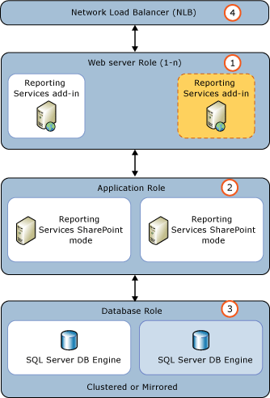

# Add an Additional Reporting Services Web Front-end to a Farm
  [!INCLUDE[ssRSnoversion](../../includes/ssrsnoversion-md.md)] SharePoint mode includes components needed for application servers and web front-end (WFE) servers. This topic focuses on installing the required [!INCLUDE[ssRSnoversion](../../includes/ssrsnoversion-md.md)] components for a WFE server, including the application pages used by [!INCLUDE[ssRSnoversion](../../includes/ssrsnoversion-md.md)] features such as subscriptions, data alerts, and [!INCLUDE[ssCrescent](../../includes/sscrescent-md.md)]. The primary [!INCLUDE[ssRSnoversion](../../includes/ssrsnoversion-md.md)] installation needed for a WFE is to install the [!INCLUDE[ssRSnoversion](../../includes/ssrsnoversion-md.md)] add-in for SharePoint 2010 products.  
  
## Prerequisites  
  
-   You must be a local administrator to run SQL Server Setup.  
  
-   The computer must be joined to a domain.  
  
-   You need to know the name of the existing database server that is hosting the SharePoint configuration and content databases.  
  
-   The database server must be configured to allow for remote database connections.  If it is not, you will not be able to join the new server to the farm because the new server will not be able to make a connection to the SharePoint configuration databases.  
  
-   The new server will need to have the same version of SharePoint installed that the current farm servers are running. For example if the farm already has SharePoint 2010 Service Pack 1 (SP1) installed, you will need to also install SP1 on the new server before it can join the farm.  
  
-   Review the following additional topics to understand system and version requirements:  
  
     [Guidance for Using SQL Server BI Features in a SharePoint 2010 Farm](../../../2014/sql-server/install/guidance-for-using-sql-server-bi-features-in-a-sharepoint-2010-farm.md)  
  
## Steps  
 The steps in this topic assume that a SharePoint farm administrator is installing and configuring the server. The diagram shows a typical three tier environment and the numbered items in the diagram are described in the following list:  
  
-   (1) Multiple web front-end (WFE) servers. The WFE servers require the [!INCLUDE[ssRSnoversion](../../includes/ssrsnoversion-md.md)] add-in for SharePoint 2010. The following steps add a second application server to this tier.  
  
-   (2) Two application servers running [!INCLUDE[ssRSnoversion](../../includes/ssrsnoversion-md.md)] and web sites, for example Central Administration.  
  
-   (3) Two SQL Server database servers.  
  
-   (4) Represents a software or hardware network load balancing solution (NLB)  
  
   
  
 The following steps assume that an administrator is installing and configuring the server.  
  
|Step|Description and Link|  
|----------|--------------------------|  
|Run the SharePoint 2010 Products Preparation Tool|You must have the SharePoint 2010 installation media. The preparation tool is **PrerequisiteInstaller.exe** on the installation media.|  
|Install a SharePoint 2010 product.|1) Select the **Server Farm** installation type.   2) Select **Complete** for the server type.   3) When the installation is complete, do not run the SharePoint Products Configuration wizard if your existing SharePoint farm has SharePoint 2010 SP1 installed. You should install SharePoint SP1 before running the SharePoint products configuration wizard.|  
|Install SharePoint Server 2010 SP1.|If your existing SharePoint farm has SharePoint 2010 SP1 installed download and install SharePoint 2010 SP1 from:[https://support.microsoft.com/kb/2460045](https://go.microsoft.com/fwlink/p/?linkID=219697).   For more information on SharePoint 2010 SP1, see [Known issues when you install Office 2010 SP1 and SharePoint 2010 SP1](https://support.microsoft.com/kb/2532126):|  
|Run the SharePoint Products Configuration wizard to add the server to the farm.|1) In the **Microsoft SharePoint 2010 Products** program group, click **Microsoft SharePoint 2010 Products Configuration Wizard**.   2) On the **Connect to a Server Farm** page select **Connect to an existing Farm** and click **Next**.   3) On the **Specify Configuration Database Settings** page, type the name of the database server used for the existing farm and the name of the configuration database. Click **Next**. **&#42;&#42; Important &#42;&#42;** If you see an error message similar to the following and you have verified you have permissions, then verify what protocols are enabled for the SQL Server Network Configuration in **Sql Server Configuration Manager**. "Failed to connect to the database server. Ensure the database exists , is a Sql Server, and that you have the appropriate permissions to access the server." **&#42;&#42; Important &#42;&#42;** If you see the page **Server Farm Product and Patch Status**, you will need to review the information on the page and update the server with the needed files before you can proceed with joining the server to the farm.   4) On the **Specify Farm Security Settings** page type your farm passphrase and click **Next**. Click **Next** on the confirmation page to run the wizard.   5) Click **Next** to run the **Farm Configuration Wizard**.|  
|Verify the server was added to the SharePoint farm.|1) In SharePoint Central Administration, click **Manage servers in this farm** in the **System Settings** group.   2) Verify the new server is added and the status is correct.   3) To remove this server from the WFE role, click **Manage services on server** and stop the service **Microsoft SharePoint Foundation Web Application**.|  
|Install the [!INCLUDE[ssCurrent](../../includes/sscurrent-md.md)] [!INCLUDE[ssRSnoversion](../../includes/ssrsnoversion-md.md)] add-in for SharePoint 2010 products.|There are several methods for installing the add-in. The following steps use the [!INCLUDE[ssCurrent](../../includes/sscurrent-md.md)] setup wizard. For more information on installing the add-in, see [Install or Uninstall the Reporting Services Add-in for SharePoint &#40;SharePoint 2010 and SharePoint 2013&#41;](install-or-uninstall-the-reporting-services-add-in-for-sharepoint.md). Run [!INCLUDE[ssCurrent](../../includes/sscurrent-md.md)] installation:   1) On the **Setup Role** page, select **SQL Server Feature Installation**   2) On the **Feature Selection** page, select **Reporting Services add-in for SharePoint products**   3) Click **Next** on the next several pages to complete the setup options.   For more information on installing [!INCLUDE[ssRSnoversion](../../includes/ssrsnoversion-md.md)], see [Install Reporting Services SharePoint Mode for SharePoint 2010](../../../2014/sql-server/install/install-reporting-services-sharepoint-mode-for-sharepoint-2010.md)|  
|Verify the new server is operational.|1) In SharePoint Central Administration, click **Manage servers in this farm** in the **System Settings** group.   2) Verify the new server is in the list.|  
|Update your NLB solution.|If appropriate, update your hardware or software NLB environment to include the new server.|  
  
## See Also  
 [Add a Web or application server to the farm (SharePoint Server 2010)](https://technet.microsoft.com/library/bb218968.aspx?missingurl=%2fen-us%2flibrary%2fe1aeaddf-6ee4-43a9-82b7-db20b68c71db\(Office.14\))   
 [Configure services (SharePoint Server 2010)](https://technet.microsoft.com/library/ee794878.aspx)  
  
  
