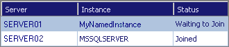

# Configure a Native Mode Report Server Scale-Out Deployment (SSRS Configuration Manager)

  Reporting Services native mode supports a scale-out deployment model that allows you to run multiple report server instances that share a single report server database. Scale-out deployments are used to increase scalability of report servers to handle more concurrent users and larger report execution loads. It can also be used to dedicate specific servers to process interactive or scheduled reports  
  
 SharePoint mode report servers utilize the SharePoint products infrastructure for scale-out. SharePoint mode scale-out is performed by adding more SharePoint mode report servers to the SharePoint farm. For information on scale-out in SharePoint mode, see [Add an Additional Report Server to a Farm &#40;SSRS Scale-out&#41;](../../reporting-services/install-windows/add-an-additional-report-server-to-a-farm-ssrs-scale-out.md).  
  
 **Scale-out deployments consist of:**  
  
-   Two or more report server instances sharing a single report server database.  
  
-   Optionally, a network load-balanced (NLB) cluster to spread interactive user load across the report server instances.  
  
 When deploying Reporting Services on an NLB cluster, you need to ensure the NLB virtual server name is used in the configuration of report server URLs and that servers are configured to share the same view state.  
  
 Reporting Services does not participate in Microsoft Cluster Services clusters. However, you can create the report server database on a Database Engine instance that is part of a failover cluster.  
  
 **To plan, install, and configure a scale-out deployment, follow these steps:**  
  
-   Review [Install SQL Server 2014 from the Installation Wizard &#40;Setup&#41;](../../database-engine/install-windows/install-sql-server-from-the-installation-wizard-setup.md) in [!INCLUDE[ssNoVersion](../../includes/ssnoversion-md.md)] Books Online for instructions on how to install report server instances.  
  
-   If you are planning to host the scale-out deployment on a network load balanced (NLB) cluster, you should configure the NLB cluster before you configure the scale-out deployment. For more information, see [Configure a Report Server on a Network Load Balancing Cluster](../report-server/configure-a-report-server-on-a-network-load-balancing-cluster.md).  
  
-   Review the procedures in this topic for instructions on how to share a report server database and join report servers to a scale-out.  
  
     The procedures explain how to configure a two-node report server scale-out deployment. Repeat the steps described in this topic to add additional report server nodes to the deployment.  
  
    -   Use Setup to install each report server instance that will be joined to the scale-out deployment.  
  
         To avoid database compatibility errors when connecting the server instances to the shared database, be sure that all instances are the same version. For example, if you create the report server database using a [!INCLUDE[ssCurrent](../../includes/sscurrent-md.md)] report server instance, all other instances in the same deployment must also be [!INCLUDE[ssCurrent](../../includes/sscurrent-md.md)].  
  
    -   Use the Reporting Services Configuration manager to connect each report server to the shared database. You can only connect to and configure one report server at a time.  
  
    -   Use the Reporting Services Configuration tool to complete the scale-out by joining new report server instances to the first report server instance already connected to the report server database.  
  
### To install a SQL Server instance to host the report server databases  
  
1.  Install a [!INCLUDE[ssNoVersion](../../includes/ssnoversion-md.md)] instance on a computer that will host the report server databases. At a minimum, install [!INCLUDE[ssDEnoversion](../../includes/ssdenoversion-md.md)] and [!INCLUDE[ssRSnoversion](../../includes/ssrsnoversion-md.md)].  
  
2.  If necessary, enable the report server for remote connections. Some versions of [!INCLUDE[ssNoVersion](../../includes/ssnoversion-md.md)] do not enable remote TCP/IP and Named Pipes connections by default. To confirm whether remote connections are allowed, use [!INCLUDE[ssNoVersion](../../includes/ssnoversion-md.md)] Configuration Manager and view the network configuration settings of the target instance. If the remote instance is also a named instance, verify that the [!INCLUDE[ssNoVersion](../../includes/ssnoversion-md.md)] Browser service is enabled and running on the target server. [!INCLUDE[ssNoVersion](../../includes/ssnoversion-md.md)] Browser provides the port number that is used to connect to the named instance.  
  
### To install the first report server instance  
  
1.  Install the first report server instance that is part of the deployment. When you install [!INCLUDE[ssRSnoversion](../../includes/ssrsnoversion-md.md)], choose the **Install but do not configure server** option on the Report Server Installation Options page.  
  
2.  Start the [!INCLUDE[ssRSnoversion](../../includes/ssrsnoversion-md.md)] Configuration tool.  
  
3.  Configure the Report Server Web service URL, Report Manager URL, and the report server database. For more information, see [Configure a Report Server &#40;Reporting Services Native Mode&#41;](../report-server/configure-a-report-server-reporting-services-native-mode.md) in [!INCLUDE[ssNoVersion](../../includes/ssnoversion-md.md)] Books Online.  
  
4.  Verify that the report server is operational. For more information, see [Verify a Reporting Services Installation](../../reporting-services/install-windows/verify-a-reporting-services-installation.md) in [!INCLUDE[ssNoVersion](../../includes/ssnoversion-md.md)] Books Online.  
  
### To install and configure the second report server instance  
  
1.  Run Setup to install a second instance of [!INCLUDE[ssRSnoversion](../../includes/ssrsnoversion-md.md)] on a different computer or as a named instance on the same computer. When you install Reporting Services, choose the **Install but do not configure server** option on the Report Server Installation Options page.  
  
2.  Start the [!INCLUDE[ssRSnoversion](../../includes/ssrsnoversion-md.md)] Configuration tool and connect to the new instance you just installed.  
  
3.  Connect the report server to the same database you used for the first report server instance:  
  
    1.  Click **Database** to open the Database page.  
  
    2.  Click **Change Database**.  
  
    3.  Click **Choose an existing report server database**.  
  
    4.  Type the server name of the SQL Server Database Engine instance that hosts the report server database you want to use. This must be the same server that you connected to in the previous set of the instructions.  
  
    5.  Click **Test Connection**, and then click **Next**.  
  
    6.  In **Report Server Database**, select the database you created for the first report server, and then click **Next**. The default name is ReportServer. Do not select ReportServerTempDB; it is used only for storing temporary data when processing reports. If the database list is empty, repeat the previous four steps to establish a connection to the server.  
  
    7.  In the Credentials page, select the type of account and credentials that the report server will use to connect to the report server database. You can use the same credentials as the first report server instance or different credentials. Click **Next**.  
  
    8.  Click **Summary** and then click **Finish**.  
  
4.  Configure the Report Server Web service URL. Do not test the URL yet. It will not resolve until the report server is joined to the scale-out deployment.  
  
5.  Configure the Report Manager URL. Do not test the URL yet or try to verify the deployment. The report server will be unavailable until the report server is joined to the scale-out deployment.  
  
### To join the second report server instance to the scale-out deployment  
  
1.  Open the [!INCLUDE[ssRSnoversion](../../includes/ssrsnoversion-md.md)] Configuration tool, and reconnect to the first report server instance. The first report server is already initialized for reversible encryption operations, so it can be used to join additional report server instances to the scale-out deployment.  
  
2.  Click **Scale-out Deployment** to open the Scale-out Deployment page. You should see two entries, one for each report server instance that is connected to the report server database. The first report server instance should be joined. The second report server should be "Waiting to join". If you do not see similar entries for your deployment, verify you are connected to the first report server that is already configured and initialized to use the report server database.  
  
       
  
3.  On the Scale-out Deployment page, select the report server instance that is waiting to join the deployment, and click **Add Server**.  
  
    > [!NOTE]  
    >  **Issue:** When you attempt to join a Reporting Services report server instance to the scale-out deployment, you may experience error messages similar to 'Access Denied'.  
    >   
    >  **Workaround:** Back up the [!INCLUDE[ssRSnoversion](../../includes/ssrsnoversion-md.md)] encryption key from the first [!INCLUDE[ssRSnoversion](../../includes/ssrsnoversion-md.md)] instance and restore the key to the second [!INCLUDE[ssRSnoversion](../../includes/ssrsnoversion-md.md)] report server. Then try to join the second server to the [!INCLUDE[ssRSnoversion](../../includes/ssrsnoversion-md.md)] scale-out deployment.  
  
4.  You should now be able to verify that both report server instances are operational. To verify the second instance, you can use the Reporting Services Configuration tool to connect to the report server and click the Web Service URL or the Report Manager URL.  
  
 If you plan to run the report servers in a load-balanced server cluster, additional configuration is required. For more information, see [Configure a Report Server on a Network Load Balancing Cluster](../report-server/configure-a-report-server-on-a-network-load-balancing-cluster.md).  
  
## See Also  
 [Configure a Service Account &#40;SSRS Configuration Manager&#41;](../../../2014/sql-server/install/configure-a-service-account-ssrs-configuration-manager.md)   
 [Configure a URL  &#40;SSRS Configuration Manager&#41;](../../reporting-services/install-windows/configure-a-url-ssrs-configuration-manager.md)   
 [Create a Native Mode Report Server Database  &#40;SSRS Configuration Manager&#41;](../../reporting-services/install-windows/ssrs-report-server-create-a-native-mode-report-server-database.md)   
 [Configure Report Server URLs  &#40;SSRS Configuration Manager&#41;](../../reporting-services/install-windows/configure-report-server-urls-ssrs-configuration-manager.md)   
 [Configure a Report Server Database Connection  &#40;SSRS Configuration Manager&#41;](../../../2014/sql-server/install/configure-a-report-server-database-connection-ssrs-configuration-manager.md)   
 [Add and Remove Encryption Keys for Scale-Out Deployment &#40;SSRS Configuration Manager&#41;](../../reporting-services/install-windows/add-and-remove-encryption-keys-for-scale-out-deployment.md)   
 [Manage a Reporting Services Native Mode Report Server](../report-server/manage-a-reporting-services-native-mode-report-server.md)  
  
  
