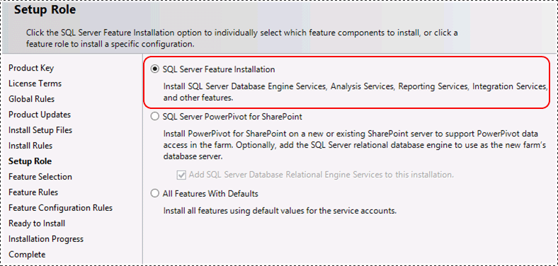
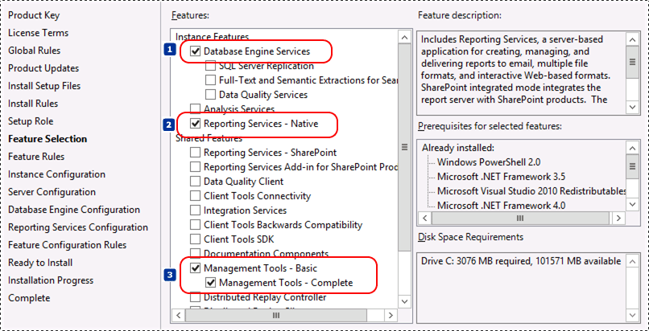
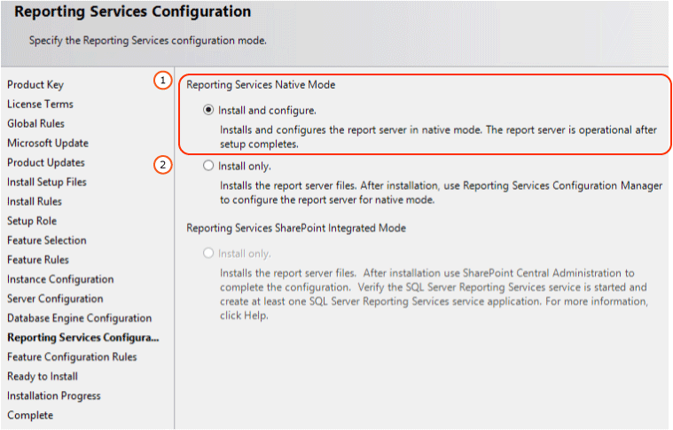

# Install Reporting Services Native Mode Report Server
  A [!INCLUDE[ssRSnoversion](../../includes/ssrsnoversion-md.md)] native mode report server can be installed from the [!INCLUDE[ssNoVersion](../../includes/ssnoversion-md.md)] installation wizard or from the command line. In the setup wizard, you can select to either 1) install files and configure the server with default settings or to 1) only install the files and the server is not configured by the installation wizard. This topic reviews the *Default configuration for native mode* where Setup both installs and configures a report server instance. After Setup is finished, the report server is running and ready to use. A native mode report server runs as a stand-alone application server. Native mode is the default server mode.  
  
||  
|-|  
|**[!INCLUDE[applies](../../includes/applies-md.md)]**  [!INCLUDE[ssRSnoversion](../../includes/ssrsnoversion-md.md)] Native mode|  
  
##  <a name="bkmk_top"></a> In this topic  
  
-   [What is the Default Configuration?](#bkmk_whatisdefaultconfiguration)  
  
-   [When to Install the Default Configuration for Native Mode](#bkmk_whentoinstalldefaultconfig)  
  
-   [Requirements](#bkmk_requirements)  
  
-   [Default URL Reservations](#bkmk_defaultURLreservations)  
  
-   [Install Native Mode with the SQL Server Installation Wizard](#bkmk_installwithwizard)  
  
-   [Install Native Mode with the Command Line](#bkmk_commandline)  
  
##  <a name="bkmk_whatisdefaultconfiguration"></a> What is the Default Configuration?  
 Setup installs the following [!INCLUDE[ssRSnoversion](../../includes/ssrsnoversion-md.md)] features when you select the default configuration for native mode option:  
  
-   Report Server service (which includes the Report Server Web service, background processing application, and Report Manager)  
  
-   The [!INCLUDE[ssRSnoversion](../../includes/ssrsnoversion-md.md)] Configuration Manager  
  
-   The [!INCLUDE[ssRSnoversion](../../includes/ssrsnoversion-md.md)] command line utilities (rsconfig.exe, rskeymgmt.exe and rs.exe)  
  
 This option does not apply to shared features such as [!INCLUDE[ssNoVersion](../../includes/ssnoversion-md.md)] [!INCLUDE[ssManStudio](../../includes/ssmanstudio-md.md)] or [!INCLUDE[ssBIDevStudioFull](../../includes/ssbidevstudiofull-md.md)], which must be specified as separate items if you want to install them.  
  
 Setup configures the following for a native mode report server installation:  
  
-   Service account for the Report Server service.  
  
-   Report Server Web service URL.  
  
-   Report Manager URL.  
  
-   Report Server database.  
  
-   Service account access to the report server databases.  
  
-   DSN connection for the report server databases.  
  
 Setup does not configure the unattended execution account, report server e-mail, back up the encryption keys, or a scale-out deployment. You can use the [!INCLUDE[ssRSnoversion](../../includes/ssrsnoversion-md.md)] Configuration Manager to configure these properties. For more information, see [Reporting Services Configuration Manager &#40;Native Mode&#41;](../../sql-server/install/reporting-services-configuration-manager-native-mode.md).  
  
##  <a name="bkmk_whentoinstalldefaultconfig"></a> When to Install the Default Configuration for Native Mode  
 A default configuration installs [!INCLUDE[ssRSnoversion](../../includes/ssrsnoversion-md.md)] in an operational state so that you can use the report server immediately after Setup is finished. Specify this mode when you want to save steps by eliminating any required configuration tasks you would otherwise have to perform in the [!INCLUDE[ssRSnoversion](../../includes/ssrsnoversion-md.md)] Configuration tool.  
  
 Installing the default configuration does not guarantee that the report server will work after Setup is finished. The default URLs might not register when the service starts. Always test your installation to verify that the service starts and runs as expected.  
  
##  <a name="bkmk_requirements"></a> Requirements  
 The default configuration option uses default values to configure the core settings required to make a report server operational. It has the following requirements:  
  
-   You hardware should meet minimum hardware and software requirements for running Microsoft SQL Server. For more information, see [Hardware and Software Requirements for Installing SQL Server 2014](../../sql-server/install/hardware-and-software-requirements-for-installing-sql-server.md).  
  
-   [!INCLUDE[ssRSnoversion](../../includes/ssrsnoversion-md.md)] and [!INCLUDE[ssNoVersion](../../includes/ssnoversion-md.md)] [!INCLUDE[ssDE](../../includes/ssde-md.md)] must be installed together in the same instance. The [!INCLUDE[ssDE](../../includes/ssde-md.md)] instance hosts the report server database that Setup creates and configures.  
  
-   The user account used to run Setup must be a member of the local Administrators group and have permission to access and create databases on the [!INCLUDE[ssDE](../../includes/ssde-md.md)] instance that hosts the report server databases.  
  
-   Setup must be able to use the default values to reserve the URLs that provide access to the report server and Report Manager. These values are port 80, a strong wildcard, and the virtual directory names in the format **ReportServer_\<***instance_name***>** and **Reports_\<***instance_name***>**.  
  
-   Setup must be able to use the default values to create the report server databases. These values are **ReportServer** and **ReportServerTempDB**. If you have existing databases from a previous installation, Setup will be blocked because it cannot configure the report server in the default configuration for native mode. You must rename, move, or delete the databases to unblock Setup.  
  
 If your computer does not meet all requirements for a default installation, you must install [!INCLUDE[ssRSnoversion](../../includes/ssrsnoversion-md.md)] in files-only mode and then use the [!INCLUDE[ssRSnoversion](../../includes/ssrsnoversion-md.md)] Configuration Manager to configure it after Setup is finished.  
  
 Do not try to reconfigure your computer only to allow a default installation to continue. Doing so could require several hours of work, effectively eliminating the time-saving benefit the installation option provides. The best solution is to install [!INCLUDE[ssRSnoversion](../../includes/ssrsnoversion-md.md)] in files-only mode and then configure the report server to use specific values.  
  
##  <a name="bkmk_defaultURLreservations"></a> Default URL Reservations  
 URL reservations are composed of a prefix, host name, port, and virtual directory:  
  
|Part|Description|  
|----------|-----------------|  
|Prefix|The default prefix is HTTP. If you previously installed a Secure Sockets Layer (SSL) certificate, Setup will try to create URL reservations that use the HTTPS prefix.|  
|Host name|The default host name is a strong wildcard (+). It specifies that the report server will accept any HTTP request on the designated port for any host name that resolves to the computer, including http://\<computername>/reportserver, http://localhost/reportserver, or http://\<IPAddress>/reportserver.|  
|Port|The default port is 80. Note that if you use any port other than port 80, you will have to explicitly add it to the URL when you open a [!INCLUDE[ssRSnoversion](../../includes/ssrsnoversion-md.md)] Web application in a browser window.|  
|Virtual directory|By default, virtual directories are created in the format of ReportServer_\<*instance_name*> for the Report Server Web service and Reports_\<*instance_name*> for Report Manager. For the Report Server Web service, the default virtual directory is **reportserver**. For Report Manager, the default virtual directory is **reports**.|  
  
 An example of the complete URL string might be as follows:  
  
-   http://+:80/reportserver, provides access to the report server.  
  
-   http://+:80/reports, provides access to Report Manager.  
  
##  <a name="bkmk_installwithwizard"></a> Install Native Mode with the SQL Server Installation Wizard  
 The following list describes the  [!INCLUDE[ssRSnoversion](../../includes/ssrsnoversion-md.md)] specific  steps and options you select in the SQL Server Installation Wizard. The list does not described each page you will see in the installation wizard, only the [!INCLUDE[ssRSnoversion](../../includes/ssrsnoversion-md.md)] related pages that are part of a Native mode installation.  
  
1.  On the **Setup Role** page, Select **SQL Server Feature Installation**.  
  
       
  
2.  On the **Feature Selection** page, select the following:  
  
    -   **Database Engine Services**, unless an instance of the database engine is already installed.  
  
    -   **Reporting Services-Native**.  
  
    -   **Management Tools - Basic**. The management tools are not required but it is recommended unless you have some other installation of management tools. The default configuration option will result a functioning report server but you may want to change configuration options at a later date. Some options such as 'My Reports' are managed through [!INCLUDE[ssManStudio](../../includes/ssmanstudio-md.md)]  
  
       
  
3.  If you plan to use the [!INCLUDE[ssRSnoversion](../../includes/ssrsnoversion-md.md)] subscription feature, then on the **Server Configuration** page, you want to verify SQL Server Agent is configured for **Automatic** Startup type.  
  
4.  On the **Reporting Services Configuration** page select **Install and Configure**.  
  
       
  
5.  After the SQL Server installation wizard is complete, verify the default Native mode installation using the following basic steps.  
  
    -   Open [!INCLUDE[ssRSnoversion](../../includes/ssrsnoversion-md.md)] Configuration Manager and confirm you can connect to the report server.  
  
    -   Open your browser with administrative privileges and connect to [!INCLUDE[ssRSnoversion](../../includes/ssrsnoversion-md.md)] Report Manager, for example `http://loclahost/Reports`.  
  
    -   Open your browser with administrative privileges and connect to the [!INCLUDE[ssRSnoversion](../../includes/ssrsnoversion-md.md)] report server page. For example,  `http://loclahost/ReportServer`  
  
 For more information, see the Native section of the following two topics:  
  
 [Verify a Reporting Services Installation](../../reporting-services/install-windows/verify-a-reporting-services-installation.md)  
  
 [Troubleshoot a Reporting Services Installation](../../reporting-services/install-windows/troubleshoot-a-reporting-services-installation.md)  
  
##  <a name="bkmk_commandline"></a> Install Native Mode with the Command Line  
 The following example includes the [!INCLUDE[ssDE](../../includes/ssde-md.md)] Service because it is required for a default configuration.  
  
```  
setup /q /ACTION=install /FEATURES=SQL,RS,TOOLS /INSTANCENAME=MSSQLSERVER /SQLSYSADMINACCOUNTS="BUILTIN\ADMINISTRATORS"   
/RSSVCACCOUNT="NT AUTHORITY\NETWORK SERVICE" /SQLSVCACCOUNT="NT AUTHORITY\NETWORK SERVICE" /AGTSVCACCOUNT="NT AUTHORITY\NETWORK   
SERVICE" /RSSVCSTARTUPTYPE="Manual" /RSINSTALLMODE="DefaultNativeMode"  
```  
  
 For more information and examples, see [Command Prompt Installation of Reporting Services SharePoint Mode and Native Mode](../../reporting-services/install-windows/install-reporting-services-at-the-command-prompt.md) and [Install SQL Server 2014 from the Command Prompt](../../database-engine/install-windows/install-sql-server-from-the-command-prompt.md)  
  
## See Also  
 [Troubleshoot a Reporting Services Installation](../../reporting-services/install-windows/troubleshoot-a-reporting-services-installation.md)   
 [Verify a Reporting Services Installation](../../reporting-services/install-windows/verify-a-reporting-services-installation.md)   
 [Configure the Report Server Service Account &#40;SSRS Configuration Manager&#41;](../../reporting-services/install-windows/configure-the-report-server-service-account-ssrs-configuration-manager.md)   
 [Configure Report Server URLs  &#40;SSRS Configuration Manager&#41;](../../reporting-services/install-windows/configure-report-server-urls-ssrs-configuration-manager.md)   
 [Configure a Report Server Database Connection  &#40;SSRS Configuration Manager&#41;](../../../2014/sql-server/install/configure-a-report-server-database-connection-ssrs-configuration-manager.md)   
 [Files-Only Installation &#40;Reporting Services&#41;](../../reporting-services/install-windows/files-only-installation-reporting-services.md)   
 [Initialize a Report Server &#40;SSRS Configuration Manager&#41;](../../reporting-services/install-windows/ssrs-encryption-keys-initialize-a-report-server.md)   
 [Configure SSL Connections on a Native Mode Report Server](../security/configure-ssl-connections-on-a-native-mode-report-server.md)   
 [Configure Report Server URLs  &#40;SSRS Configuration Manager&#41;](../../reporting-services/install-windows/configure-report-server-urls-ssrs-configuration-manager.md)   
 [Configure Windows Service Accounts and Permissions](../../database-engine/configure-windows/configure-windows-service-accounts-and-permissions.md)   
 [Quick-Start Installation of SQL Server 2014](../../../2014/getting-started/quick-start-installation-of-sql-server-2014.md)  
  
  
