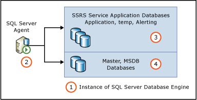

# Provision Subscriptions and Alerts for SSRS Service Applications
  [!INCLUDE[ssRSnoversion](../../includes/ssrsnoversion-md.md)] subscriptions and data alerts require SQL Server Agent and require the configuration of permissions for SQL Server Agent. If you see error messages that indicate SQL Server Agent is required and you have verified SQL Server Agent is running, then update or verify permissions. The scope of this topic is [!INCLUDE[ssRSnoversion](../../includes/ssrsnoversion-md.md)] in SharePoint mode and the topic describes three ways you can update the permissions of SQL Server Agent with [!INCLUDE[ssRSnoversion](../../includes/ssrsnoversion-md.md)] subscriptions. The credentials you use for the steps in this topic need to have sufficient permissions to grant execute permissions to the RSExecRole for objects in the service application, msdb, and master databases.  
  
||  
|-|  
|**[!INCLUDE[applies](../../includes/applies-md.md)]**  SharePoint 2013 &#124; SharePoint 2010|  
  
   
  
||Description|  
|------|-----------------|  
|**1**|The instance of SQL Server Database engine that is hosting the Reporting Services service application databases.|  
|**2**|The instance of SQL Server agent for the instance of the SQL database engine.|  
|**3**|The Reporting Services service application databases. The names are based on the information used for creating the service application. The following are example database names:   ReportingService_2fbae157295d49df86d0b85760c704b0   ReportingService_2fbae157295d49df86d0b85760c704b0_Alerting   ReportingService_2fbae157295d49df86d0b85760c704b0TempDB|  
|**4**|The master and MSDB database of the instance of the SQL Server Database engine.|  
  
 Use one the following three methods to update the permissions:  
  
1.  From the **Provisions and Subscriptions and Alerts** page, type credentials and click **ok**.  
  
2.  From the Provisions and Subscriptions and Alerts page, click the **Download Script** button to download a transact SQL script that can be used to configure permissions.  
  
3.  Run a PowerShell cmdlet to build a transact SQL script that can be used to configure permissions.  
  
### To update permissions using the provision page  
  
1.  From SharePoint Central Administration, in the **Application Management** group click **Manage Service Applications**  
  
2.  Find your service application in the list and click the name of the application or click the **Type** column to select the services application and click the **Manage** button in the SharePoint ribbon.  
  
3.  On the **Manage Reporting Services Application** page, click **Provision Subscriptions and Alerts**.  
  
4.  If the SharePoint administrator has enough privileges to the Master database and the service application databases, type those credentials.  
  
5.  Click the **OK** button.  
  
##   To download the Transact-SQL Script  
  
1.  From SharePoint Central Administration, in the **Application Management** group click **Manage Service Applications**  
  
2.  Find your service application in the list and click the name of the application or click the **Type** column to select the services application and click the **Manage** button in the SharePoint ribbon.  
  
3.  On the **Manage Reporting Services Application** page, click **Provision Subscriptions and Alerts**.  
  
4.  In the **View Status** area, verify SQL Server Agent is running.  
  
5.  Click **Download Script** to download a transact SQL script you can run in SQL Server Management studio to grant permissions. The script file name that is created will contain the name of your Reporting Services service application name, for example **[name of the service application]-GrantRights.sql**.  
  
### To generate the Transact-SQL statement with PowerShell  
  
1.  You can also use a Windows PowerShell cmdlet in the SharePoint 2010 Management Shell to create the Transact-SQL script.  
  
2.  On the **Start** menu, click **All Programs**.  
  
3.  Expand **Microsoft SharePoint 2010 Products** and click **SharePoint 2010 Management Shell**.  
  
4.  Update the following PowerShell cmdlet by replacing the name of the report server database, application pool account, and the path of the statement.  
  
     **Syntax of cmdlet:** `Get-SPRSDatabaseRightsScript -DatabaseName <ReportingServices database name> -UserName <app pool account> -IsWindowsUser | Out-File <path of statement>`  
  
     **Sample cmdlet:** `Get-SPRSDatabaseRightsScript -DatabaseName ReportingService_46fd00359f894b828907b254e3f6257c -UserName "NT AUTHORITY\NETWORK SERVICE" -IsWindowsUser | Out-File c:\SQLServerAgentrights.sql`  
  
## Using the Transact-SQL Script  
 The following procedures can be used with scripts download from the provisions page or scripts created using PowerShell.  
  
#### To load the Transact-SQL script in SQL Server Management Studio  
  
1.  To open SQL Server Management Studio, on the **Start** menu, click **Microsoft SQL Server 2012** and click **SQL Server Management Studio**.  
  
2.  In the **Connect to Server** dialog box set the following options:  
  
    -   In the **Server type** list, select **Database Engine**  
  
    -   In **Server Name**, type the name of the SQL Server instance on which you want to configure SQL Server Agent.  
  
    -   Select an authentication mode.  
  
    -   If connecting using SQL Server Authentication, provide a login and password.  
  
3.  Click **Connect**.  
  
#### To run the Transact-SQL statement  
  
1.  On the toolbar of SQL Server Management Studio, click **New Query**.  
  
2.  On the **File** menu, click **Open**, and then click **File**.  
  
3.  Navigate to the folder where you saved the Transact-SQL statement that you generated in SharePoint 2010 Management Shell.  
  
4.  Click the file and then click **Open**.  
  
     The statement is added to the query window.  
  
5.  Click **Execute**.  
  
  
