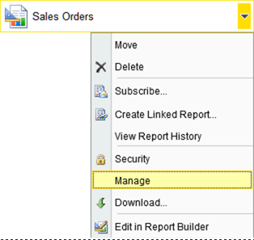
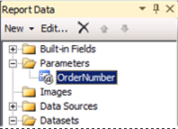
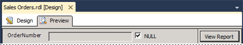

# Lesson 2: Modifying the Report Data Source Properties
  In this lesson, you will use Report Manager to select a report that will be delivered to recipients. The data-driven subscription that you will define will distribute the **Sales Order** report created in the tutorial [Create a Basic Table Report &#40;SSRS Tutorial&#41;](../reporting-services/create-a-basic-table-report-ssrs-tutorial.md). In the steps that follow, you will modify the data source connection information used by the report to get data. Only reports that use **stored credentials** to access a report data source can be distributed through a data-driven subscription. Stored credentials are necessary for unattended report processing.  
  
 You will also modify the dataset and report to use a parameter to filter the report on the `[Order]` so the subscription can output different instances of the report for specific orders and rendering formats.  
  
 **In this topic:**  
  
-   [To Modify the Data Source Properties](#bkmk_modify_datasource)  
  
-   [To Modify the AdventureWorksDataset](#bkmk_modify_dataset)  
  
-   [To Add a Report Parameter and Republish the Report](#bkmk_add_reportparameter)  
  
-   [To Re-deploy the Report](#bkmk_redeploy)  
  
##  <a name="bkmk_modify_datasource"></a> To Modify the Data Source Properties  
  
1.  Start [Report Manager  &#40;SSRS Native Mode&#41;](../../2014/reporting-services/report-manager-ssrs-native-mode.md) with administrator privileges, for example, right-click the icon for Internet Explorer and click **Run as administrator**.  
  
2.  Browse to the folder containing the **Sales Orders** report and in the context menu of the report, click **Manage**.  
  
       
  
3.  Click the **Data Sources** tab.  
  
4.  For **Connection Type**, select **Microsoft SQL Server**.  
  
5.  The custom data source connection string will be the following and it assumes that the sample database is on a local database server:  
  
    ```  
    Data source=localhost; initial catalog=AdventureWorks2012  
    ```  
  
6.  Click **Credentials stored securely in the report server**.  
  
7.  Type your user name (use the format *domain\user*) and password. If you do not have permission to access the [!INCLUDE[ssSampleDBobject](../includes/sssampledbobject-md.md)] database, specify a login that does.  
  
8.  Click **Use as windows credentials when connecting to the data source**, and then click **OK**. If you are not using a domain account (for example, if you are using a [!INCLUDE[ssNoVersion](../includes/ssnoversion-md.md)] login), do not click this checkbox.  
  
9. Click **Test Connection** to verify you can connect to the data source.  
  
10. Click **Apply**.  
  
11. View the report to verify that the report runs with the credentials you specified. To view the report, click the **View** tab. Note that once the report is open, you must select an Employee name and then click the **View Report** button to view the report.  
  
##  <a name="bkmk_modify_dataset"></a> To Modify the AdventureWorksDataset  
  
1.  Open the Sales Orders report in [!INCLUDE[ssBIDevStudio](../includes/ssbidevstudio-md.md)]  
  
2.  Right-click the dataset `AdventureWorksDataset` and click **Dataset Properties**.  
  
3.  Add the statement `WHERE (UPPER(SalesOrderNumber) =UPPER(@OrderNumber) or  @OrderNumber IS NULL)` before the `Group By` statement. The full query syntax is the following:  
  
    ```  
    SELECT soh.OrderDate AS Date, soh.SalesOrderNumber AS [Order], pps.Name AS Subcat, pp.Name AS Product, SUM(sd.OrderQty) AS Qty, SUM(sd.LineTotal)  AS LineTotal  
    FROM Sales.SalesPerson AS sp INNER JOIN  
      Sales.SalesOrderHeader AS soh ON sp.BusinessEntityID = soh.SalesPersonID INNER JOIN  
       Sales.SalesOrderDetail AS sd ON sd.SalesOrderID = soh.SalesOrderID INNER JOIN  
       Production.Product AS pp ON sd.ProductID = pp.ProductID  
    INNER JOIN  
       Production.ProductSubcategory AS pps ON pp.ProductSubcategoryID = pps.ProductSubcategoryID   
    INNER JOIN  
        Production.ProductCategory AS ppc ON ppc.ProductCategoryID = pps.ProductCategoryID  
  
    WHERE (UPPER(SalesOrderNumber) =UPPER(@OrderNumber) or  @OrderNumber IS NULL)  
  
    GROUP BY ppc.Name, soh.OrderDate, soh.SalesOrderNumber, pps.Name, pp.Name, soh.SalesPersonID  
    HAVING (ppc.Name = 'Clothing')  
    ```  
  
4.  Click **OK**  
  
##  <a name="bkmk_add_reportparameter"></a> To Add a Report Parameter and Republish the Report  
  
1.  In the **Report Data** pane click **New** and then click **Parameter...**  
  
2.  In **Name**, type `OrderNumber`.  
  
3.  In **Prompt**, type `OrderNumber`.  
  
4.  Select **Allow blank value ("")**.  
  
5.  Select **Allow null value**.  
  
6.  Click **OK**. The parameter will be added to the **Report Data pane** and it will look like the following image:  
  
       
  
7.  Click the **Preview** tab to run the report.Note the parameter input box at the top of the report. You can either:  
  
    -   Click View Report to see the full report without using a parameter.  
  
    -   Unselect the Null option and type an order number, for example so71949 to view only the one order in the report.  
  
           
  
8.  Re-deploy the report so the subscription configuration in the next lesson can utilize the changes you made in this lesson. For more information on the project properties used in the table tutorial, see section 'To Publish the Report to the Report Server (Optional)' of [Lesson 6: Adding Grouping and Totals &#40;Reporting Services&#41;](../reporting-services/lesson-6-adding-grouping-and-totals-reporting-services.md).  
  
##  <a name="bkmk_redeploy"></a> To Re-deploy the Report  
  
1.  Re-deploy the report so the subscription configuration in the next lesson can utilize the changes you made in this lesson. For more information on the project properties used in the table tutorial, see section 'To Publish the Report to the Report Server (Optional)' of [Lesson 6: Adding Grouping and Totals &#40;Reporting Services&#41;](../reporting-services/lesson-6-adding-grouping-and-totals-reporting-services.md).  
  
2.  On the toolbar click **Build** and then click **Deploy tutorial**.  
  
## Next Steps  
 You successfully configured the report to get data using stored credentials. Next, you specify the subscription using the Data-Driven Subscription pages in Report Manager. See [Lesson 3: Defining a Data-Driven Subscription](../reporting-services/lesson-3-defining-a-data-driven-subscription.md).  
  
## See Also  
 [Manage Report Data Sources](report-data/manage-report-data-sources.md)   
 [Specify Credential and Connection Information for Report Data Sources](report-data/specify-credential-and-connection-information-for-report-data-sources.md)   
 [Create a Data-Driven Subscription &#40;SSRS Tutorial&#41;](../reporting-services/create-a-data-driven-subscription-ssrs-tutorial.md)   
 [Create a Basic Table Report &#40;SSRS Tutorial&#41;](../reporting-services/create-a-basic-table-report-ssrs-tutorial.md)  
  
  
