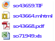

# Lesson 3: Defining a Data-Driven Subscription
  In this lesson, you use the data-driven subscription pages to connect to a subscription data source, build a query that retrieves subscription data, and map the result set to report and delivery options.  
  
> [!NOTE]  
>  Before you start, verify that [!INCLUDE[ssNoVersion](../includes/ssnoversion-md.md)] Agent service is running. If it is not running, you cannot save the subscription.  
  
 This lesson assumes you completed Lesson 1 and Lesson 2 and that the report data source uses stored credentials.  For more information, see [Lesson 2: Modifying the Report Data Source Properties](../reporting-services/lesson-2-modifying-the-report-data-source-properties.md)  
  
 In this topic:  
  
-   [Start the Data-Driven Subscription Wizard](#bkmk_startwizard)  
  
-   [Step 1 - Define a description](#bkmk_definesubscription)  
  
-   [Step 2 - Define a Connection to the Subscriber Data Source](#bkmk_defineconnectiontosubscriber)  
  
-   [Step 3 - Define a Query to Retrieve Subscriber data](#bkmk_definequery)  
  
-   [Step 4 - Set Delivery Options](#bkmk_set_deliveryoptions)  
  
-   [Step 5 - Configure a Parameter Value to Very Report Output](#bkmk_configure_parameter)  
  
-   [Step 6 - To Schedule a Subscription](#bkmk_schedule_subscription)  
  
##  <a name="bkmk_startwizard"></a> Start the Data-Driven Subscription Wizard  
  
1.  In Report Manager, click **Home**, and navigate to the folder containing the **Sales Orders** report.  
  
2.  In the context menu of the report, click **Manage**, and then click the **Subscriptions** tab.  
  
3.  Click **New Data-driven Subscription**. If you do not see this button, you do not have Content Manager permissions.  
  
##  <a name="bkmk_definesubscription"></a> Step 1 - Define a description  
  
1.  Type **Sales Order delivery** in description.  
  
2.  Select **Windows FileShare** for **Specify how recipients are notified**.  
  
3.  Select **Specify for this subscription only**, and then click **Next**.  
  
##  <a name="bkmk_defineconnectiontosubscriber"></a> Step 2 - Define a Connection to the Subscriber Data Source  
  
1.  Select **Microsoft SQL Server** as the data source type.  
  
2.  In Connection string, type the following connection string:  
  
    ```  
    data source=localhost; initial catalog=Subscribers  
    ```  
  
    > [!NOTE]  
    >  Subscribers is the database you created in lesson 1.  
  
3.  Click **Credentials stored securely in the report server**.  
  
4.  In **User Name** and **Password**, type your domain user name and password. Include both the domain and user account when specifying **User Name**.  
  
    > [!NOTE]  
    >  Credentials used to connect to a subscriber data source are not passed back to [!INCLUDE[ssManStudio](../includes/ssmanstudio-md.md)]. If you modify the subscription later, you must retype the password used to connect to the data source.  
  
5.  Select **Use as windows credentials when connecting to the data source**, and then click **Next**.  
  
##  <a name="bkmk_definequery"></a> Step 3 - Define a Query to Retrieve Subscriber data  
  
1.  In the query box, type the following query:  
  
    ```  
    Select * from OrderInfo  
    ```  
  
2.  Specify a time-out of 30 seconds.  
  
3.  Click **Validate**, and then click **Next**.  
  
##  <a name="bkmk_set_deliveryoptions"></a> Step 4 - Set Delivery Options  
  
1.  For **File name**, select **Get the value from the database**. Select the field **Order**.  
  
2.  For **Path**, select **Specify a static value**. In Setting Value, type the name of a public file share for which you have write permissions (for example, `\\mycomputer\public\myreports`).  
  
3.  For **Render Format**, select **Get the value from the database**. Select **Format**.  
  
4.  For **Write mode**, select **Specify a static value** and select **AutoIncrement**.  
  
5.  For **File Extension**, select **Specify a static value** and select **True**.  
  
6.  For **User name**, select **Specify a static value**. Type your domain user account. Enter it in this format: `<domain>\<account>`. The user account needs to have permissions to the path you configured in the previous steps.  
  
7.  For **Password**, select **Specify a static value**. Type your password. Be sure that you type the password carefully. The wizard does not validate the password.  
  
8.  Click **Next.**  
  
##  <a name="bkmk_configure_parameter"></a> Step 5 - Configure a Parameter Value to Very Report Output  
  
1.  For **OrderNumber**, select **Get the value from the database**. In Value, select **Order**. Click **Next.**  
  
##  <a name="bkmk_schedule_subscription"></a> Step 6 - To Schedule a Subscription  
  
1.  Click **On a schedule created for this subscription**, and then click **Next**.  
  
2.  In **Schedule Details**, click **Once**.  
  
3.  Specify a start time that is a few minutes ahead of the current time.  
  
4.  Click **Finish**.  
  
## Next Steps  
 When the subscription runs, four report files will be delivered to the file share you specified, one for each order in the *Subscribers* data source. Each delivery should be unique in terms of data (the data should be order-specific), rendering format, and file format. You can open each report from the shared folder to verify that each version is customized based on the subscription options you defined.  
  
   
  
 The subscription page in Report Manager will contain the **Last Run** date and **Status** of the subscription.  
  
> [!NOTE]  
>  Refresh the page after the subscription runs to see the updated information.  
  
   
  
 This step concludes the tutorial "Defining a Data-Driven Subscription". To learn more about other [!INCLUDE[ssRSnoversion](../includes/ssrsnoversion-md.md)] tutorials, see [Reporting Services Tutorials &#40;SSRS&#41;](../reporting-services/reporting-services-tutorials-ssrs.md).  
  
## See Also  
 [Create a Data-Driven Subscription &#40;SSRS Tutorial&#41;](../reporting-services/create-a-data-driven-subscription-ssrs-tutorial.md)   
 [Subscriptions and Delivery &#40;Reporting Services&#41;](subscriptions/subscriptions-and-delivery-reporting-services.md)   
 [Data-Driven Subscriptions](subscriptions/data-driven-subscriptions.md)   
 [Create, Modify, and Delete a Data-Driven Subscription](subscriptions/create-modify-and-delete-data-driven-subscriptions.md)   
 [Use an External Data Source for Subscriber Data &#40;Data-Driven Subscription&#41;](subscriptions/use-an-external-data-source-for-subscriber-data-data-driven-subscription.md)  
  
  
