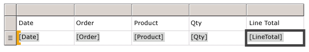
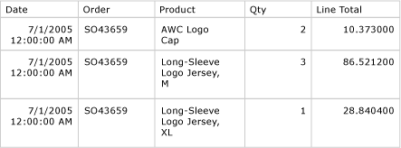

# Lesson 4: Adding a Table to the Report (Reporting Services)
  After the dataset is defined, you can start designing the report. You create a report layout by dragging and dropping data regions, text boxes, images, and other items that you want to include in your report to the design surface.  
  
 Items that contain repeated rows of data from underlying datasets are called *data regions*. A basic report will have only one data region, but you can add more, for example, if you want to add a chart to your tabular report. After you add a data region, you can add fields to the data region.  
  
### To add a Table data region and fields to a report layout  
  
1.  In the **Toolbox**, click **Table**, and then click on the design surface and drag the mouse. Report Designer draws a table data region with three columns in the center of the design surface.  
  
    > [!NOTE]  
    >  The **Toolbox** may appear as a tab on the left side of the **Report Data** pane. To open the **Toolbox**, move the pointer over the **Toolbox** tab. If the **Toolbox** is not visible, from the **View** menu, click **Toolbox**.  
  
2.  In the **Report Data** pane, expand the **AdventureWorksDataset** dataset to display the fields.  
  
3.  Drag the Date field from the **Report Data** pane to the first column in the table.  
  
     When you drop the field into the first column, two things happen. First, the data cell will display the field name, known as the *field expression*, in brackets: `[Date]`. Second, a column header value is automatically added to Header row, just above the field expression. By default, the column is the name of the field. You can select the Header row text and type a new name.  
  
4.  Drag the Order field from the **Report Data** pane to the second column in the table.  
  
5.  Drag the Product field from the **Report Data** pane to the third column in the table.  
  
6.  Drag the Qty field to the right edge of the third column until you get a vertical cursor and the mouse pointer has a plus sign [+]. When you release the mouse button, a fourth column is created for `[Qty]`.  
  
7.  Add the LineTotal field in the same way, creating a fifth column.  
  
    > [!NOTE]  
    >  The column header is Line Total. Report Designer automatically creates a friendly name for the column by splitting LineTotal into two words.  
  
     The following diagram shows a table data region that has been populated with these fields: Date, Order, Product, Qty, and Line Total.  
  
       
  
## Preview Your Report  
 Previewing a report enables you to view the rendered report without having to first publish it to a report server. You will probably want to preview your report frequently during design time. Previewing the report will also run validation on the design and data connections so you can correct errors and issues before publishing the report to a report server.  
  
#### To preview a report  
  
-   Click the **Preview** tab. Report Designer runs the report and displays it in Preview view.  
  
     The following diagram shows part of the report in Preview view.  
  
       
  
     Notice that the currency (in the Line Total column) has six places after the decimal, and the date has includes a time stamp. You're going to fix that formatting in the next lesson.  
  
> [!NOTE]  
>  On the **File** menu, click **Save All** to save the report.  
  
## Next Steps  
 You have successfully added a Table data region to your report, added fields to the data region, and previewed your report. Next, you will format column headers and date and currency values. See [Lesson 5: Formatting a Report &#40;Reporting Services&#41;](../reporting-services/lesson-5-formatting-a-report-reporting-services.md).  
  
## See Also  
 [Tables &#40;Report Builder  and SSRS&#41;](report-design/tables-report-builder-and-ssrs.md)   
 [Dataset Fields Collection &#40;Report Builder and SSRS&#41;](report-data/dataset-fields-collection-report-builder-and-ssrs.md)  
  
  
