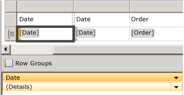
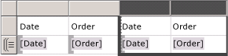
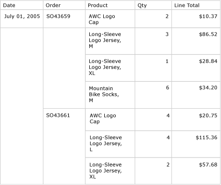
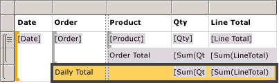
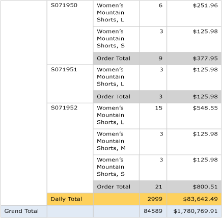

# Lesson 6: Adding Grouping and Totals (Reporting Services)
  Add grouping and totals to your report to organize and summarize your data.  
  
 For information about adding running totals to reports, see: [Adding totals to Reporting Services (SSRS) reports](https://www.tutorialgateway.org/add-total-and-subtotal-to-ssrs-report/).  
  
 **In this topic:**  
  
-   [To group data in a report](#bkmk_groupdata)  
  
-   [To add totals to a report](#bkmk_addtotals)  
  
-   [To add a daily total to a report](#bkmk_adddailytotal)  
  
-   [To add a grand total to a report](#bkmk_addgrandtotal)  
  
-   [To Publish the Report to the Report Server (Optional)](#bkmk_publishreport)  
  
##   To group data in a report  
  
1.  Click the **Design** tab.  
  
2.  If you do not see the **Row Groups** pane , right-click the design surface and click **view** and then click **Grouping**.  
  
3.  From the **Report Data** pane, drag the `Date` field to the **Row Groups** pane. Place it above the row called **(Details)**.  
  
     Note that the row handle now has a bracket in it, to show a group. The table now also has two Date columns -- one on either side of a vertical dotted line.  
  
       
  
4.  From the **Report Data** pane, drag the `Order` field to the **Row Groups** pane. Place it below Date and above **(Details)**.  
  
     Note that the row handle now has two brackets in it, to show two groups. The table now has two `Order` columns, too.  
  
5.  Delete the original Date and Order columns to the **right** of the double line. This removes this individual record values so that only the group value is displayed. Select the column handles for the two columns, right-click and click **Delete Columns**.  
  
       
  
     You can format the column headers and date again.  
  
6.  Switch to the **Preview** tab to preview the report. It should look similar to the following illustration:  
  
       
  
##   To add totals to a report  
  
1.  Switch to Design view.  
  
2.  Right-click the data region cell that contains the field `[LineTotal]`, and click **Add Total**.  
  
     This adds a row with a sum of the dollar amount for each order.  
  
3.  Right-click the cell that contains the field `[Qty]`, and click **Add Total**.  
  
     This adds a sum of the quantity for each order to the totals row.  
  
4.  In the empty cell to the left of `Sum[Qty]`, type the label "**Order Total"**.  
  
5.  You can add a background color to the totals row. Select the two sum cells and the label cell.  
  
6.  On the **Format** menu, click **Background Color**, click **Light Gray**, and click **OK**.  
  
       
  
##   To add a daily total to a report  
  
1.  Right-click the Order cell, point to **Add Total**, and click **After**.  
  
     This adds a new row containing sums of the quantity and dollar amount for each day, and the label "**Total**" in the Order column.  
  
2.  Type the word **Daily** before the word **Total** in the same cell, so it reads **Daily Total**.  
  
3.  Select the **Daily Total** cell, the two **Sum** cells and the empty cell between them.  
  
4.  On the **Format** menu, click **Background Color**, click **Orange**, and click **OK**.  
  
       
  
##   To add a grand total to a report  
  
1.  Right-click the Date cell, point to **Add Total**, and click **After**.  
  
     This adds a new row containing sums of the quantity and dollar amount for the entire report, and the **Total** label in the `Date` column.  
  
2.  Type the word **Grand** before the word **Total** in the same cell, so it reads **Grand Total**.  
  
3.  Select the **Grand Total** cell, the two **Sum** cells and the empty cells between them.  
  
4.  On the **Format** menu, click **Background Color**, click **Light Blue**, and click **OK**.  
  
       
  
5.  Click Preview.  
  
     The last page should look something like this:  
  
       
  
##   To Publish the Report to the Report Server (Optional)  
  
1.  An optional step is to publish the completed report to the native mode report server so you can view the report from Report Manager.  
  
2.  On the toolbar click **Project** and then click **tutorial Properties...**  
  
3.  In the **TargetServerURL** type the name of the name of your report server, for example **http://\<servername>/reportserver**  
  
4.  Click **OK**  
  
5.  On the toolbar click **Build** and then click **Deploy tutorial**.  
  
     If you see a message similar to the following in the output window, it indicates a successful deployment.  
  
    > ------ Build started: Project: tutorial, Configuration: Debug ------Skipping 'Sales Orders.rdl'. Item is up to date.Build complete -- 0 errors, 0 warnings------ Deploy started: Project: tutorial, Configuration: Debug ------Deploying to http://\<server name>/reportserverDeploying report '/tutorial/Sales Orders'.Deploy complete -- 0 errors, 0 warnings========== Build: 1 succeeded or up-to-date, 0 failed, 0 skipped ==================== Deploy: 1 succeeded, 0 failed, 0 skipped ==========  
  
     If you see an error message similar to the following, verify you have permissions on the report server and you have started [!INCLUDE[ssBIDevStudio](../includes/ssbidevstudio-md.md)] with administrator privileges.  
  
    > "The permissions granted to user 'XXXXXXXX\\<your user name\>' are insufficient for performing this operation"  
  
6.  Start Report Manager with administrator privileges, for example, right-click the icon for Internet Explorer and click **Run as administrator**.  
  
     Browse to the Report Manager URL, for example: `http://<server name>/reports`.  
  
7.  Browse to the folder that contains the report and click the name of the report `Sales Orders` to view the rendered report in the browser.  
  
## Next Steps  
 You have successfully completed the Creating a Basic Table Report tutorial.  
  
## See Also  
 [Filter, Group, and Sort Data &#40;Report Builder and SSRS&#41;](report-design/filter-group-and-sort-data-report-builder-and-ssrs.md)  
  
  
