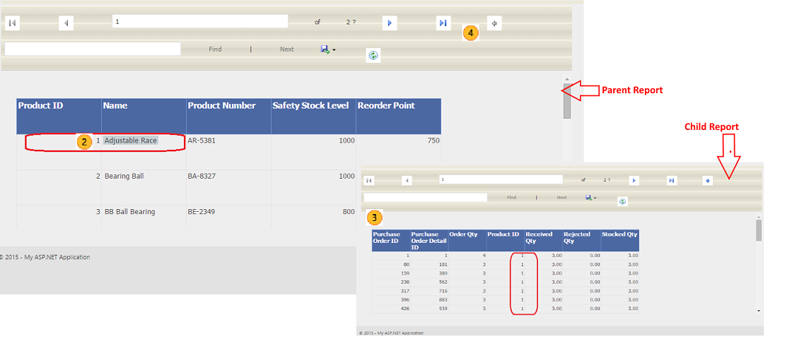

# Lesson 9: Build and Run the Application
  After you create a data filter for the data table, your next step is to build and run the website application.  
  
### To build and run the application  
  
1.  Press **CTRL+F5** to run the Default.aspx page without debugging, or press F5 to run the page with debugging.  
  
     As part of the build process, the report is compiled and any errors found (such as a syntax error in an expression used in the report) are added to the **Task List** that is located at the bottom of the Visual Studio window.  
  
     The webpage appears in the browser. The ReportViewer control displays the report. You can use the toolbar to browse through the report, zoom, and export the report to Excel.  
  
2.  Hover the mouse over any of the rows under **Name** column. The mouse cursor will display a Hand symbol.  
  
3.  Click a value in the **Name** column. The child report is shown with the corresponding filtered data.  
  
4.  Click the icon, **Go back to parent report**, in the **ReportViewer** tool bar to navigate back to the **Parent** report.  
  
       
  
5.  Close the browser to exit.  
  
  
