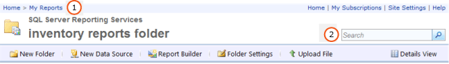

# Finding and Viewing Reports in Report Manager (Report Builder and SSRS)
  Report Manager is a Web-based tool that includes features for viewing and managing reports. It is part of a report server installation. To open Report Manager, type the Report Manager URL in a browser window. For information on browser requirements, see [Planning for Reporting Services and Power View Browser Support &#40;Reporting Services 2014&#41;](../browser-support-for-reporting-services-and-power-view.md). For more information about how a Report Manager URL might be configured on your report server, contact your system administrator. For more information, see [Configure Report Manager &#40;Native Mode&#41;](../report-server/configure-web-portal.md).  
  
 The permissions that the system administrator set on the report server determine what you can see when you use Report Manager. Permissions are granted via a role assignment. To find and view reports, your role assignment must include the View Reports task. To find a report on a report server, search for it by name or description, or browse report server folders. You can only search or browse for reports that have been published or uploaded to the report server. For more information about how to search for a report, see [Searching for Reports and Other Items &#40;Report Builder  and SSRS&#41;](searching-for-reports-and-other-items-report-builder-and-ssrs.md).  
  
> [!NOTE]  
>  [!INCLUDE[ssRBRDDup](../../includes/ssrbrddup-md.md)]  
  
## Navigating the Folder Hierarchy in Report Manager  
 To browse for the reports that you want to run, you can use the Home page, which appears automatically when you start Report Manager and when you open any folder in the folder hierarchy. The Home page shows only the items that you have permission to view. The folder path is displayed as a row of links at the top of the Home page. Folder names are listed in sequence, starting with the root folder (Home). As you open each additional folder, the folder name is added to the folder path at the top of the page. **(1)** in the image below. When you open a report, the name of the report is also added to the folder path.  
  
   
Report Manager Ribbon  
  
 Use the following techniques to navigate through a folder hierarchy:  
  
-   To view the contents of a folder, click the folder name on the Home page. A folder page opens, displaying the contents of the folder.  
  
-   To navigate down through the folder hierarchy, open a subfolder of the current folder. Folders contain reports, resources, shared data source items, and other folders. Clicking a folder icon opens the folder, showing the contents of the hierarchy one level down.  
  
-   To navigate up through the folder hierarchy, in the row of links at the top of the page, click the name of the folder whose contents you want to see. **(1)** in the above image.  
  
## Opening a Report  
 After you find a report, click the report name to open it. The report is rendered in HTML and appears in the Contents page in Report Manager. Reports are always cached by the browser session, so if you open a report, you can usually return to it by clicking the **Back** button. This is true even if you were required to supply a user name and password to run the report. You cannot fully close a rendered report until you close the browser.  
  
 Not all reports that are visible in the folder hierarchy are immediately accessible. Some reports may prompt you for your user name and password to determine whether you can access the data source for the report. For more information about opening reports in Report Manager, see [Open and Close a Report &#40;Report Manager&#41;](../reports/open-and-close-a-report-report-manager.md).  
  
 You can also browse to and open a report from the report server directly from Report Builder. For more information, see [Searching for Reports and Other Items &#40;Report Builder  and SSRS&#41;](searching-for-reports-and-other-items-report-builder-and-ssrs.md).  
  
## To Search for a Items  
  
-   To search for items in Report Manager, type a search string in the **Search** text box at the top of the page. **(2)** in the above image. Searches begin at the top node in the folder hierarchy and then proceed through every branch. If you do not have permission to access a specific branch, that branch is skipped. This applies to My Reports folders that belong to other users, and to other folders that are not generally available. Only reports and items that you have permission to view are included in the search results.  
  
-   To search for an item by name or description, specify all or part of the text that you want to match. The search string is not case-sensitive. You cannot use search operators such as plus (+) or minus (-) symbols to require or exclude search criteria.  
  
-   To search for specific text within a report, use the toolbar at the top of the report.  
  
## See Also  
 [Searching for Reports and Other Items &#40;Report Builder  and SSRS&#41;](searching-for-reports-and-other-items-report-builder-and-ssrs.md)   
 [Finding, Viewing, and Managing Reports &#40;Report Builder and SSRS &#41;](finding-viewing-and-managing-reports-report-builder-and-ssrs.md)  
  
  
