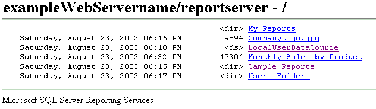

# Finding and Viewing Reports with a Browser (Report Builder and SSRS)
  You can use any supported Web browser to view a report through a direct connection to a report server. Every report has a URL address on a report server. You can enter the Web address of a report to open it in a browser window independently of a Web application. The report opens in HTML format and includes the report toolbar so that you can navigate pages or search on data values within the report. You can set parameters on the URL to hide the toolbar or select the output format of the report.  
  
 Opening a report through its Web address is suitable for viewing a report, but not managing a report. You cannot access an item's property pages or subscription definition pages. You must use Report Manager or a SharePoint site for those tasks.  
  
 If you do not know the Web address of a report, you can open the Web address of the report server and then browse the report server folder hierarchy to select the report you want to view. The following diagram illustrates a folder hierarchy as it appears in a browser window.  
  
   
Folders in a browser  
  
> [!NOTE]  
>  If you are accessing a report from a handheld device, you must use a browser to open a report. Report Manager is not scaled for handheld devices.  
  
 For more information about types of browsers that you can use, see "Browser Types Supported by Reporting Services" in the [Reporting Services documentation](https://go.microsoft.com/fwlink/?linkid=121312) in SQL Server Books Online.  
  
> [!NOTE]  
>  [!INCLUDE[ssRBRDDup](../../includes/ssrbrddup-md.md)]  
  
## Navigating Report Server Folders in a Web Browser  
 You can use a Web browser to navigate report server folders and run reports. Reports and items are displayed as links in the folder hierarchy. You can click links to open a report, resource, or folder, or view the contents of a shared data source. Navigating the folder hierarchy is useful if you do not know the URL of a report. You can specify the report server Web address to open a browser connection at the root node of the folder hierarchy, and then click folder links to navigate through the hierarchy.  
  
 When you access a report server virtual directory, you see only the folders, reports, and uploaded items to which you have access. The user interface shows only the folder hierarchy and basic information, such as creation or modification date, file size, and item type for individual items:  
  
-   A link with no other indicator is a report or a model.  
  
-   The tag \<ds> indicates a shared data source.  
  
-   The tag \<dir> indicates a folder item.  
  
-   A file name extension indicates a resource. The file name extension identifies the MIME type of the resource. For example, .jpg indicates an image in JPEG format.  
  
## Typing the URL Address of a Report  
 [!INCLUDE[ssRSnoversion](../../includes/ssrsnoversion-md.md)] supports URL access to specific items on a report server. The URL must include a fully qualified path to the report and commands to render the report. If the report includes parameters, you must also specify any values that are required to open the report. If you are typing a URL for a report that includes spaces in the path, parameter values, or a rendering extension, you must incorporate URL encoded characters into the URL to get the results you expect. The following example illustrates a report URL that includes encoding for spaces in the path name, parameters, and a rendering extension:  
  
 `http://<Webservername>/reportserver?/<reportfolder>/employee+sales+summary&ReportYear=2004&ReportMonth=06&EmpID=24&rs:Command=Render&rs:Format=HTML4.0`  
  
 The maximum limit for a URL in Internet Explorer is 2,083 characters. For more information, see [Maximum URL length in Internet Explorer](https://support.microsoft.com/kb/208427).  
  
 For more information about how to access a report through a URL, including information on how a URL is constructed, see "URL Access" in the [Reporting Services documentation](https://go.microsoft.com/fwlink/?linkid=121312) in SQL Server Books Online.  
  
## See Also  
 [Finding and Viewing Reports in Report Manager &#40;Report Builder and SSRS&#41;](finding-and-viewing-reports-in-the-web-portal-report-builder-and-ssrs.md)  
  
  
