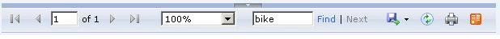
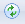
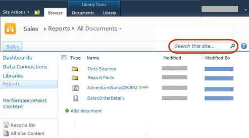
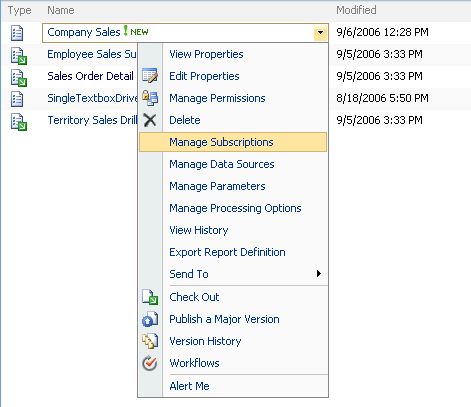

# Finding, Viewing, and Managing Reports (Report Builder and SSRS )
  In Report Builder, you can browse folders on a report server or SharePoint site to find reports, shared data sources, models, and other related report items and browse your computer to find local reports. To make it easier to find reports, Report Builder maintains a list of recently used servers and sites and provides direct access to the Desktop, My Documents and My Computer folders in the file system of your computer.  
  
 In Report Designer, you can also browse your computer to find local reports. After you deploy reports to a report server or SharePoint site, you can browse the report server by using Report Manager or search the SharePoint site to find reports. Reports and related items remain available locally after they are deployed.  
  
> [!NOTE]  
>  You can use Report Builder in local mode or connected to a report server. Certain limitations apply when you do not have an active connection to a report server.  
  
 To locate a report on a report server or SharePoint site from Report Builder, you must provide URL to the report server or SharePoint site. When you first install Report Builder you can specify the URL to use. This is the server or site that Report Builder connects to by default when you save or open reports.  
  
 Reports can be previewed in Report Builder and Report Designer when you create or update reports and viewed and managed on a report server by using Report Manager or on a SharePoint site that is integrated with Reporting Services by using the built-in SharePoint tools and features after you publish the reports. For more information, see [Previewing Reports in Report Builder](previewing-reports-in-report-builder.md) and [Previewing Reports](../reports/previewing-reports.md).  
  
 When you preview reports in Report Builder and Report Designer, or view reports in Report Manager or a SharePoint site, the data is refreshed and the reports display the current data from the data source that the report uses. If you want to view a report without refreshing its data, you can use report history and cached data with published reports. You cannot use these features when previewing reports in Report Builder and Report Designer.  
  
> [!NOTE]  
>  [!INCLUDE[ssRBRDDup](../../includes/ssrbrddup-md.md)]  
  
##   Finding and Viewing Reports in Report Builder  
 To find a report that you want to work with or to select a shared data source, image, or subreport to use in a report, browse your computer, folders on a report server, or SharePoint site integrated with Reporting Services.  
  
 To find reports on a report server, you must specify a URL for the report server and have the appropriate permissions on the folders that enable you to read and save report items. Ask the system administrator for the report server for the appropriate URL and permissions.  
  
 After you find and open the report in Report Builder, you can preview it and make changes. When you preview it, you see the current data. For more information, see [Previewing Reports in Report Builder](previewing-reports-in-report-builder.md).  
  
 Report Builder can help you with the following tasks:  
  
-   **Finding reports** When you browse for a report, you can use the familiar Microsoft Office-style **Open File** dialog box that is customized for Report Builder. You can browse the folders on a report server or on a file system, including My Reports, Sites and Servers, Desktop, My Documents, My Computer. Sites and Servers provides a recently used server list.  
  
-   **Finding shared data sources** When you browse for a shared data source, you can pick from a recently used list, or browse to another folder on the same report server as the report.  
  
-   **Viewing reports** You preview a report in Report Builder when creating or updating reports. When Report Builder is connected to a report server the report server loads and processes the report; otherwise, the reports are processed locally. The report viewer in Report Builder displays the rendered report.  
  

  
##   Viewing and Managing Reports on a Report Server  
 You use Report Manager to view and manage reports on the report server. Browse the folders on the server to locate reports, run reports to view them in a browser, and perform management tasks.  
  
 Report Manager you can help you with following management tasks:  
  
-   View and update the properties of reports, shared data sources, and other report items.  
  
-   Upload reports and create new shared data sources for reports.  
  
-   Create schedules to run reports at specified times and intervals.  
  
-   Create, change, or delete subscriptions to reports.  
  
-   Create report history and specify the number of report snapshots to keep in the report history.  
  
-   Create new folders on the server to organize your reports the way you want.  
  
 Some of these tasks might be done for you by the administrator of the report server. To learn more about tasks performed on a report server, see [Reporting Services Report Server &#40;Native Mode&#41;](../report-server/reporting-services-report-server-native-mode.md).  
  
 Report Manager typically contains folders, reports, data sources, and report models as well as the My Reports folder. My Reports is a personal workspace that you can use to store and work with reports that you own. Other report server folders are public and typically require users to have advanced permissions to add to or modify folder contents. You can create folders within My Reports to further organize your reports. For more information, see [Using My Reports &#40;Report Builder and SSRS&#41;](using-my-reports-report-builder-and-ssrs.md).  
  
 Report Manager displays reports in the Reporting Services HTML Viewer. The HTML Viewer provides a framework for viewing reports in HTML and includes a report toolbar, a parameter section, a credentials section, and a document map. The report toolbar provides page navigation, zoom, refresh, search, export, print, and data feed functionality. The report toolbar also appears in a browser window at the top of a report when you access reports through a URL. Print functionality is optional and must be turned on by your administrator. When it is available, a Printer icon appears on the report toolbar. The following illustrations show the report toolbar in a Report Manager window and the report toolbar features close up.  
  
   
Report Manager window  
  
   
Report toolbar  
  
 After you run a report, you can export it to another format, such as [!INCLUDE[msCoName](../../../includes/msconame-md.md)] Excel or PDF. You can also export the report using a data rendering extension such as the Comma-Separated Value (CSV) rendering extension and then use the CSV data file as input to another application. For more information about exporting reports, see [Exporting Reports &#40;Report Builder and SSRS&#41;](export-reports-report-builder-and-ssrs.md) and [Export a Report as Another File Type &#40;Report Builder and SSRS&#41;](../export-a-report-as-another-file-type-report-builder-and-ssrs.md).  
  
 The easiest way to select and run a report is to open Report Manager and then search for or browse to the report that you want to view. For step-by-step instruction on how to open reports, see [Open and Close a Report &#40;Report Manager&#41;](../reports/open-and-close-a-report-report-manager.md).  
  
 After you run a report, you can refresh it to see new data.  
  
### Refreshing Reports  
 Report data frequently changes and you might want to refresh the report to view the newest data. You can refresh a report in three different ways.  
  
|Option|Result|  
|------------|------------|  
|**Refresh** button on the browser window|Displays the report stored in the session cache. A session cache is created when a user opens a report. [!INCLUDE[ssRSnoversion](../../../includes/ssrsnoversion-md.md)] uses browser sessions to maintain a consistent viewing experience while a report is open.|  
||When you click the **Refresh** button on the report toolbar, the report server re-runs the query and updates report data if the report runs on-demand. If the report is cached or is a snapshot, **Refresh** displays the report that is stored in the report server database.|  
|CTRL+F5 keyboard combination|Produces the same result as clicking the **Refresh** button on the report toolbar.|  
  

  
##   Viewing and Managing Report Server Items from a SharePoint Site  
 When the system administrator configures a report server to run in SharePoint integrated mode, you can view and manage reports and other report server items from a SharePoint site.  
  
 The SharePoint site includes pages to set data source properties, report history, report processing options, schedules, subscriptions, report parameters, and create shared schedules. You can manage report server items on a SharePoint site the same way you create and manage them from other tools in [!INCLUDE[ssNoVersion](../../../includes/ssnoversion-md.md)].  
  
 To access the application pages, select item-specific actions from a drop-down menu on a report or other report server item that you previously added to a SharePoint library. Depending on the item and your permissions, you might also be able to create reports in Report Builder, generate models, and set model item security.  
  
 For more information about Reporting Services and SharePoint technology, see [Configuration and Administration of a Report Server &#40;Reporting Services SharePoint Mode&#41;](../configure-administer-report-server-reporting-services-sharepoint-mode.md) in [!INCLUDE[ssNoVersion](../../../includes/ssnoversion-md.md)] [Books Online](https://go.microsoft.com/fwlink/?LinkId=154888) on msdn.microsoft.com.  
  
### Finding Report Server Items on a SharePoint Site  
 Before you can set properties, you must first be able to locate the item. Report server items are always stored in libraries or in a folder within a library.  
  
 When you access the SharePoint site, you see the Browse page and the Library Tools tab. The Browse page lists the libraries and the content of the selected library. You can view the report, report models, and other items in the library, explore folders, and search the site to locate items.  
  
 To distinguish report server items from other items on a SharePoint site, you can use the icon to visually identify an item, or pause the mouse cursor over the type and read the file extension. The following image shows folders, a report model, and a report definition in the **Reports** library:  
  
   
  
### Viewing Reports  
 Report definitions (.rdl files) that you upload to a SharePoint library are viewed through a Report Viewer Web Part that is installed by the Reporting Services Add-in. An .rdl file association is defined automatically when you install the add-in. When you select a report, it opens automatically in the Web Part. After the report is open, you can use the report toolbar that is included in the Web Part to navigate pages, search, zoom, and print the report. The toolbar includes the Export Data Feed option to export the report as an Atom data feed and an **Actions** menu with options to print, subscribe, and export the report to different formats such as PDF, Word, and Excel. From the **Actions** menu you can also open the report in Report Builder. The following image shows a report and the options of the Export options in the **Action** menu.  
  
   
  
### Managing Items Through Actions  
 Management tasks are supported through actions on a drop-down menu for each item. Depending on your permissions, each item has common actions that are standard for items that are stored in a SharePoint library. **View Properties** and **Edit Properties** are examples of common actions. Custom actions provide item-specific management functionality. The following image shows the actions for a report definition. Examples of custom actions for a report definition include **Manage Subscriptions** and **Manage Processing Options**:  
  
   
  

  
##   Viewing Reports in a Desktop Application  
 You can bypass browser viewing entirely and use a desktop application (such as [!INCLUDE[msCoName](../../../includes/msconame-md.md)] Excel) as your report viewer instead. To do this, define a subscription that specifies a desktop application format and a shared folder destination. The report server generates your report as an application file, appends a file name extension, and saves the report as a file on your hard disk. You can then use [!INCLUDE[msCoName](../../../includes/msconame-md.md)] Excel (or another application) instead of a browser to view your report.  
  

  
##   About User Sessions  
 [!INCLUDE[ssRSnoversion](../../../includes/ssrsnoversion-md.md)] uses browser sessions to maintain consistency while viewing reports. Sessions are based on browser connections, not authenticated users. A new session is created every time that a user opens a report in a new browser window. Once a browser session is established, you continue to work with the version of the report that was opened when the session began, even if the report is modified on the report server. For example, if you open a report at 11:00 P.M., and a report author republishes the same report at 11:01 P.M., your session will contain the version that you opened for the duration of the session.  
  
 If you refresh a report within the same session using the browser's **Refresh** button, the original session version of the report is displayed. If you refresh an on-demand report using the **Refresh** button on the report toolbar, the report is re-run and new data, if any, is displayed.  
  
 Session information is stored in the report server temporary database. The report server does not use [!INCLUDE[vstecasp](../../includes/vstecasp-md.md)] session management. If you restart the server or perform a database recovery operation, session state is not restored. For more information about session management, see [Identifying Execution State](../report-server-web-service-net-framework-soap-headers/identifying-execution-state.md).  
  

  
##   In This Section  
 The following topics provide additional information about viewing and managing reports.  
  
 [Finding and Viewing Reports in Report Manager &#40;Report Builder and SSRS&#41;](finding-and-viewing-reports-in-the-web-portal-report-builder-and-ssrs.md)  
 Describes how you use Report Manager to find, view, and manage your reports,  
  
 [Finding and Viewing Reports with a Browser &#40;Report Builder and SSRS&#41;](finding-and-viewing-reports-with-a-browser-report-builder-and-ssrs.md)  
 Describes how to use a URL to find and view a report.  
  
 [Searching for Reports and Other Items &#40;Report Builder  and SSRS&#41;](searching-for-reports-and-other-items-report-builder-and-ssrs.md)  
 Describes how to use the search functionality in Report Manager to locate items on the report server.  
  
 [Using My Reports &#40;Report Builder and SSRS&#41;](using-my-reports-report-builder-and-ssrs.md)  
 Describes how to use the My Reports folder as the personal workspace to store and work with reports that you own.  
  
 [Previewing Reports in Report Builder](previewing-reports-in-report-builder.md)  
 Describes how to preview reports while you create or update them.  
  

  
## See Also  
 [Saving Reports &#40;Report Builder&#41;](saving-reports-report-builder.md)   
 [Report Builder in SQL Server 2014](report-builder-in-sql-server-2016.md)   
 [Install, Uninstall, and Report Builder Support](../install-uninstall-and-report-builder-support.md)  
  
  
