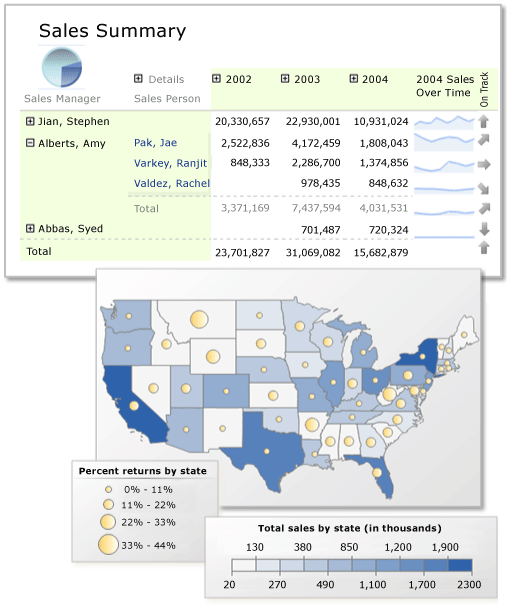

# Report Builder in SQL Server 2014
  Report Builder is a report authoring environment for business users who prefer to work in the [!INCLUDE[msCoName](../../../includes/msconame-md.md)] Office environment. When you design a report, you specify where to get the data, which data to get, and how to display the data. When you run the report, the report processor takes all the information you have specified, retrieves the data, and combines it with the report layout to generate the report. You can preview your reports in Report Builder, or you can publish your report to a report server or a report server in SharePoint integrated mode, where others can run it.  
  
 The report in this illustration features a matrix with row and column groups, sparklines, indicators, and a summary pie chart in the corner cell, accompanied by a map with two sets of geographic data represented by color and by circle size.  
  
   
  
##   Jump-Start Report Creation  
  
-   **Start your report withreport parts** created by someone else on your team. Report parts are report items that have been published separately to a report server or a SharePoint site that is integrated with a report server. They can be reused in other reports. Report items such as tables, matrices, charts, and images can be published as report parts.  
  
-   **Start with a shared dataset** created by someone else on your team. Shared datasets are queries based on a shared data source that are saved to a report server or a SharePoint site that is integrated with a report server.  
  
-   **Start with the Table, Matrix, or Chart wizard**. Choose a data source connection, drag and drop fields to create a dataset query, select a layout and style, and customize your report.  
  
-   **Start with the Map wizard** to create reports that display aggregated data against a geographic or geometric background. Map data can be spatial data from a [!INCLUDE[tsql](../../includes/tsql-md.md)] query or an Environmental Systems Research Institute, Inc. (ESRI) shapefile. You can also add a [!INCLUDE[msCoName](../../../includes/msconame-md.md)] Bing map tile background.  
  

  
##   Design Your Report  
  
-   **Create reports with table, matrix, chart, and free-form report layouts.** Create table reports for column-based data, matrix reports (like cross-tab or PivotTable reports) for summarized data, chart reports for graphical data, and free-form reports for anything else. Reports can embed other reports and charts, together with lists, graphics, and controls for dynamic Web-based applications.  
  
-   **Report from a variety of data sources.** Build reports using data from any data source type that has a [!INCLUDE[msCoName](../../../includes/msconame-md.md)] [!INCLUDE[dnprdnshort](../../includes/dnprdnshort-md.md)]-managed data provider, OLE DB provider, or ODBC data source. You can create reports that use relational and multidimensional data from [!INCLUDE[ssNoVersion](../../includes/ssnoversion-md.md)] and [!INCLUDE[ssASnoversion](../../includes/ssasnoversion-md.md)], Oracle, Hyperion, and other databases. You can use an XML data processing extension to retrieve data from any XML data source. You can use table-valued functions to design custom data sources.  
  
-   **Modify existing reports.** By using Report Builder, you can customize and update reports that were created in [!INCLUDE[ssBIDevStudioFull](../../includes/ssbidevstudiofull-md.md)]Report Designer.  
  
-   **Modify your data** by filtering, grouping and sorting data, or by adding formulas or expressions.  
  
-   **Add charts, gauges, sparklines, and indicators** to summarize data in a visual format, and present large volumes of aggregated information at a glance.  
  
-   **Add interactive features** such as document maps, show/hide buttons, and drillthrough links to subreports and drillthrough reports. Use parameters and filters to filter data for customized views.  
  
-   **Embed or reference images** and other resources, including external content.  
  

  
##   Manage Your Report  
  
-   **Save the definition of the report** to your computer or to the report server, where you can manage it and share it with others.  
  
-   **Choose a presentation format** when you open the report, or after you open the report. You can select Web-oriented, page-oriented, and desktop application formats. Formats include HTML, MHTML, PDF, XML, CSV, TIFF, Word, and Excel.  
  
-   **Set up subscriptions.** After you publish the report to the report server or a report server in SharePoint integrated mode, you can configure your report to run at a specific time, create a report history, and set up e-mail subscriptions.  
  
-   **Generate data feeds** from your report by using the Reporting Services Atom rendering extension.  
  
> [!NOTE]  
>  Published reports are managed on a report server or a report server in SharePoint integrated mode by a report server administrator. Report server administrators can define security, set properties, and schedule operations such as report history and e-mail report delivery. They can create shared schedules and shared data sources and make them available for general use. Administrators also manage all of the report server folders. The ability to perform management tasks depends on user permissions.  
  

  
##   In This Section  
 [What's New in Report Builder for SQL Server 2014](../what-s-new-in-report-builder-for-sql-server-2014.md)  
 Describes the new features in this version of Report Builder, including maps.  
  
 [Tutorial: Creating a Quick Chart Report Offline](tutorial-create-a-quick-chart-report-offline-report-builder.md)  
 Introduces Report Builder and the wizards available to help you create reports. The tutorial provides a set of data for you to work with so you do not need to connect to a data source to get started.  
  
 [Planning a Report &#40;Report Builder&#41;](../report-design/planning-a-report-report-builder.md)  
 Provides information on what you should consider before you start to build your report.  
  
 [Report Authoring Concepts &#40;Report Builder and SSRS&#41;](../report-design/report-authoring-concepts-report-builder-and-ssrs.md)  
 Defines key concepts used in throughout Report Builder documentation.  
  
 [Report Design View &#40;Report Builder&#41;](report-design-view-report-builder.md)  
 Explains the different panes and regions of report design view.  
  
 [Shared Dataset Design View &#40;Report Builder&#41;](shared-dataset-design-view-report-builder.md)  
 Explains the different panes and regions of shared dataset design view.  
  
 [Keyboard Shortcuts &#40;Report Builder&#41;](keyboard-shortcuts-report-builder.md)  
 Outlines the shortcut keys available for navigating and designing reports in Report Builder.  
  
 [Start Report Builder &#40;Report Builder&#41;](start-report-builder.md)  
 Explains how to start the two different versions of Report Builder: stand-alone and [!INCLUDE[ndptecclick](../../includes/ndptecclick-md.md)].  
  
  
