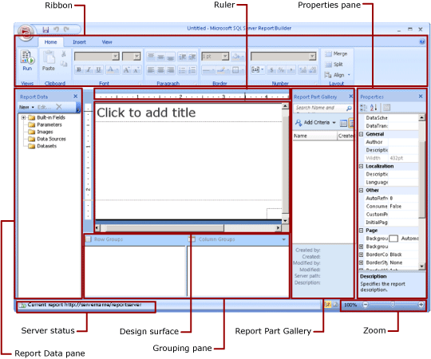
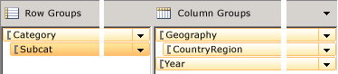

# Report Design View (Report Builder)
  The Report Builder window is designed to help you easily organize your report resources and quickly build the reports you need. The design surface is at the center of the window, with the Ribbon above and the Report Data, Grouping, and Properties panes and Report Part Gallery to the left, below, and right. The design surface is where you add and organize your report items. The Ribbon organizes traditional menu items into categories that you can easily find and use. The panes help you to add, select, and organize your report resources, and change report item properties.  
  
   
  
##   The Ribbon  
 The Ribbon is designed to help you quickly find the commands that you need to complete a task. Commands are organized in logical groups, which are collected together under tabs. Each tab relates to a type of activity, such as inserting report items or formatting text.  
  
 In report design view, the Ribbon is divided into the following tabs: Home, Insert, and View. If you cannot find a task on the Ribbon, some Ribbon groups have a related dialog box that you can open by clicking the arrow in the lower right of the group. You cannot minimize or delete the Ribbon or replace it with toolbars and menus.  
  
 In run mode, the Ribbon has just one tab, **Run**.  
  
### Home tab  
 The Home tab is a collection of commonly used commands focused on the appearance of items within your report. From the Home tab, you can access the run, font, paragraph, border, number, and layout commands. When you click an item on the tab, the selected item on the design surface changes. When you click **Run**, the report is rendered in HTML so that you can see how the contents of the report will appear when published, and you see the Run tab instead of the Home tab. The Home tab is the default tab displayed when you first create a report.  
  
### Insert tab  
 The Insert tab is a collection of commands commonly used for adding report items to the report. From the Insert tab, you can use wizards to add a table, matrix, chart, or map. You can also add these items without using a wizard, and add other report items such as sparklines, indicators, text boxes, images, rectangles, subreports, and report headers and footers.  
  
 Clicking **Report Parts** on the Insert tab opens the Report Part Gallery. You can search for report parts saved to a report server. For more information, see [Report Parts &#40;Report Builder and SSRS&#41;](../report-parts-report-builder-and-ssrs.md).  
  
 After you insert an item, Report Builder automatically switches back to the Home tab.  
  
### View tab  
 The View tab is a collection of commands that control what is displayed within the Report Builder window. You can change display options for the ruler and the Grouping, Report Data, and Properties panes.  
  
### Run tab  
 When you click **Run** on the Home tab, you run a preview of the report in the HTML Viewer, and you see the Run tab instead of the Home tab.  
  
 The Run tab contains a collection of commands that you can use after the report is rendered. You can print the report, navigate through the report pages, export the report to another file format, view the document map or parameters (if the report has them), and locate items within the report. For more information, see [Previewing Your Report in Run Mode](#RunMode).  
  
 To return to report design view, on the **Run** tab, click **Design**.  
  
  
##   The Report Design Surface  
 The Report Builder report design surface is the main work area for designing your reports. To place report items such as data regions, subreports, text boxes, images, rectangles, and lines in your report, you add them from the Ribbon or the Report Part Gallery to the design surface. There, you can add groups, expressions, parameters, filters, actions, visibility, and formatting to your report items.  
  
 You can also change the following:  
  
-   The report body properties, such as border and fill color, by right-clicking the white area of the design surface, outside any report items, and clicking **Body Properties**.  
  
-   The header and footer properties, such as border and fill color, by right-clicking the white area of the design surface in the header or footer area, outside any report items, and clicking **Header Properties** or **Footer Properties**.  
  
-   The properties of the report itself, such as page setup, by right-clicking the blue area around the design surface and clicking **Report Properties**.  
  
-   The properties of report items by right-clicking them and clicking **Properties**.  
  
> [!NOTE]  
>  If you drag a field from the Report Data pane directly to the report design surface instead of placing it in a data region such as a table or chart, when you run the report, you will see only the first value from the data in that field.  
  
 For information about using the keyboard to manipulate items on the design surface, see [Keyboard Shortcuts &#40;Report Builder&#41;](keyboard-shortcuts-report-builder.md)  
  
### Design Surface Size and Print Area  
 The design surface size might be different from the page size print area you specify to print the report. Changing the size of the design surface will not change the print area of your report. No matter what size you set for the print area of your report, the full design area size does not change. For more information, see [Rendering Behaviors &#40;Report Builder  and SSRS&#41;](../report-design/rendering-behaviors-report-builder-and-ssrs.md).  
  
> [!NOTE]  
>  To display the ruler, on the **View** tab, select the **Ruler** check box.  
  
  
##   The Report Data Pane  
 From the Report Data pane, you can define the report data and report resources that you need for a report before you design your report layout. For example, you can add data sources, datasets, calculated fields, report parameters, and images to the Report Data pane.  
  
 After you add items to the Report Data pane, drag fields to report items on the design surface to control where data appears in the report.  
  
 You can also drag built-in fields from the Report Data pane to the report design surface. When rendered, these fields provide information about the report, such as the report name, the total number of pages in the report, and the current page number.  
  
 Some things are automatically added to the Report Data pane when you add something to the report design surface. For example, if you add a report part from the Report Part Gallery, and the report part is a data region, the dataset is automatically added to the Report Data pane. For more information, see [Report Parts and Datasets in Report Builder](../report-data/report-parts-and-datasets-in-report-builder.md). Also, if you embed an image in your report, it will be added to the Images folder in the Report Data pane.  
  
> [!NOTE]  
>  You can use the **New** button to add a new item to the Report Data pane. You can add multiple datasets from the same data source or from other data sources to the report. You can add shared datasets from the report server. To add a new dataset from the same data source, right-click a data source, and then click **Add Dataset**.  
  
 For more information about items in the Report Data pane, see the following topics:  
  
-   [Built-in Globals and Users References &#40;Report Builder and SSRS&#41;](../report-design/built-in-collections-built-in-globals-and-users-references-report-builder.md)  
  
-   [Report Parameters &#40;Report Builder and Report Designer&#41;](../report-design/report-parameters-report-builder-and-report-designer.md)  
  
-   [Images &#40;Report Builder and SSRS&#41;](../report-design/images-report-builder-and-ssrs.md)  
  
-   [Data Connections, Data Sources, and Connection Strings in Report Builder](../data-connections-data-sources-and-connection-strings-in-report-builder.md)  
  
-   [Report Embedded Datasets and Shared Datasets &#40;Report Builder and SSRS&#41;](../report-data/report-embedded-datasets-and-shared-datasets-report-builder-and-ssrs.md)  
  
-   [Dataset Fields Collection &#40;Report Builder and SSRS&#41;](../report-data/dataset-fields-collection-report-builder-and-ssrs.md)  
  
  
##   The Report Part Gallery  
 The easiest way to create a report is to find an existing report part, like a table or chart, on the report server or a report server integrated into a SharePoint site. You search for report parts to add to your report in the Report Part Gallery. You can filter the report parts by all or part of the name of the report part, who created it, who last modified it, when it was last modified, where it's stored, or what type of report part it is. For example, you could search for all charts created last week by one of your coworkers.  
  
> [!NOTE]  
>  You must be connected to a server to view the Report Part Gallery.  
  
 You can view the search results either as thumbnails or as a list, and sort the search results by name, created and modified dates, and creator. For more information, see [Report Parts &#40;Report Builder and SSRS&#41;](../report-parts-report-builder-and-ssrs.md).  
  
  
##   The Properties Pane (Report Builder)  
 Every item in a report, including the report body itself, data regions, images, and text boxes, has properties associated with it. For example, the BorderColor property for a text box shows the color value of the text box's border, and the PageSize property for the report shows the page size of the report.  
  
 These properties are displayed in the Properties pane. The properties in the pane change depending on the report item that you select.  
  
 To see the Properties pane, on the View tab, in the Show/Hide group, click Properties.  
  
### Changing Property Values  
 In Report Builder, you can change the properties for report items several ways:  
  
-   By clicking buttons and lists on the Ribbon.  
  
-   By changing settings within dialog boxes.  
  
-   By changing property values within the Properties pane.  
  
 The most commonly used properties are available in the dialog boxes and on the Ribbon.  
  
 Depending on the property, you can set a property value from a drop-down list, type the value, or click `<Expression>` to create an expression.  
  
### Changing the Properties Pane View  
 By default, properties displayed in the Properties pane are organized into broad categories, such as Action, Border, Fill, Font, and General. Each category has a set of properties associated with it. For example, the following properties are listed within the Font category: Color, FontFamily, FontSize, FontStyle, FontWeight, LineHeight, and TextDecoration. If you prefer, you can alphabetize all the properties listed in the pane. This removes the categories and lists all the properties in alphabetical order, regardless of category.  
  
 The Properties pane has three buttons at the top of pane: Category, Alphabetize, and Property Pages. Click the Category and Alphabetize buttons to switch between the Properties pane views. Click the **Property Pages** button to open the properties dialog box for a selected report item.  
  
  
##   The Grouping Pane (Report Builder)  
 Groups are used to organize your report data into a visual hierarchy and to calculate totals. You can view the row and column groups within a data region on the design surface and also in the Grouping pane. The Grouping pane has two panes: Row Groups and Column Groups. When you select a data region, the Grouping pane displays all the groups within that data region as a hierarchical list: Child groups appear indented under their parent groups.  
  
   
  
 You can create groups by dragging fields from the Report Data pane and dropping them on the design surface or in the Grouping pane. In the Grouping pane, you can add parent, adjacent, and child groups, change group properties, and delete groups.  
  
 The Grouping pane is displayed by default but you can close the pane by clearing the Grouping pane check box on the View tab. The Grouping pane is not available for the Chart or Gauge data regions.  
  
 For more information, see [Grouping Pane &#40;Report Builder&#41;](../report-design/grouping-pane-report-builder.md) and [Understanding Groups &#40;Report Builder and SSRS&#41;](../report-design/understanding-groups-report-builder-and-ssrs.md).  
  
  
##   Previewing Your Report in Run Mode  
 In report design view, you are not working with the actual data but a representation of the data indicated by the field name or expression. When you want to see the actual data displayed in the context of the report that you designed, you can run the report to preview the data from the underlying database displayed in the report layout. Switching between designing and running your report allows you to adjust its design and see the results immediately. To preview your report, click **Run** in the **Views** group on the Ribbon.  
  
 When you click **Run**, Report Builder connects to the report data sources, caches the data on your computer, combines the data and the layout and then renders the report in the HTML Viewer. You can run your report as often as you like while you continue to design it. When you are satisfied with your report, you can save the report to the report server where other individuals with the appropriate permissions can view your report.  
  
### Running a Report with Parameters  
 When you run your report, it is processed automatically. If the report contains parameters, all the parameters must have default values before the report can run automatically. If a parameter does not have a default value, when you run the report you need to choose a value for the parameter, and then click **View Report** on the Run tab. For more information, see [Report Parameters &#40;Report Builder and Report Designer&#41;](../report-design/report-parameters-report-builder-and-report-designer.md).  
  
### Print Preview  
 When you preview a report in run mode, it resembles a report produced in HTML. The preview is not HTML, but the layout and pagination of the report is similar to HTML output. You can change the view to represent a printed report by switching to print preview mode. Click the **Print Preview** button on the **Run** tab. The report will display as though it were on a physical page. This view resembles the output produced by the Image and PDF rendering extensions. Print Preview is not an image or PDF file, but the layout and pagination of the report are similar to the output of those formats.  
  
  
## See Also  
 [Finding, Viewing, and Managing Reports &#40;Report Builder and SSRS &#41;](finding-viewing-and-managing-reports-report-builder-and-ssrs.md)   
 [Report Builder in SQL Server 2014](report-builder-in-sql-server-2016.md)  
  
  
