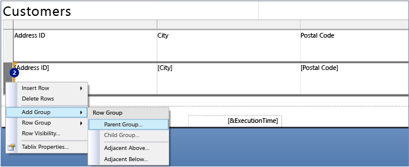
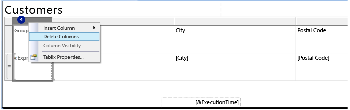
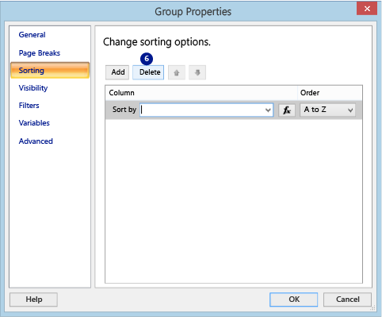

# Work Around the Excel Row Limitation
  This topic explains how to work around the Excel 2003 row limitation when you export reports to Excel. The workaround is for a report that contains only a table.  
  
 Excel 2003 supports a maximum of 65,536 rows per worksheet. You can work around this limitation by forcing an explicit page break after a certain number of rows. The Excel renderer creates a new worksheet for each explicit page break.  
  
### To create an explicit page break  
  
1.  Open the report in [!INCLUDE[ss_dtbi](../../includes/ss-dtbi-md.md)] or Report Manager.  
  
2.  Right click the Data row in the table, and then click **Add Group** > **Parent Group** to add an outer table group.  
  
       
  
3.  Enter the following formula in the **Group by** expression box, and then click **OK** to add the parent group.  
  
     =Int((RowNumber(Nothing)-1)/65000)  
  
     The formula assigns a number to each set of 65000 rows in the dataset. When a page break is defined for the group, the expression results in a page break every 65000 rows.  
  
     Adding the outer table group adds a group column to the report.  
  
4.  Delete the group column by right-clicking on the column header, clicking **Delete Columns**, selecting **Delete columns only**, and then click **OK**.  
  
       
  
5.  Right click **Group 1** in the **Row Groups** section, and then click **Group Properties**.  
  
       
  
6.  On the **Sorting** page of the **Group Properties** dialog box, select the default sorting option and click **Delete**.  
  
       
  
7.  On the **Page Breaks** page, click **Between each instance of a group** and then click **OK**.  
  
       
  
8.  Save the report. When you export it to Excel, it exports to multiple worksheets and each worksheet contains a maximum of 65000 rows.  
  
  
