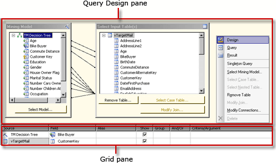

# Analysis Services DMX Query Designer User Interface
  [!INCLUDE[ssRSnoversion](../../includes/ssrsnoversion-md.md)] provides graphical query designers for building Data Mining Expressions (DMX) queries and Multidimensional Expression (MDX) queries for an [!INCLUDE[ssASnoversion](../../../includes/ssasnoversion-md.md)] data source. This topic describes the DMX query designer. For more information about the MDX query designer, see [Analysis Services MDX Query Designer User Interface](analysis-services-mdx-query-designer-user-interface.md).  
  
 The DMX graphical query designer has three modes: Design, Query, and Result. To switch modes, right-click on the Query Design pane, and select the mode. Each mode provides a Metadata pane from which you can drag members from the selected cubes to build a DMX query that retrieves data for a dataset when the report is processed.  
  
## Graphical DMX Query Designer Toolbar  
 The query designer toolbar provides buttons to help you design DMX queries using the graphical interface. The following table describes the buttons and their functions.  
  
|Button|Description|  
|------------|-----------------|  
|**Edit As Text**|Disabled for this data source type.|  
|**Import**|Import an existing query from a report definition (.rdl) file on the file system. For more information, see [Report Embedded Datasets and Shared Datasets &#40;Report Builder and SSRS&#41;](report-embedded-datasets-and-shared-datasets-report-builder-and-ssrs.md).|  
||Switch to the MDX query designer mode.|  
||Switch to the DMX query designer mode.|  
||Refresh metadata from the data source.|  
||Delete the selected column in the Data pane from the query.|  
||Display the **Query Parameters** dialog box. When you assign a default value to a variable, a corresponding report parameter is created when you switch to the Layout view in Report Designer.|  
||Prepare the query.|  
||Toggle between Design mode and Query mode. To change to result view, right-click on the Design pane and choose **Result**.|  
  
## Graphical DMX Query Designer in Design Mode  
 When you edit a dataset that uses an [!INCLUDE[ssASnoversion](../../../includes/ssasnoversion-md.md)] data source that has no valid cubes but that does have valid mining models, the graphical query designer opens in Design mode. The following figure labels the panes for Design mode.  
  
   
  
 The following table describes the function of each pane.  
  
|Pane|Function|  
|----------|--------------|  
|Query Design pane|Use the **Mining Model** and **Select Input Table** dialog boxes to build the DMX query.|  
|Grid pane|For each row in the grid, use the **Source** drop-down list to select a function or expression, and choose fields, groups, and criteria or arguments to use in your DMX query. To see the DMX query text generated by your selections, click the **Design Mode** button on the toolbar.|  
  
 To run the DMX query and show results in the Result pane, right-click on the Query Design pane and select **Result**.  
  
## Graphical DMX Query Designer in Query Mode  
 To change the graphical query designer to Query mode, click the **Design Mode** button on the toolbar or right-click on the query design surface, and choose **Query** from the shortcut menu. Use this mode to enter DMX text directly into the Query pane.  
  
 The following figure labels the panes for Query mode.  
  
   
  
 The following table describes the function of each pane.  
  
|Pane|Function|  
|----------|--------------|  
|Query Design pane|Use the **Mining Model** and **Select Input Table** dialog boxes to build the DMX query.|  
|Query pane|View or edit DMX query text directly in the pane. Changes to the DMX query text do not persist if you change back to **Design** mode.|  
  
 To run the DMX query and show results in the Result pane, right-click on the Query Design pane and select **Result**.  
  
## Graphical DMX Query Designer in Result Mode  
 To display the Result mode, right-click the query design surface and choose **Result** from the shortcut menu. When you switch to Result mode, the DMX query runs automatically.  
  
 The following figure shows the query designer in Result mode.  
  
   
  
 To switch back to Design mode or Query mode, right-click on the Result pane and select **Design** or **Query**.  
  
## See Also  
 [Define Parameters in the MDX Query Designer for Analysis Services &#40;Report Builder and SSRS&#41;](define-parameters-in-the-mdx-query-designer-for-analysis-services.md)   
 [Create a Shared Dataset or Embedded Dataset &#40;Report Builder and SSRS&#41;](create-a-shared-dataset-or-embedded-dataset-report-builder-and-ssrs.md)   
 [Analysis Services Connection Type for DMX &#40;SSRS&#41;](analysis-services-connection-type-for-dmx-ssrs.md)   
 [Retrieve Data from a Data Mining Model &#40;DMX&#41; &#40;SSRS&#41;](retrieve-data-from-a-data-mining-model-dmx-ssrs.md)   
 [RSReportDesigner Configuration File](../report-server/rsreportdesigner-configuration-file.md)   
 [Analysis Services Connection Type for MDX &#40;SSRS&#41;](analysis-services-connection-type-for-mdx-ssrs.md)   
 [Analysis Services Connection Type for DMX &#40;SSRS&#41;](analysis-services-connection-type-for-dmx-ssrs.md)  
  
  
