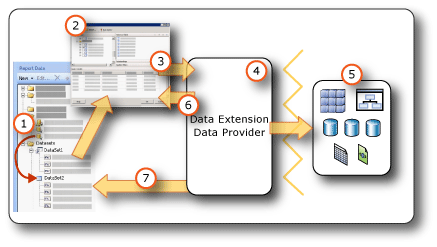

# Report Embedded Datasets and Shared Datasets (Report Builder and SSRS)
  A dataset specifies the data that you want to use from a data connection. A dataset is based on a data connection that has been saved in the report as an embedded data source or a reference to a shared data source on a report server. The dataset includes a query that specifies a set of fields. As you drag these fields to the design surface, you create expressions that evaluate to the actual data when the report runs.  
  
 There are two types of datasets:  
  
-   **Shared dataset.** A shared dataset is defined on the report server. You can browse to the server to create a shared dataset or to select a predefined one to add to your report. Use a shared dataset to provide a query that can be used by more than one report. Shared datasets are stored on the report server and managed separately from reports or shared data sources. For example, a report server administrator might update the query to take advantage of improved indexing or other query performance optimization.  
  
-   **Embedded dataset.** An embedded dataset is defined in and used by only the report it is embedded in. Use an embedded dataset when you want to get data from an external data source to be used only in one report. Embedded datasets are useful when you want to create a query that has no other dependencies and that you do not need to use for multiple reports.  
  
 A dataset also includes parameters, filters, and data options that specify character sensitivities, such as case, kana type, width, accent, and collation information.  
  
   
  
1.  **Datasets in the Report Data pane** A dataset appears in the Report Data pane after you create an embedded dataset or add a shared dataset. A dataset is based on a data source.  
  
2.  **Query Designer** When you design a dataset query, the query designer that is associated with the data source type opens.  
  
3.  **Query command** The query designer helps you build a query command. The command syntax is determined by the data provider.  
  
4.  **Data Extension/Data Provider** Connecting to the data can be through multiple data access layers.  
  
5.  **External data sources** Retrieve data from relational databases, multidimensional data bases, SharePoint lists, Web services, or report models.  
  
6.  **Query results** You can run the query and see an example result set. You must have design time credentials to run a query.  
  
7.  **Metadata from schema** The data provider runs a schema query command separate from the query to retrieve metadata for the dataset field collection. For example, a [!INCLUDE[tsql](../../../includes/tsql-md.md)] `SELECT` statement returns the column names for a database table. Use the Report Data pane to expand the dataset to view the dataset field collection.  
  
 Data can also be included in a report by using predefined shared datasets and report parts. These items already have the data connection information that you need. For more information, see [Add Data to a Report &#40;Report Builder and SSRS&#41;](report-datasets-ssrs.md) and [Report Parts &#40;Report Builder and SSRS&#41;](../report-parts-report-builder-and-ssrs.md).  
  
 For more information about built-in data source types and data extensions, see [Add Data from External Data Sources &#40;SSRS&#41;](add-data-from-external-data-sources-ssrs.md).  
  
> [!NOTE]  
>  [!INCLUDE[ssRBRDDup](../../includes/ssrbrddup-md.md)]  
  
##  <a name="Overview"></a> Understanding Report Datasets and Queries  
 A report dataset contains a query command that runs on the external data source and specifies what data to retrieve. To build the query command, you use the query designer that is associated with the data extension for the external data source. In the query designer, you can run the query command and view a result set. The result set is a rectangular row set that has column names and rows with the same number of values in each row. Hierarchical data, also known as *ragged hierarchies*, is not supported. The column names are saved in the report definition as a list of dataset fields.  
  
 After you add datasets to your report, you drag fields from their field collections in the Report Data pane to tables, charts, and other report items that you use to design the report layout. For more information about working with fields, see [Dataset Fields Collection &#40;Report Builder and SSRS&#41;](dataset-fields-collection-report-builder-and-ssrs.md).  
  
### Understanding Data from a Report Dataset  
 Depending on the data extension, a report dataset can consist of the following types of data:  
  
-   A result set from a relational database, which can result from running database commands, stored procedures, or user-defined functions. If multiple result sets are retrieved through a single query, only the first result set is processed, and all other result sets are ignored. For example, when you run the following query in the text-based query designer, only the result set for `Production.Product` appears in the result pane:  
  
    ```  
    SELECT ProductID FROM Production.Product  
    GO  
    SELECT ContactID FROM Person.Contact  
    ```  
  
-   A flattened rowset from multidimensional data sources that use the XML for Analysis (XMLA) protocol. Some data providers supply additional cell and dimension properties from the data source that you cannot see in the result set but that are available in your report.  
  
-   A flattened result set from XML data sources that include XML elements, their attributes, and their child elements.  
  
-   A result set from any registered and configured [!INCLUDE[dnprdnshort](../../../includes/dnprdnshort-md.md)] data provider.  
  
-   Data from a report model that has been designed for a specific data source, with predefined entities, entity relationships, and fields. For more information, see "**Using Report** Models as Data Sources" in the [Reporting Services documentation](https://go.microsoft.com/fwlink/?linkid=121312) in SQL Server Books Online.  
  
 When the report is processed at run time, the actual result set returned for a query may have zero or more rows. It is also possible that the columns defined in the query may be missing from the data source. Null values from the data source are mapped to the [!INCLUDE[dnprdnshort](../../../includes/dnprdnshort-md.md)] value `System.DBNull.Value`.  
  
 For more information about dataset fields, see [Dataset Fields Collection &#40;Report Builder and SSRS&#41;](dataset-fields-collection-report-builder-and-ssrs.md).  
  
### Dataset Query  
 When you run a dataset query in a query designer at design time, you see a row set from the data source that shows you example data. At run time, when a user views the report, the dataset query may produce different values because the data on the data source has changed. Each time the report is processed, new data may appear.  
  
 When you define each dataset, Report Builder opens the query designer that corresponds to the type of data source to help you design queries. For example, to define a query for data from a SQL Server relational database, the Table/Matrix, Chart, and Map wizards open a simple graphical interface that helps you build the query; all you need to do is select the fields that you want in your dataset.  
  
 In a query designer, you can do the following:  
  
-   Toggle between graphical and text-based query view. Use the graphical to explore schemas, tables, views, and stored procedures on the data source. Use the text-based view to type, paste, or view an existing query, typically used for a complex query that cannot be displayed in a graphical query designer. For example, you can import a query from a [!INCLUDE[tsql](../../../includes/tsql-md.md)] (.sql) file, a different report on the report server, or a report definition (.rdl) file from a file share.  
  
-   Run the query to see data. The query returns a result set. The columns in the result set become the collection of fields for the dataset. The rows in the result become the data for the dataset. You can work with the query until you get the columns that you want.  
  
-   Add query parameters to help retrieve just the data that you want for your report. Query parameters automatically generate matching report parameters. For a report model data source, the filter that you specify automatically generates a matching report parameter. Report parameters enable users to specify the report data that they want to see when they run the report. For example, the user selects which product categories they want to data for, and when the report runs, data for only those product categories appear in the report.  
  
-   Import an existing query from another report.  
  
 Query designers can provide a graphical mode or a text mode depending on the data source type. If you choose text mode, you must use the appropriate query syntax for the data source.  
  
 When you define a report dataset, you can set data properties in the query or accept the defaults set by the data provider. You can change a data type by using one of the following strategies:  
  
-   Rewrite the dataset query to specifically convert a field to a different data type.  
  
-   Edit the field in the dataset and provide a custom format.  
  
-   Create a new custom field based on a database field and provide a custom format.  
  
 For more information, see [Dataset Fields Collection &#40;Report Builder and SSRS&#41;](dataset-fields-collection-report-builder-and-ssrs.md).  
  
### Importing Existing Queries for a Dataset  
 When you create a dataset, you can create a new query or you can import an existing query from a file or from another report. When you import a query from another report, you can choose which query to import from the list of datasets in the report.  
  
 Only the .sql and .rdl file types are supported. Multidimensional Expression (MDX) queries, Data Mining Prediction (DMX) queries, and model queries (SMQL) can only be generated by the associated the query designer.  
  
##  <a name="Compare"></a> Comparing and Creating Shared Datasets and Embedded Datasets  
 An embedded dataset is defined in a report or in a published report part. Changes made to an embedded dataset affect only that report or that report part.  
  
 A shared dataset is defined on a report server or SharePoint site, is based on a shared data source, and can be used by multiple reports and report parts. Changes made to a shared dataset definition affect all reports and all report parts that use it.  
  
 When you add a shared dataset to a report, the dataset field collection is updated to the current definition on the report server. You do not receive update notifications when changes are made on the report server. To synchronize a local copy of the field collection with changes made to the shared dataset definition on the report server, you must refresh the local field collection. For more information, see [Add, Edit, Refresh Fields in the Report Data Pane &#40;Report Builder and SSRS&#41;](add-edit-refresh-fields-in-the-report-data-pane-report-builder-and-ssrs.md).  
  
 Published report items contain the embedded and shared datasets that they depend on. For more information, see [Report Parts and Datasets in Report Builder](report-parts-and-datasets-in-report-builder.md).  
  
 The difference between the embedded and shared data sources is in how they are created, stored, and managed. The following table summarizes the differences between embedded and shared data sources:  
  
|Description|Embedded<br /><br /> Data Source|Shared<br /><br /> Data Source|  
|-----------------|------------------------------|----------------------------|  
|Data connection is embedded in the report definition.|||  
|Pointer to the data connection on the report server is embedded in the report definition.|||  
|Managed on the report server|||  
|Required for shared datasets|||  
|Required for components|||  
  
 In Report Designer, you can create shared datasets as part of a report project, and control whether to deploy them to a report server. You cannot browse to a report server and select a shared dataset to add to your report.  
  
 In Report Builder, you can do the following:  
  
-   To create a shared dataset, use Shared Dataset Design View. You can save it to a report server or SharePoint site to share with other reports. You can also browse to the report server and edit and existing shared dataset. In this view, you can build a query and set all dataset options. For more information, see [Shared Dataset Design View &#40;Report Builder&#41;](../report-builder/shared-dataset-design-view-report-builder.md).  
  
-   To add a shared dataset to your report, open Report Builder in Report Design View. From a wizard or from the Report Data pane, browse to the report server and select the shared dataset to add to your report. In this view, you cannot change the query except to add fields. You can override other data options and add filters. You cannot remove filters.  
  
 The following table compares the properties that can be configured for the definition of the shared dataset on the report server and the instance of the shared dataset in the report definition.  
  
|Property|Configuration Notes for the Definition|Configuration Notes for the Instance|  
|--------------|--------------------------------------------|------------------------------------------|  
|Query text|Configure the query, including defining it as expression.|Cannot change the query.|  
|Query parameters|Cannot reference report parameters<br /><br /> Includes default values<br /><br /> Includes a Read Only flag|Configure parameters that are not marked Read Only in the definition|  
|Filters|Define filters|Cannot view or change dataset filters that are part of the definition<br /><br /> Can create additional filters|  
|Data Source|Must be a shared data source|Cannot change the data source|  
|Fields|Fields from the query command<br /><br /> Calculated fields are not part of the dataset definition|View fields, but cannot change them<br /><br /> The field collection is static based on the query at the time you added the shared dataset to the report. To update, click **Refresh Fields** in the **Dataset Properties** dialog box. The actual field collection is whatever the current query in the definition returns.<br /><br /> Add calculated fields|  
|Dataset|Data options such as case sensitivity|Override data options in the instance|  
  
 For more information about creating datasets, see [Create a Shared Dataset or Embedded Dataset &#40;Report Builder and SSRS&#41;](create-a-shared-dataset-or-embedded-dataset-report-builder-and-ssrs.md) and [Reporting Services Tools](../tools/reporting-services-tools.md) in the [Reporting Services documentation](https://go.microsoft.com/fwlink/?linkid=121312) in SQL Server Books Online.  
  
##  <a name="SortGroupFilter"></a> Filtering, Sorting, and Grouping Data in a Dataset  
 Data in a dataset comes from running a query command on an external data source. The query command syntax for a data extension determines whether data can be sorted or grouped. Sorting and grouping takes place in the query before the data is retrieved for a report. Filtering takes place after the data is retrieved for a report.  
  
 For more information, see [Filter, Group, and Sort Data &#40;Report Builder and SSRS&#41;](../report-design/filter-group-and-sort-data-report-builder-and-ssrs.md).  
  
### Filtering Data in a Dataset  
 Filters are part of the dataset definition in a report. Use dataset filters to specify what data from a dataset to include in a report. When you specify filters on a dataset, all data regions that are based on the dataset display only data that passes through the dataset filters.  
  
 Filters are part of a shared dataset definition. Shared dataset filters affect all reports that include the shared dataset. After you add a shared dataset to your report, or after you add a component with a dependent shared dataset, you can create additional dataset filters. Filters that you create are used only in your report, they are not part of the shared dataset definition on the report server.  
  
 You can set additional filters on a data region or a data region group. You can also use a combination of parameters and filters enable users to choose the data that they want to see in a report. For more information, see [Report Parameters &#40;Report Builder and Report Designer&#41;](../report-design/report-parameters-report-builder-and-report-designer.md).  
  
### Sorting Data in a Dataset  
 In a dataset, the order of the data is the order that it is retrieved from the external data source. This is the same order that you see when you run the query in the query designer. If the query-command syntax supports sorting, you can edit the query to sort the data at the source, before it is returned as report data. For example, for a [!INCLUDE[tsql](../../../includes/tsql-md.md)] query, the ORDER BY statement controls the sort order.  
  
 To sort data after it is returned to the report, define sort expressions on data regions and data region groups. For more information, see the topic for the specific type of data region, for example, [Tables, Matrices, and Lists &#40;Report Builder and SSRS&#41;](../report-design/create-invoices-and-forms-with-lists-report-builder-and-ssrs.md).  
  
 You can also use a combination of parameters and sort expressions to enable users to choose the sort order for data in a report. For more information, see [Report Parameters &#40;Report Builder and Report Designer&#41;](../report-design/report-parameters-report-builder-and-report-designer.md).  
  
### Grouping Data in a Dataset  
 You cannot group data in a dataset. To aggregate data in a dataset, you can edit the query command to calculate aggregates before the data is retrieved for a report. These are known as *server aggregates*. In expressions, to identify these values as precalculated aggregates, use the Aggregate function. For more information, see [Aggregate Function &#40;Report Builder and SSRS&#41;](../report-design/report-builder-functions-aggregate-function.md).  
  
##  <a name="Parameters"></a> Using Parameters and Datasets  
 For an embedded dataset query that contains query variables, query parameters and corresponding report parameters are automatically created. When the report runs, the value of the report parameter is linked to the dataset query parameter. In this way, the query command that runs on the external data source includes the values that are specified for report parameters. Report parameters enable a user to help choose the data that they want to see in the report. You can view how query parameters and report parameters are linked in the [Dataset Properties Dialog Box, Parameters &#40;Report Builder&#41;](../dataset-properties-dialog-box-parameters-report-builder.md) page.  
  
 For a shared dataset, query parameters are part of the shared dataset definition that can be managed on the report server independently from a report. The following list describes support for query parameter values:  
  
-   Can be expression based.  
  
-   Can include default values.  
  
-   Can be set to read-only. Read-only parameters cannot be changed in an instance of the shared dataset in a report.  
  
-   Cannot include references to the built-in collection Parameters, which represents report parameters.  
  
 To configure query parameter values for a shared dataset, in dataset design mode, browse to and open a shared dataset from the report server, and set options on the [Dataset Properties Dialog Box, Parameters &#40;Report Builder&#41;](../dataset-properties-dialog-box-parameters-report-builder.md) page. For more information, see [Create a Shared Dataset or Embedded Dataset &#40;Report Builder and SSRS&#41;](create-a-shared-dataset-or-embedded-dataset-report-builder-and-ssrs.md).  
  
 For some multidimensional data sources, such as [!INCLUDE[ssASnoversion](../../includes/ssasnoversion-md.md)], the graphical query designer enables you to specify query filters and select an option to create a corresponding query parameter. When you select the parameter option, the data extension automatically creates a separate report dataset to provide available values for a drop-down list for that parameter. By default, these hidden datasets do not appear in the Report Data pane.  
  
 Report parameters that are linked to query parameters help filter data before the data is returned from the external data source. You can also filter data in the report by creating filters that are part of the report definition. For more information, see [Filter, Group, and Sort Data &#40;Report Builder and SSRS&#41;](../report-design/filter-group-and-sort-data-report-builder-and-ssrs.md).  
  
### Displaying Hidden Datasets  
 When you create a parameterized query for some multidimensional data sources, datasets that provide valid values for the parameter are automatically created. On some query designers, you do this by specifying filters and then selecting the option to create parameters. By default, these datasets do not appear in the Report Data pane, but they can be displayed. For more information, see [Show Hidden Datasets for Parameter Values for Multidimensional Data &#40;Report Builder and SSRS&#41;](show-hidden-datasets-for-parameter-values-multidimensional-data.md).  
  
##  <a name="Maps"></a> Using Maps and Datasets  
 If you include a map in your report, you must provide spatial data. Spatial data can come from a report dataset, from a map in the map gallery, or from ESRI Shapefiles. Spatial data from a report or from an ESRI Shapefile does not appear as a dataset in the Report Data pane. For more information, see [Maps &#40;Report Builder and SSRS&#41;](../report-design/maps-report-builder-and-ssrs.md).  
  
##  <a name="Multiple"></a> Displaying Data from Multiple Datasets  
 A report typically has more than one dataset. The following list describes how you can use datasets in a report:  
  
-   You display the data from each dataset using a separate data region. For more information, see [Data Regions and Maps &#40;Report Builder and SSRS&#41;](../report-design/data-regions-and-maps-report-builder-and-ssrs.md).  
  
-   You can link more than one data region to a dataset and provide multiple views of the same data. For more information, see [Linking Multiple Data Regions to the Same Dataset &#40;Report Builder and SSRS&#41;](../report-design/linking-multiple-data-regions-to-the-same-dataset-report-builder-and-ssrs.md).  
  
-   You can use datasets to provide a drop-down list of available values or default values for a report parameter. For more information, see [Report Parameters &#40;Report Builder and Report Designer&#41;](../report-design/report-parameters-report-builder-and-report-designer.md).  
  
-   You can link related data from multiple datasets by using parameters with drillthrough reports or subreports. For example, a sales report can show summary data for all stores, and a drillthrough link can specify the store identifier as a parameter to a report with a dataset query that retrieves the individual sales for the specified store. For more information, see [Drillthrough, Drilldown, Subreports, and Nested Data Regions &#40;Report Builder and SSRS&#41;](../report-design/drillthrough-drilldown-subreports-and-nested-data-regions.md) and [Subreports &#40;Report Builder and SSRS&#41;](../report-design/subreports-report-builder-and-ssrs.md).  
  
-   You cannot display detail data from multiple datasets in a single data region. However, you can display aggregate or built-in function values for multiple datasets within a data region. For more information, see [Aggregate Functions Reference &#40;Report Builder and SSRS&#41;](../report-design/report-builder-functions-aggregate-functions-reference.md). If you need to combine detail data from multiple datasets into one data region, you must rewrite your query to retrieve the data as a single dataset.  
  
##  <a name="NoRows"></a> Displaying a Message When No Rows of Data Are Available  
 During report processing, when the query for a dataset runs, the result set may contain no rows. In the rendered report, a data region linked to an empty dataset displays as an empty data region. You can specify text to display in the rendered report in place of the empty data region. You can also specify a message for subreports when the queries for all datasets produce no data at run time. For more information, see [Set a No Data Message for a Data Region &#40;Report Builder and SSRS&#41;](set-a-no-data-message-for-a-data-region-report-builder-and-ssrs.md).  
  
##  <a name="Options"></a> Setting Dataset Options  
 For data sources that support international data, you might need to adjust properties for a dataset that affect the sort order, international character properties, and case sensitivity. These properties include case, kanatype, width, accent, and collation. For more information, see "International Considerations for Databases and Database Engine Applications" and "Working with Collations" in [SQL Server Books Online](https://go.microsoft.com/fwlink/?linkid=98335). For more information about how to set these properties, see [Dataset Properties Dialog Box, Options &#40;Report Builder&#41;](dataset-properties-dialog-box-options-report-builder.md).  
  
## See Also  
 [Dataset Fields Collection &#40;Report Builder and SSRS&#41;](dataset-fields-collection-report-builder-and-ssrs.md)   
 [Data Connections, Data Sources, and Connection Strings in Report Builder](../data-connections-data-sources-and-connection-strings-in-report-builder.md)   
 [Add Data to a Report &#40;Report Builder and SSRS&#41;](report-datasets-ssrs.md)  
  
  
