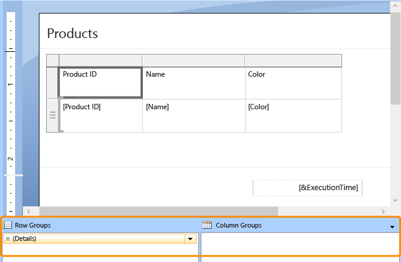
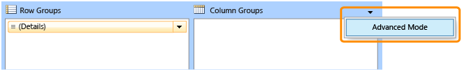
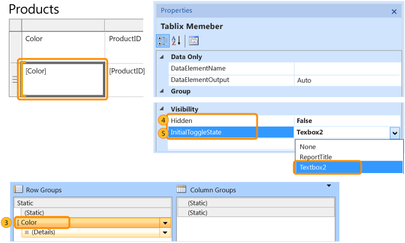
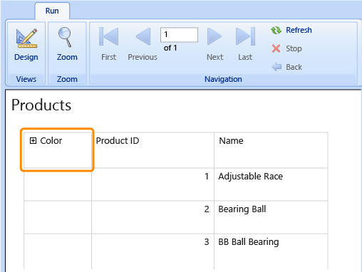
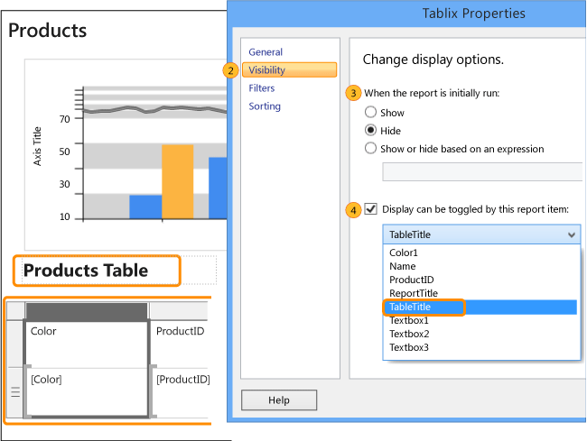
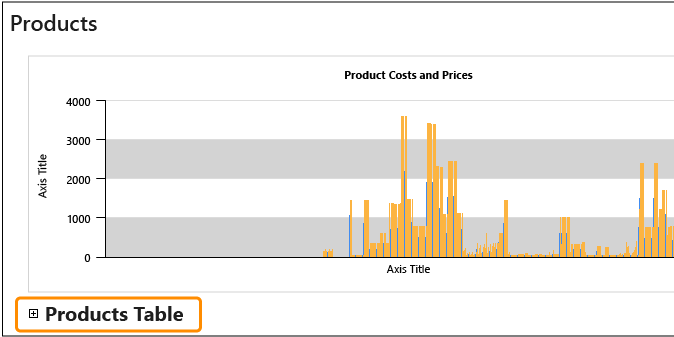

# Add an Expand or Collapse Action to an Item (Report Builder and SSRS)
  You can enable a user to interactively expand or collapse report items, or expand or collapse rows and columns associated with a group for a table or matrix. To allow users to expand or collapse an item, you set the visibility properties for that item. Setting visibility works in an HTML report viewer, and is sometimes called a *drilldown* action.  
  
 In report design view, you specify the name of the text box where you want to display the expand and collapse toggle icons. In the rendered report, the text box displays a plus (+) or minus (-) sign in addition to its contents. When the user clicks the toggle, the report display is refreshed to show or hide the report item, based on the current visibility settings for items in the report.  
  
 Typically, the expand and collapse action is used to initially display only summary data and to enable the user to click the plus sign to show detail data. For example, you can initially hide a table that displays values for a chart, or hide child groups for a table with nested row or column groups, as in a drilldown report.  
  
> [!NOTE]  
>  [!INCLUDE[ssRBRDDup](../../includes/ssrbrddup-md.md)]  
  
### To add expand and collapse action to a group  
  
1.  In report design view, click the table or matrix to select it. The Grouping pane displays the row and column groups.  
  
       
  
     If the Grouping pane does not appear, click the **View** menu and then click **Grouping**.  
  
2.  Right-click anywhere in the title bar of the Grouping pane, and then click **Advanced**. The Grouping pane mode toggles to show the underlying display structure for rows and columns on the design surface.  
  
       
  
3.  In the appropriate group pane, click the name of the row group or column group for which you want to hide the associated rows or columns. The group is selected and the Properties pane shows the **Tablix Member** properties.  
  
    > [!NOTE]  
    >  If you do not see the Properties pane, click **View** on the Ribbon and then click **Properties**.  
  
4.  In `Hidden`, choose one of the following options to set the visibility of this report item the first time you run a report:  
  
    -   Select `False` to display the report item.  
  
    -   Select `True` to hide the report item.  
  
    -   Select **\<Expression>** to open the **Expression** dialog box to create an expression that is evaluated at run time to determine the visibility.  
  
5.  In **ToggleItem**, from the drop-down box, select the name of a text box to which to add the toggle image.  
  
     In the following image, the Color row group is configured enable users to expand and collapse associated rows.  
  
       
  
    > [!NOTE]  
    >  The text box with the toggle image cannot be the row or column group for which you want to hide the associated rows or columns. It must either be in the same group as the item that is being hidden or in an ancestor group. For example, to toggle visibility of rows associated with a child group, select a text box in a row associated with the parent group.  
  
6.  To test the toggle, run the report and click the text box with the toggle image. The report display refreshes to show row groups and column groups with their toggled visibility.  
  
       
  
### To add expand and collapse action to a report item  
  
1.  In report design view, right-click the report item to show or hide, and then click *\<report item>* **Properties**. The *\<report item>* **Properties** dialog box for the report item opens.  
  
2.  Click **Visibility**.  
  
3.  In **When the report is initially run**, choose one of the following options to set the visibility of this report item the first time you run a report:  
  
    -   Select **Show** to display the report item.  
  
    -   Select **Hide** to hide the report item.  
  
    -   Select **Show or hide based on an expression** to use an expression evaluated at run time to determine the visibility. Click (**fx**) to open the **Expression** dialog box to create an expression.  
  
        > [!NOTE]  
        >  When you specify an expression for visibility, you are setting the Hidden property of the report item. The expression evaluates to a `Boolean` value of `True` to hide the item and `False` to show the item.  
  
4.  In **Display can be toggled by this report item**, from the drop-down box, type or select the name of a text box in the report in which to display a toggle image; for example, Textbox1.  
  
     In the following image, the table is configured to enable users to expand and collapse it. The display of the table is toggled by the Products Table text box.  
  
       
  
    > [!NOTE]  
    >  The text box that you choose must be in the current or containing scope for this report item (up to and including the report body). For example, to toggle visibility of a chart, select a text box that is in the same containing scope as the chart; for example, the report body or a rectangle. The text box must be in the same container hierarchy or higher.  
  
5.  To test the toggle, run the report and click the text box with the toggle image. The report display refreshes to show report items with their toggled visibility.  
  
       
  
## See Also  
 [Drilldown Action &#40;Report Builder and SSRS&#41;](drilldown-action-report-builder-and-ssrs.md)   
 [Hide an Item &#40;Report Builder and SSRS&#41;](../report-builder/hide-an-item-report-builder-and-ssrs.md)  
  
  
