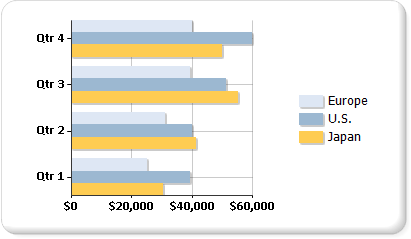

# Bar Charts (Report Builder and SSRS)
  A bar chart displays series as sets of horizontal bars. The plain bar chart is closely related to the column chart, which displays series as sets of vertical bars, and the range bar chart, which displays series as sets of horizontal bars with varying beginning and end points.  
  
 The bar chart is the only chart type that displays data horizontally. For this reason, it is popular for representing data that occurs over time, with a finite start and end date. It is also popular for showing categorical information since the categories can be displayed horizontally. For more information about how to add data to a bar chart, see [Charts &#40;Report Builder and SSRS&#41;](charts-report-builder-and-ssrs.md).  
  
 The following illustration shows a bar chart. The bar chart is well suited for this data because all three series share a common time period, allowing for valid comparisons to be made.  
  
   
  
> [!NOTE]  
>  [!INCLUDE[ssRBRDDup](../../includes/ssrbrddup-md.md)]  
  
## Variations of the Bar Chart  
  
-   **Stacked**. A bar chart where multiple series are stacked vertically. If there is only one series in your chart, the stacked bar chart will display the same as a bar chart.  
  
-   **Percent stacked**. A bar chart where multiple series are stacked vertically to fit 100% of the chart area. If there is only one series in your chart, all the bars will fit to 100% of the chart area.  
  
-   **3D clustered**. A bar chart that shows individual series in separate rows on a 3D chart.  
  
-   **3D cylinder**. A bar chart that shapes the bars as cylinders on a 3D chart.  
  
## Data Considerations for Bar Charts  
  
-   Bar charts have their axes reversed. The category axis is the vertical axis (or "y-axis") and the value axis is the horizontal axis (or "x-axis"). This means that in a bar chart, you have more space for category labels to be displayed along the y-axis as a list that reads from top to bottom.  
  
-   Bar and column charts are most commonly used to show comparisons between groups. If more than three series are present on the chart, consider using a stacked bar or column chart. You can also collect stacked bar or column charts into multiple groups if you have several series on your chart.  
  
-   A bar chart displays values from left to right, which may be more intuitive when displaying data related to durations.  
  
-   If you are looking to add bars to a table or matrix within the report, consider using a linear gauge instead of a bar chart. The linear gauge is designed to show one value instead of multiple groups, so it is more flexible for use within a list or table data region. For more information, see [Gauges &#40;Report Builder and SSRS&#41;](gauges-report-builder-and-ssrs.md).  
  
-   You can add special drawing styles to the individual bars on a bar chart to increase its visual impact. Drawing styles include wedge, emboss, cylinder, and light-to-dark. These effects are designed to improve the appearance of your 2D chart. If you are using a 3D chart, the drawing styles will still be applied, but may not have the same effect. For more information about how to add a drawing style to a bar chart, see [Add Bevel, Emboss, and Texture Styles to a Chart &#40;Report Builder and SSRS&#41;](chart-effects-add-bevel-emboss-or-texture-report-builder.md).  
  
-   Stacked bar charts place series on top of each other to create one bar stack. You have the option of separating the stacked bar chart into multiple sets of stacks for each category. The grouped stacked chart is displayed side-by-side. You can have any number of grouped stacked series in a chart.  
  
-   When data point labels are shown on a bar chart, the labels are placed on the outside of each bar. This can cause labels to overlap when the bars take up all of the allotted space within the chart area. You can change the position of the data point labels displayed for each bar by setting the **BarLabelStyle** property in the Properties pane.  
  
-   If there are a lot of data points in your dataset relative to the size of your chart, the size of the columns or bars and the spacing between them are reduced. To manually set the width of the columns in a chart, modify their width, in pixels, by modifying the **PointWidth** property. By default, this property has a value of 0.8. When you increase the width of the columns or bars in a chart, the space between each column or bar decreases.  
  
## See Also  
 [Charts &#40;Report Builder and SSRS&#41;](charts-report-builder-and-ssrs.md)   
 [Chart Types &#40;Report Builder and SSRS&#41;](chart-types-report-builder-and-ssrs.md)   
 [Empty and Null Data Points in Charts &#40;Report Builder and SSRS&#41;](empty-and-null-data-points-in-charts-report-builder-and-ssrs.md)   
 [Column Charts &#40;Report Builder and SSRS&#41;](column-charts-report-builder-and-ssrs.md)   
 [Range Charts &#40;Report Builder and SSRS&#41;](range-charts-report-builder-and-ssrs.md)   
 [Formatting Series Colors on a Chart &#40;Report Builder and SSRS&#41;](formatting-series-colors-on-a-chart-report-builder-and-ssrs.md)   
 [Formatting Axis Labels on a Chart &#40;Report Builder and SSRS&#41;](formatting-axis-labels-on-a-chart-report-builder-and-ssrs.md)   
 [Formatting the Legend on a Chart &#40;Report Builder and SSRS&#41;](chart-legend-formatting-report-builder.md)   
 [Add Bevel, Emboss, and Texture Styles to a Chart &#40;Report Builder and SSRS&#41;](chart-effects-add-bevel-emboss-or-texture-report-builder.md)   
 [Tutorial: Adding a Bar Chart to a Report (Report Builder)](https://go.microsoft.com/fwlink/?LinkId=198052)   
 [Tutorial: Adding a Bar Chart to a Report](https://go.microsoft.com/fwlink/?LinkId=198042)  
  
  
