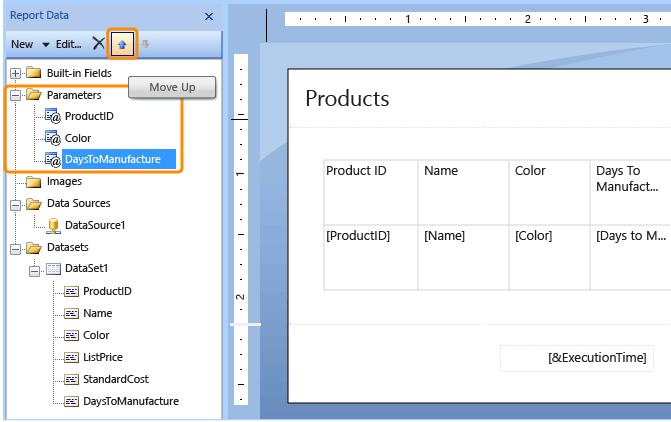

# Change the Order of a Report Parameter (Report Builder and SSRS)
  Change the order of report parameters when you have a dependent parameter that is listed before the parameter it is dependent on. Parameter order is important when you have cascading parameters, or when you want to show users the default value for one parameter before they choose values for other parameters. A dependent report parameter contains a reference, in either its default values query or valid values query, to a query parameter that points to a report parameter that is after it in the parameter list in the Report Data pane.  
  
 The order that you see parameters display on the report viewer toolbar is determined by the order of the parameters in the Report Data pane.  
  
> [!NOTE]  
>  [!INCLUDE[ssRBRDDup](../../includes/ssrbrddup-md.md)]  
  
### To change the order of report parameters  
  
1.  In the Report Data pane, expand the Parameters node.  
  
2.  Click a parameter and use the up and down arrow buttons on the Report Data pane toolbar to move the parameter higher or lower in the list. The following image shows the Report Data pane in Report Builder.  
  
       
  
## See Also  
 [Report Parameters &#40;Report Builder and Report Designer&#41;](report-parameters-report-builder-and-report-designer.md)   
 [Report Builder Help for Dialog Boxes, Panes, and Wizards](../report-builder-help-for-dialog-boxes-panes-and-wizards.md)   
 [Add Cascading Parameters to a Report &#40;Report Builder and SSRS&#41;](add-cascading-parameters-to-a-report-report-builder-and-ssrs.md)   
 [Tutorial: Add a Parameter to Your Report &#40;Report Builder&#41;](../tutorial-add-a-parameter-to-your-report-report-builder.md)   
 [Add Dataset Filters, Data Region Filters, and Group Filters &#40;Report Builder and SSRS&#41;](add-dataset-filters-data-region-filters-and-group-filters.md)   
 [Parameters Collection References &#40;Report Builder and SSRS&#41;](built-in-collections-parameters-collection-references-report-builder.md)  
  
  
