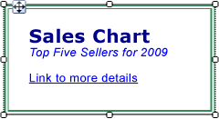

# Formatting Text and Placeholders (Report Builder and SSRS)
  A text box can be a report item or an individual cell within a data region that contains text, a calculated field, a pointer to a field in a database, or a combination of all three items. You can mix fonts and colors, add bold and italic styles, and use paragraph styles such as alignment and hanging indents. You can format an entire text box or you can format specific text, numbers, expressions, or fields within the text box.  
  
 Font, size, color, and effects all contribute to the readability of a report. Font, font style, font size, and underline effects can be applied to text within a text box or data region. By default, the report font that is used is Arial, 10 points, and black. By using the **Text Box** and **Text Properties** dialog boxes, you can specify how the text appears when the report is rendered.  
  
   
  
 In this illustration, the text box itself has a border, and all the text is in the same text box, but the text has a variety of formatting.  
  
 To quickly get started, see [Tutorial: Format Text &#40;Report Builder&#41;](../tutorial-format-text-report-builder.md).  
  
> [!NOTE]  
>  [!INCLUDE[ssRBRDDup](../../includes/ssrbrddup-md.md)]  
  
## Creating Placeholder Text in a Text Box  
 When a simple or complex expression is defined inside a text box, the resulting UI representation of this expression is known as a *placeholder*. You can define colors, fonts, actions, and other behavior on any number of placeholders or sections of text within a single text box.  
  
 The value of a placeholder is always a simple or complex expression. You can add a placeholder to a text box by creating an expression using one of the following methods:  
  
-   Drag a field from the **Report Data** pane and drop it into the text box. If you drag the expression anywhere else on the report body, a new text box will be created that contains the placeholder. The value of this placeholder will be the field expression that corresponds to the field that was dropped.  
  
-   Right-click anywhere in the text box and select **Insert Placeholder**. In the **Placeholder Properties** dialog box, you can specify an expression as the value of your placeholder. For more information, see [Placeholder Properties Dialog Box, General &#40;Report Builder and SSRS&#41;](../placeholder-properties-dialog-box-general-report-builder-and-ssrs.md).  
  
-   Type any simple or complex expression into the text box. For example, if you type **Name: [Name]** into the text box, the **[Name]** text will be displayed as a placeholder that represents the expression `=Fields!Name.Value`.  
  
-   Type an expression in an empty text box by starting with an equal sign (=). When you change the focus off the text box, the resulting expression is converted into a placeholder that you can edit. If the text box is not empty, or the equal sign is inserted anywhere but as the first character in the text box, the equal sign is treated as a string literal and a placeholder is not created. For more information about defining simple and complex expressions, see [Expression Uses in Reports &#40;Report Builder and SSRS&#41;](expression-uses-in-reports-report-builder-and-ssrs.md).  
  
## Formatting Placeholders and Static Text in a Text Box  
 You can format placeholders using the **Placeholder Properties** dialog box. You can format only the entire placeholder, not sections of the placeholder. If you want to see the underlying expression, you can pause your pointer on the placeholder. You can change the underlying expression by double-clicking the placeholder or right-clicking the placeholder and selecting **Placeholder Properties**. You can also specify a UI label using the **Label** property in **General** of the **Placeholder Properties** dialog box. This will be the text that is shown at design-time for the placeholder.  
  
   
  
 In this illustration, a text box in a list contains both a label with bold formatting and a placeholder with no formatting.  
  
 Unlike placeholder text, you can align individual text in a text box separately, use multiple paragraphs within a single text box, and define other behavior for any subset of text  
  
 You can define colors, fonts, actions, and other behavior on any subset of text within a single text box to create a mail merge or template for text in your report. You can also use multiple paragraphs inside a single text box. For example, if you have two separate paragraphs of text, you can separate the paragraphs by pressing ENTER in the text box. You can also set an alignment value for any individual string of text. You can also define an action for individual text in a text box. This can be useful if you want to add a hyperlink for a string of text that is contained inside a text box.  
  
> [!NOTE]  
>  Actions defined on the text box have a higher priority than actions defined for individual text in a text box.  
  
 For more information about mixed formatting, see [Format Text in a Text Box &#40;Report Builder and SSRS&#41;](format-text-in-a-text-box-report-builder-and-ssrs.md).  
  
## Aligning Horizontal Text using General  
 In **Alignment** on the **Text Box Properties** dialog box, you can specify how the text should be aligned horizontally. If you do not specify a value for alignment, the default value of the alignment is **Default**. This means that the text is aligned based on the field type of your placeholder value. If you specify an expression that evaluates to a non-string value, i.e., not a number, the text is aligned to the right. If your expression evaluates to a string value, such as a number, the text is aligned to the left.  
  
## See Also  
 [Expressions &#40;Report Builder and SSRS&#41;](expressions-report-builder-and-ssrs.md)   
 [Formatting Axis Labels on a Chart &#40;Report Builder and SSRS&#41;](formatting-axis-labels-on-a-chart-report-builder-and-ssrs.md)   
 [Formatting Scales on a Gauge &#40;Report Builder and SSRS&#41;](formatting-scales-on-a-gauge-report-builder-and-ssrs.md)   
 [Lists &#40;Report Builder and SSRS&#41;](tables-matrices-and-lists-report-builder-and-ssrs.md)   
 [Placeholder Properties Dialog Box, General &#40;Report Builder and SSRS&#41;](../placeholder-properties-dialog-box-general-report-builder-and-ssrs.md)   
 [Exporting to Microsoft Excel &#40;Report Builder and SSRS&#41;](../report-builder/exporting-to-microsoft-excel-report-builder-and-ssrs.md)   
 [Text Boxes &#40;Report Builder and SSRS&#41;](text-boxes-report-builder-and-ssrs.md)  
  
  
